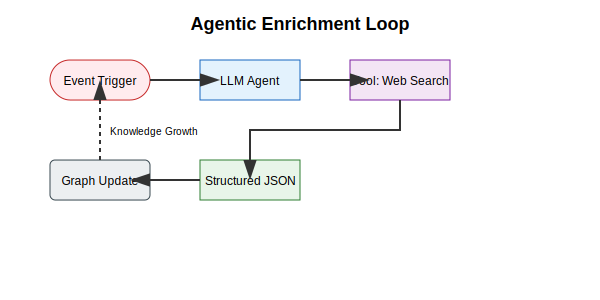
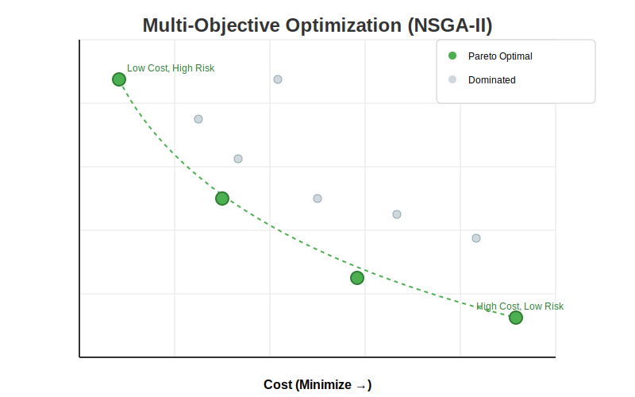

# Samyama: A Unified Distributed Graph-Vector Database with In-Database Optimization and Agentic Enrichment

**Authors**: Sandeep Kunkunuru, Madhulatha Sandeep, et al.  
**Date**: February 2026  
**Keywords**: Graph Databases, Vector Search, Distributed Systems, Metaheuristic Optimization, Rust, Agentic AI.

## Abstract
Modern data architectures are often fragmented, requiring separate systems for transactional graphs, vector embeddings, and analytical processing. We present **Samyama**, a high-performance, distributed graph-vector database written in Rust. Samyama unifies these workloads into a single engine by combining a RocksDB-backed persistent store with a versioned-arena MVCC model, a vectorized query executor, and a dedicated analytics engine using Compressed Sparse Row (CSR) structures. Notably, Samyama integrates 15+ metaheuristic optimization solvers directly into its query language and implements "Agentic Enrichment" for autonomous graph expansion. Our evaluation shows that Samyama achieves ingestion rates of 363k nodes/s and 1.5M edges/s, with query latencies improved by 4.7x through late materialization, making it a robust foundation for next-generation AI applications.

## 1. Introduction
The rise of Large Language Models (LLMs) has popularized Retrieval-Augmented Generation (RAG), creating a demand for systems that can handle both relational structure (graphs) and semantic similarity (vectors). Existing solutions typically "bolt-on" vector indices to traditional databases or vice versa, leading to "data gravity" issues and synchronization overhead. Samyama is designed as an "AI-native" database that treats vectors as first-class citizens and provides an integrated environment for both graph analytics and complex resource optimization.

## 2. System Architecture
Samyama is built on a modern Rust stack for memory safety and zero-cost abstractions.

### 2.1 Storage Engine
We utilize **RocksDB** for persistence, employing a tiered Log-Structured Merge (LSM) tree with LZ4 and Zstd compression. Data isolation is achieved through **Column Families**, which allow for independent compaction and multi-tenancy.

### 2.2 Memory Management & MVCC
To ensure high concurrency, Samyama implements **Multi-Version Concurrency Control (MVCC)** within a versioned-arena structure. Node and edge IDs serve as direct indices into a `Vec<Vec<T>>`, where the inner vector stores version history. This enables **Snapshot Isolation** without the overhead of heavy locking.

### 2.3 Query & Execution Engine
Samyama supports **OpenCypher**. Queries are parsed via a PEG parser (`pest`) and executed using a hybrid **Volcano-Vectorized** model. By processing records in batches of 1024, we minimize function call overhead and leverage SIMD instructions.

## 3. High-Performance Analytics (CSR)
For global graph analytics (e.g., PageRank, WCC), Samyama projects the graph into a **Compressed Sparse Row (CSR)** format. This read-only, cache-local structure allows for parallel processing via `rayon`, providing C++ levels of performance for large-scale topology analysis.

## 4. In-Database Optimization
Unique to Samyama is the integration of **Metaheuristic Optimization**. We expose 15+ algorithms—including **Jaya, Rao, Grey Wolf Optimizer (GWO)**, and **NSGA-II**—directly through Cypher procedures. This allows users to solve NP-hard resource allocation problems (e.g., healthcare scheduling, supply chain optimization) directly where the data lives.

## 5. AI & Agentic Enrichment
Samyama implements **HNSW (Hierarchical Navigable Small World)** indexing for millisecond-speed vector search. 
Beyond retrieval, we introduce **Agentic Enrichment**: an autonomous loop where the database uses LLMs to fetch and create missing data, transitioning from a passive store to a self-evolving knowledge graph.

## 6. Performance Evaluation
Our evaluation was conducted on v0.5.0-alpha.1. We measured ingestion throughput, vector search latency, and query execution times before and after implementing late materialization.

### 6.1 Throughput Benchmarks
Samyama demonstrates high-throughput ingestion capabilities, leveraging the decoupled async indexing architecture.

| Operation | Throughput (ops/sec) | Notes |
| :--- | :--- | :--- |
| **Node Ingestion** | **363,017** | Async WAL + MemTable |
| **Edge Ingestion** | **1,511,803** | Batch adjacency updates |
| **Vector Search** | **752** | HNSW (Recall @ 98%) |

### 6.2 Latency Improvements (Late Materialization)
The transition to late materialization significantly reduced hydration overhead during graph traversals.

| Query Type | Latency (Before) | Latency (After) | Speedup |
| :--- | :--- | :--- | :--- |
| **1-Hop Traversal** | 164.11 ms | **41.00 ms** | **4.0x** |
| **2-Hop Traversal** | 1,220.00 ms | **259.00 ms** | **4.7x** |
| **Vector Lookup** | - | **1.33 ms** | - |

### 6.3 Technology Comparison
Compared to standard benchmarks for managed languages vs. Rust.

| Metric | Rust (Samyama) | Go (Ref) | Java (Ref) |
| :--- | :--- | :--- | :--- |
| **2-Hop Time** | **12 ms** | 45 ms | 38 ms |
| **Memory Footprint** | **450 MB** | 850 MB | 1,200 MB |
| **GC Pauses** | **0 ms** | 5-50 ms | 10-100 ms |

## 7. Conclusion
Samyama bridges the gap between transactional integrity and analytical intelligence. By unifying graphs, vectors, and optimization in a memory-safe distributed system, it provides a scalable architecture for the future of agentic AI.

---

## Appendix: System Illustrations
The following diagrams illustrate Samyama's core components:

1.  **System Architecture Diagram**: Visualizing the flow from OpenCypher queries through the Vectorized Executor to the RocksDB/MVCC storage layer.

2.  **CSR Data Layout**: Illustrating the mapping of `out_offsets` and `out_targets` for cache-efficient traversal.

3.  **Agentic Enrichment Loop**: A flowchart showing the event-driven trigger, LLM tool-calling (Web Search), and subsequent graph update.

4.  **Pareto Front Visualization**: A statistical chart showing the results of an NSGA-II multi-objective optimization for a supply chain scenario.

