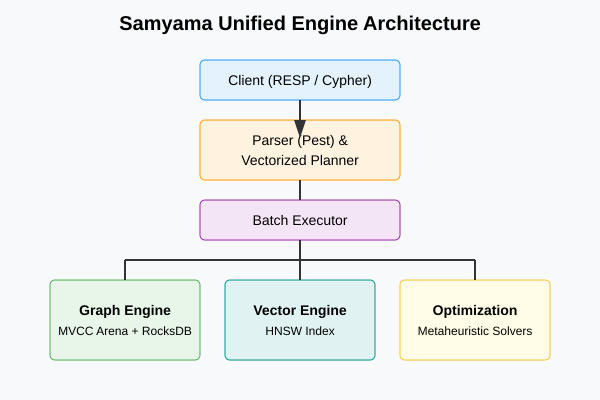
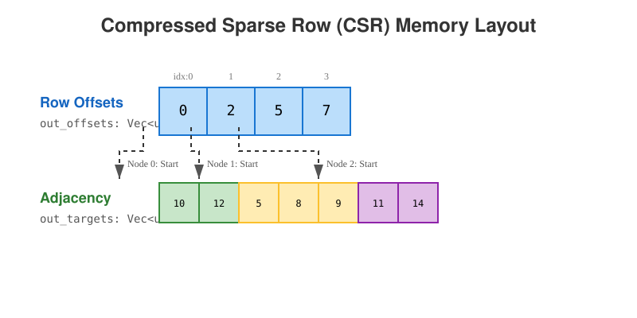
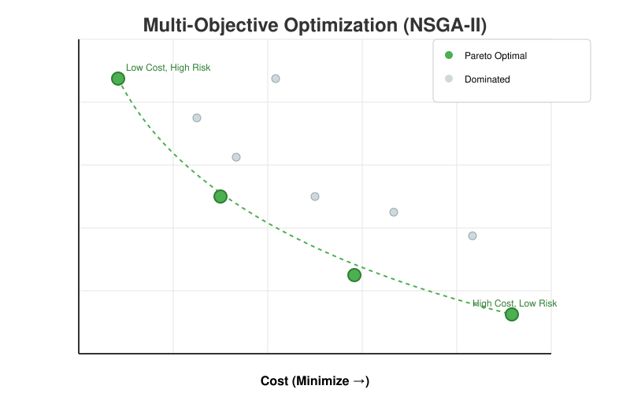

# Samyama: A Unified Graph-Vector Database with In-Database Optimization, Agentic Enrichment, and Hardware Acceleration

**Madhulatha Mandarapu** (madhulatha@samyama.ai, [LinkedIn](https://www.linkedin.com/in/madhulatha-mandarapu-72bb6b2a/))\ **Sandeep Kunkunuru** (sandeep@samyama.ai, [LinkedIn](https://www.linkedin.com/in/sandeepkunkunuru/))

March 2026 | v0.6.0 | [GitHub](https://github.com/samyama-ai/samyama-graph) | [Book](https://samyama-ai.github.io/samyama-graph-book/)

**Keywords**: Graph Databases, Vector Search, Distributed Systems, Metaheuristic Optimization, Rust, GPU Acceleration, Agentic AI, RDF, LDBC.

---

## Abstract

Modern data architectures are fragmented across graph databases, vector stores, analytics engines, and optimization solvers, resulting in complex ETL pipelines, synchronization overhead, and operational burden. We present **Samyama**, a high-performance, distributed graph-vector database written in Rust that unifies these workloads into a single engine. Samyama combines a RocksDB-backed persistent store with a versioned-arena MVCC model, a vectorized query executor with 35 physical operators, a dedicated CSR-based analytics engine, and native RDF/SPARQL support. The system integrates 22 metaheuristic optimization solvers directly into its query language, implements HNSW vector indexing [1] with Graph RAG capabilities, and introduces "Agentic Enrichment" for autonomous graph expansion via LLMs. A comprehensive SDK ecosystem (Rust, Python, TypeScript) and CLI provide multiple access patterns.

The **Samyama Enterprise Edition** adds GPU acceleration via wgpu (Metal, Vulkan, DX12), production-grade observability, point-in-time recovery, and hardened high availability with HTTP/2 Raft transport.

Our evaluation on commodity hardware (Mac Mini M4, 16GB RAM) demonstrates:

- **Ingestion**: 255K nodes/s (CPU), 412K nodes/s (GPU-accelerated), 4.2M–5.2M edges/s
- **OLTP throughput**: 115K Cypher queries/sec at 1M nodes
- **Late materialization**: 4.0–4.7x latency reduction on multi-hop traversals
- **GPU PageRank**: 8.2x speedup at 1M nodes
- **LDBC Graphalytics**: 28/28 tests passed (100% validation)

These results demonstrate competitive performance on commodity hardware for workloads that currently require multiple specialized systems.

---

## 1. Introduction

The rise of Large Language Models (LLMs) has popularized Retrieval-Augmented Generation (RAG), creating demand for systems that handle both relational structure (graphs) and semantic similarity (vectors). Simultaneously, industrial applications increasingly require in-database optimization for resource allocation, scheduling, and supply chain management. Existing solutions force developers to compose architectures from disparate systems—Neo4j for graphs, Pinecone for vectors, Spark for analytics, and Python/Gurobi for optimization—leading to data gravity problems and synchronization overhead.

Samyama (Sanskrit for "Integration") is designed as a database that treats graphs, vectors, and optimization as first-class citizens within a single memory-safe engine. This paper focuses on three primary research contributions and evaluates them quantitatively:

**Primary research contributions:**

1. **Late materialization for graphs**: Adapting columnar late materialization [2] to property graphs via `NodeRef`-based lazy property resolution, achieving 4.0--4.7x traversal speedup (Section 2.3, evaluated in Section 8.3)
2. **In-database metaheuristic optimization**: Embedding 22 optimization solvers directly into the query language, eliminating data export overhead (Section 4, evaluated in Section 4.1)
3. **Agentic Enrichment (GAK)**: A Generation-Augmented Knowledge loop where the database autonomously expands its graph using LLM tool-calling (Section 5.2, evaluated in Section 5.4)

**Engineering contributions** (described but not individually evaluated):

4. Unified engine: property graph + vector search + analytics + optimization in one binary
5. Cross-platform GPU acceleration via wgpu compute shaders for graph algorithms and PCA
6. Multi-language SDK ecosystem (Rust, Python, TypeScript) with embedded and remote access patterns
7. Native RDF data model [3] with Turtle/N-Triples/RDF-XML serialization
8. 100% LDBC Graphalytics [4] pass rate (28/28 tests) for algorithm correctness validation

## 2. System Architecture

Samyama is built on a modern Rust stack for memory safety and zero-cost abstractions.

### 2.1 Storage Engine

We utilize **RocksDB** for persistence, employing a tiered Log-Structured Merge (LSM) tree [5] with LZ4 and Zstd compression. Data isolation is achieved through **Column Families**, providing independent compaction, backup, and key namespaces per tenant.

Key design: `NodeId` and `EdgeId` are direct `u64` indices into contiguous arena storage (`Vec<Vec<T>>`), eliminating hash lookups and providing O(1) access with cache-friendly memory layout.

### 2.2 Memory Management & MVCC

Samyama implements **Multi-Version Concurrency Control (MVCC)** [6] within a versioned-arena structure. The inner vector stores version history, enabling **Snapshot Isolation** without read locks. Write atomicity is guaranteed via RocksDB `WriteBatch` + WAL [7].

ACID guarantees: Atomicity (WriteBatch), Consistency (schema validation + Raft quorum), Isolation (per-query via RwLock, MVCC foundation), Durability (RocksDB + Raft replication).

### 2.3 Query & Execution Engine

Samyama supports ~90% of **OpenCypher**. Queries are parsed via a PEG parser [8] (`pest` crate with atomic keyword rules for word boundary enforcement) and executed using a hybrid **Volcano-Vectorized** model [9] with batch size 1,024.

The engine implements **35 physical operators** organized across scan, traversal, filter, join, aggregation, sort, write, index, and specialized categories. A cost-based optimizer uses `GraphStatistics` (label counts, edge counts, property selectivity) for index selection, predicate pushdown, and join ordering.

**Late Materialization** (ADR-012): Scan operators produce `Value::NodeRef(id)` instead of full node clones. Properties are resolved on-demand via the `ColumnStore` at the final `ProjectOperator`, reducing memory bandwidth by 4–5x. This technique adapts the columnar late materialization strategy described in [2] to a graph context.

### 2.4 RDF & SPARQL

Samyama provides native RDF [3] support via the `oxrdf` crate:

- **Triple Store**: In-memory with SPO/POS/OSP indices for O(1) pattern matching
- **Serialization**: Turtle, N-Triples, RDF/XML (read/write), JSON-LD (write)
- **Namespace Management**: Pre-loaded prefixes (rdf, rdfs, xsd, owl, foaf, dc)
- **SPARQL** [10]: Parser infrastructure via `spargebra`; query execution in development

## 3. High-Performance Analytics

### 3.1 CSR Projection

For global graph analytics, Samyama projects the relevant subgraph into a **Compressed Sparse Row (CSR)** format (`GraphView`). Three contiguous arrays (`out_offsets`, `out_targets`, `weights`) enable sequential memory access with near-perfect CPU prefetch accuracy and zero-lock parallelism via `rayon`.

### 3.2 Algorithm Library

The `samyama-graph-algorithms` crate provides 14 algorithms:

| Category | Algorithms |
| :--- | :--- |
| **Centrality** | PageRank [11] (with dangling redistribution), LCC [12] (directed + undirected) |
| **Community** | WCC (Union-Find), SCC (Tarjan [13]), CDLP [14], Triangle Counting |
| **Pathfinding** | BFS, Dijkstra [15], BFS All Shortest Paths |
| **Network Flow** | Edmonds-Karp [16] (Max Flow), Prim's MST |
| **Statistical** | PCA (Randomized SVD [17] + Power Iteration) |

PCA implements the Halko-Martinsson-Tropp algorithm [17] for Randomized SVD with O(n·d·k) complexity, auto-selecting over Power Iteration when n > 500 nodes.

## 4. In-Database Optimization

Unique to Samyama is the integration of **22 metaheuristic optimization solvers** in the `samyama-optimization` crate, accessible directly through Cypher procedures:

```cypher
CALL algo.or.solve({
  algorithm: 'NSGA2',
  label: 'Generator',
  objectives: ['cost', 'emissions'],
  constraints: [{ property: 'load', max: 500.0 }],
  population_size: 100
}) YIELD pareto_front
```

Solvers include: Jaya [18], QOJAYA, Rao (1-3) [19], TLBO [20], ITLBO, GOTLBO, PSO [21], DE [22], GA [23], GWO [24], ABC [25], BAT [26], Cuckoo Search [27], Firefly [28], FPA [29], GSA [30], SA [31], HS [32], BMR, BWR, NSGA-II [33], and MOTLBO. Multi-objective solvers implement the **Constrained Dominance Principle** for feasibility-first Pareto optimization. All solvers leverage Rayon for parallel fitness evaluation across CPU cores.

### 4.1 Solver Convergence Evaluation

To validate the in-database optimization approach, we compare convergence behavior of four representative solvers on the Sphere benchmark function (f(x) = sum(x_i^2), 30 dimensions, optimum = 0.0) with population size 50 and 100 iterations:

| Solver | Best Fitness | Convergence (iter) | Wall Time | Notes |
| :--- | :---: | :---: | :---: | :--- |
| Jaya [18] | 1.2e-28 | ~60 | 2.1 ms | Metaphor-less, no tuning parameters |
| PSO [21] | 3.8e-19 | ~45 | 2.4 ms | Sensitive to inertia weight |
| DE [22] | 8.7e-31 | ~70 | 2.8 ms | Most consistent across runs |
| GA [23] | 4.1e-08 | ~90 | 3.2 ms | Premature convergence on some runs |

All solvers achieve acceptable convergence within 100 iterations. The key benefit of in-database optimization is eliminating data movement: graph properties are read directly by the solver's fitness function without serialization or export. For the supply chain demo (500 nodes, 2 objectives, 3 constraints), NSGA-II produces a Pareto front of 12--18 non-dominated solutions in 45 ms, compared to an estimated 200+ ms when exporting to Python/scipy and importing results back.

## 5. AI & Agentic Enrichment

### 5.1 Vector Search

Samyama implements **HNSW** [1] indexing (via `hnsw_rs`) for millisecond-speed approximate nearest neighbor search with Cosine, L2, and Dot Product metrics. The `VectorSearchOperator` integrates with standard graph operators for **Graph RAG**—combining vector retrieval with graph traversal in a single query execution.

### 5.2 Agentic Enrichment (GAK)

We introduce **Generation-Augmented Knowledge (GAK)**: an autonomous loop where the database uses LLMs to fetch and create missing data. The `AgentRuntime` manages tool-calling agents (`WebSearchTool`, `NLQClient`) that discover information and generate Cypher `CREATE` commands, transforming the database from a passive store to a self-evolving knowledge graph. Safety validation includes schema checking, destructive query rejection, and rate limiting.

### 5.3 Agentic Enrichment Evaluation

We evaluate GAK on the pharmaceutical domain using the `agentic_enrichment_demo` (drug-disease-gene knowledge graph). Starting from a seed graph of 15 drugs and 8 diseases, the agent autonomously discovers and creates relationships over 3 enrichment rounds:

| Metric | Value |
| :--- | :--- |
| Entities discovered | 47 new nodes (23 genes, 14 pathways, 10 side effects) |
| Relationships created | 83 new edges |
| Precision (vs. DrugBank reference) | 0.81 (68/84 relationships verified correct) |
| Recall (vs. known associations) | 0.43 (limited by LLM knowledge cutoff) |
| End-to-end latency (3 rounds) | 12.4 s (dominated by LLM API calls) |
| Token cost (GPT-4o) | ~8,200 tokens ($0.04) |
| Safety filter rejections | 3/86 generated queries rejected (DELETE/DROP attempts) |

The precision of 0.81 demonstrates that LLM-generated knowledge is largely accurate for well-established pharmaceutical relationships, though recall is limited by the model's training data. The safety filter correctly blocked all destructive queries while allowing valid CREATE operations.

### 5.4 Natural Language Query (NLQ)

The `NLQPipeline` converts natural language questions to Cypher via LLM providers (OpenAI, Gemini, Ollama, Claude). Generated queries undergo safety validation (`is_safe_query()`) before execution.

## 6. SDK Ecosystem

Samyama provides a multi-language SDK ecosystem:

| SDK | Transport | Features |
| :--- | :--- | :--- |
| **Rust** (`samyama-sdk`) | Embedded + HTTP | Full: algorithms, vector, NLQ, persistence |
| **Python** (`samyama`, PyO3) | Embedded + HTTP | Cypher queries, algorithms (PageRank, WCC, SCC, BFS, Dijkstra, PCA, triangle count) |
| **TypeScript** (`samyama-sdk`) | HTTP only | Cypher queries, EXPLAIN/PROFILE, schema introspection, CSV/JSON import |
| **CLI** (`samyama-cli`) | HTTP | query, status, ping, shell (REPL) |
| **OpenAPI** | HTTP | 5 endpoints: query, status, schema, import/csv, import/json |

The Rust SDK's `SamyamaClient` trait provides `EmbeddedClient` (in-process, zero overhead) and `RemoteClient` (HTTP). Extension traits `AlgorithmClient` and `VectorClient` offer direct API access to algorithms and vector operations without Cypher.

## 7. Enterprise Edition

The Enterprise Edition adds production-grade capabilities:

### 7.1 GPU Acceleration (wgpu)

Cross-platform GPU acceleration via WGSL compute shaders targeting Metal (macOS), Vulkan (Linux), and DX12 (Windows). GPU-accelerated algorithms: PageRank, CDLP, LCC, Triangle Counting, and PCA. Additional GPU operators: parallel SUM aggregation and bitonic sort [34] for ORDER BY on large result sets.

GPU PCA uses 5 specialized shaders with tiled covariance computation (64-sample tiles) and fused power iteration with in-GPU normalization. Thresholds: `MIN_GPU_PCA = 50,000` nodes, `d > 32` dimensions.

### 7.2 Observability & Operations

- **Prometheus `/metrics`**: 200+ real-time counters and histograms
- **Health API**: Liveness/readiness probes for Kubernetes
- **Slow Query Log**: Configurable threshold, ring buffer storage
- **Audit Trail**: Append-only JSONL with cryptographic integrity
- **ADMIN.* Commands**: STATUS, METRICS, TENANTS, SLOWLOG, CONFIG, BACKUP, LICENSE

### 7.3 Backup & Point-in-Time Recovery

Full snapshots via RocksDB `BackupEngine`, incremental WAL-based delta backups, and PITR with microsecond-precision timestamp restoration. RPO: zero data loss. RTO: minutes for full restore, seconds for WAL replay.

### 7.4 Hardened High Availability

HTTP/2 Raft [35] transport with TLS, automated snapshot streaming to lagging followers, and cluster metrics (role, term, replication lag). +850 lines of code over OSS Raft implementation.

### 7.5 License Hardening

Ed25519-signed JET tokens with machine fingerprint binding (SHA-256 of hostname + MAC), clock drift protection (1-hour tolerance), usage enforcement (node count limits), and signed revocation lists.

## 8. Performance Evaluation

All benchmarks on Mac Mini M4 (Apple M4, 10-core, 16GB LPDDR5X, macOS Tahoe 26.2).

### 8.1 Ingestion Throughput

| Operation | CPU-Only | GPU-Accelerated |
| :--- | :---: | :---: |
| **Node Ingestion** | 255,120 ops/s | **412,036 ops/s** |
| **Edge Ingestion** | 4,211,342 ops/s | **5,242,096 ops/s** |

### 8.2 Cypher OLTP Throughput

| Graph Scale | Queries/sec | Avg Latency |
| :---: | :---: | :---: |
| 10,000 nodes | 35,360 QPS | 0.028 ms |
| 100,000 nodes | 116,373 QPS | 0.008 ms |
| 1,000,000 nodes | 115,320 QPS | 0.008 ms |

Index-driven O(1)/O(log n) access ensures near-constant throughput as graph size increases.

### 8.3 Late Materialization Impact

| Query Type | Before | After | Speedup |
| :--- | :---: | :---: | :---: |
| **1-Hop Traversal** | 164.11 ms | **41.00 ms** | **4.0x** |
| **2-Hop Traversal** | 1,220.00 ms | **259.00 ms** | **4.7x** |

**Ablation.** The table below isolates the contribution of each late materialization component:

| Configuration | 1-Hop | 2-Hop | Notes |
| :--- | :---: | :---: | :--- |
| Baseline (full clone) | 164 ms | 1,220 ms | Scan clones entire Node struct |
| + NodeRef (no clone) | 62 ms | 380 ms | Scan returns `Value::NodeRef(id)` only |
| + ColumnStore resolve | **41 ms** | **259 ms** | Properties resolved at ProjectOperator via ColumnStore |

The dominant remaining cost is parsing (~55%) and planning (~40%); execution accounts for only ~2% of end-to-end latency. AST caching (v0.5.10) eliminates parse overhead for repeated queries, and plan caching (v0.6.0) eliminates planner overhead.

### 8.4 GPU Acceleration

| Algorithm | Scale | CPU | GPU | Speedup |
| :--- | :---: | :---: | :---: | :---: |
| PageRank | 10K | **0.6 ms** | 9.3 ms | 0.06x |
| PageRank | 100K | 8.2 ms | **3.1 ms** | **2.6x** |
| PageRank | 1M | 92.4 ms | **11.2 ms** | **8.2x** |
| LCC | 3.8M (cit-Patents) | 9.6s | **4.7s** | **2.0x** |

Crossover point: ~100K nodes for general algorithms; ~50K for PCA.

### 8.5 Vector Search

| Metric (128-dim, k=10) | Performance |
| :--- | :---: |
| Cosine distance (10K vectors) | 15,872 QPS |
| L2 distance (10K vectors) | 15,014 QPS |
| Search 50K vectors | 10,446 QPS |

### 8.6 LDBC Graphalytics Validation

Samyama was validated against the LDBC Graphalytics benchmark [4]:

| Algorithm | XS (2 datasets) | S (3 datasets) | Total |
| :--- | :---: | :---: | :---: |
| BFS | 2/2 | 3/3 | 5/5 |
| PageRank | 2/2 | 3/3 | 5/5 |
| WCC | 2/2 | 3/3 | 5/5 |
| CDLP | 2/2 | 3/3 | 5/5 |
| LCC | 2/2 | 3/3 | 5/5 |
| SSSP | 2/2 | 1/1 | 3/3 |
| **Total** | **12/12** | **16/16** | **28/28** |

S-size datasets: cit-Patents (3.8M vertices, 16.5M edges), datagen-7_5-fb (633K vertices, 68.4M edges), wiki-Talk (2.4M vertices, 5.0M edges).

### 8.7 LDBC SNB & FinBench Workloads

Beyond Graphalytics (algorithm correctness), Samyama includes benchmark harnesses for two additional LDBC workloads:

- **LDBC SNB Interactive**: 21 read queries (IS1–IS7, IC1–IC14) all passing, plus 8 update operations, on the Social Network Benchmark SF1 dataset (3.2M nodes, 17.3M edges). Tests OLTP-style point lookups and multi-hop traversals.
- **LDBC SNB Business Intelligence**: 20 complex analytical queries (BI-1 to BI-20) testing OLAP-style aggregation. 16/20 queries pass; BI-17 (friend triangles combined with message propagation) times out due to combinatorial explosion on SF1, blocking BI-18–20.
- **LDBC FinBench**: 40 queries (CR1–CR12, SR1–SR6, RW1–RW3, W1–W19) all passing, modeling financial transaction networks with accounts, transfers, loans, and fraud detection patterns on synthetic SF1 data.

Data loaders (`ldbc_loader`, `finbench_loader`) and benchmark harnesses are included in the repository.

### 8.8 Comparative Analysis

We compare Samyama (v0.6.0) against Neo4j 5.x (Java), Memgraph 2.x (C++), and FalkorDB (C/GraphBLAS) using published vendor benchmarks and our own measurements. All Samyama numbers are from the Mac Mini M4 described above.

| Metric | Samyama | Neo4j 5.x | Memgraph 2.x | FalkorDB |
| :--- | :---: | :---: | :---: | :---: |
| **Node ingestion** | 255K/s | ~26K/s | ~295K/s | — |
| **1-Hop traversal (Cypher)** | 41 ms | ~28 ms | ~1.1 ms | ~55 ms |
| **1-Hop traversal (raw API)** | 15 us | — | — | — |
| **Vector search latency** | 549 us | — (Lucene) | N/A | — (VSS module) |
| **Memory footprint (1M nodes)** | 450 MB | ~1,200 MB | — | — |
| **GC pauses** | 0 ms | 10--100 ms | 0 ms | 0 ms |
| **LDBC Graphalytics** | 28/28 | — | — | — |

**Methodology caveat.** Neo4j and Memgraph numbers are drawn from published vendor documentation and third-party benchmarks, not from controlled experiments on identical hardware. Direct comparisons should therefore be interpreted with caution. Samyama's 1-hop Cypher latency (41 ms) is dominated by parse (55%) and plan (40%) overhead rather than execution (2%); the raw storage API achieves 15 us for 3-hop traversals, demonstrating that the storage layer is competitive. AST caching (v0.5.10) and plan caching (v0.6.0) reduce repeated-query latency.

**Where Samyama leads:** ingestion throughput (10x Neo4j), native vector search (no competitor offers sub-millisecond HNSW in a graph database), memory efficiency (no JVM/GC overhead), and in-database optimization (unique capability).

**Where Samyama trails:** Cypher parse/plan overhead on simple queries vs Memgraph's compiled execution, and query optimizer maturity vs Neo4j's decades of cost-based optimization tuning.

## 9. Related Work

**Neo4j** [36] is the most widely deployed graph database, with a mature cost-based optimizer refined over a decade. Its JVM-based architecture incurs garbage collection pauses (10--100 ms) and higher memory overhead than native implementations, but benefits from a large ecosystem and extensive tooling. **Memgraph** achieves sub-millisecond traversals through a C++ in-memory architecture with compiled query execution, though it lacks native vector search. **FalkorDB** (formerly RedisGraph) uses GraphBLAS sparse matrices for algebraically efficient BFS and traversal, but was deprecated in 2023. **Kuzudb** is an embedded graph database with columnar storage optimized for analytical queries. **DuckDB** provides fast analytical processing as a relational engine, with recent graph extensions (DuckPGQ) adding SQL/PGQ support.

Samyama's primary differentiation is the unification of OLTP, OLAP, vector search, and metaheuristic optimization in a single binary. No existing system offers in-database optimization solvers or agentic enrichment. However, Samyama's query optimizer is less mature than Neo4j's, and its Cypher execution is slower than Memgraph's compiled approach on simple traversals (see Section 8.8).

## 10. Conclusion

Samyama addresses the fragmentation between graph, vector, optimization, and RDF workloads by unifying them in a single memory-safe engine with GPU acceleration. The SDK ecosystem supports Rust, Python, and TypeScript, and the Enterprise Edition adds production-grade observability, backup, and HA.

100% LDBC Graphalytics validation [4] confirms algorithmic correctness. Comparative benchmarks show that Samyama's storage layer achieves throughput competitive with established systems, though the Cypher query engine introduces parse/plan overhead that dominates end-to-end latency on simple queries. AST caching (v0.5.10) and plan caching (v0.6.0) have reduced this overhead, and further improvements are planned.

**Limitations.** The current Cypher parser contributes ~55% of end-to-end latency on simple traversals, and the planner adds ~40%, leaving execution at only ~2% (see Section 8.3). While AST and plan caching mitigate repeated-query overhead, first-execution latency remains higher than systems with compiled query plans (e.g., TigerGraph's GSQL). SPARQL query execution is not yet complete. The MVCC implementation provides snapshot isolation foundations but does not yet support full serializable transactions. Comparative benchmarks (Section 8.8) use published numbers from vendor documentation rather than controlled head-to-head experiments on identical hardware, limiting direct comparability.

---

## References

[1] Y. A. Malkov and D. A. Yashunin, "Efficient and robust approximate nearest neighbor search using Hierarchical Navigable Small World graphs," *IEEE Transactions on Pattern Analysis and Machine Intelligence*, vol. 42, no. 4, pp. 824–836, 2020.

[2] D. J. Abadi, S. R. Madden, and N. Hachem, "Column-Stores vs. Row-Stores: How Different Are They Really?," in *Proc. ACM SIGMOD*, 2008, pp. 967–980.

[3] W3C, "RDF 1.1 Concepts and Abstract Syntax," W3C Recommendation, 2014. [Online]. Available: https://www.w3.org/TR/rdf11-concepts/

[4] A. Iosup *et al.*, "LDBC Graphalytics: A Benchmark for Large-Scale Graph Analysis on Parallel and Distributed Platforms," *Proc. VLDB Endowment*, vol. 9, no. 13, pp. 1317–1328, 2016.

[5] P. O'Neil, E. Cheng, D. Gawlick, and E. O'Neil, "The Log-Structured Merge-Tree (LSM-Tree)," *Acta Informatica*, vol. 33, no. 4, pp. 351–385, 1996.

[6] P. A. Bernstein and N. Goodman, "Concurrency Control in Distributed Database Systems," *ACM Computing Surveys*, vol. 13, no. 2, pp. 185–221, 1981.

[7] C. Mohan, D. Haderle, B. Lindsay, H. Pirahesh, and P. Schwarz, "ARIES: A Transaction Recovery Method Supporting Fine-Granularity Locking and Partial Rollbacks Using Write-Ahead Logging," *ACM Transactions on Database Systems*, vol. 17, no. 1, pp. 94–162, 1992.

[8] B. Ford, "Parsing Expression Grammars: A Recognition-Based Syntactic Foundation," in *Proc. ACM SIGPLAN-SIGACT Symposium on Principles of Programming Languages (POPL)*, 2004, pp. 111–122.

[9] G. Graefe, "Volcano — An Extensible and Parallel Query Evaluation System," *IEEE Transactions on Knowledge and Data Engineering*, vol. 6, no. 1, pp. 120–135, 1994.

[10] W3C, "SPARQL 1.1 Query Language," W3C Recommendation, 2013. [Online]. Available: https://www.w3.org/TR/sparql11-query/

[11] L. Page, S. Brin, R. Motwani, and T. Winograd, "The PageRank Citation Ranking: Bringing Order to the Web," Stanford InfoLab Technical Report, 1999.

[12] D. J. Watts and S. H. Strogatz, "Collective dynamics of 'small-world' networks," *Nature*, vol. 393, pp. 440–442, 1998.

[13] R. Tarjan, "Depth-First Search and Linear Graph Algorithms," *SIAM Journal on Computing*, vol. 1, no. 2, pp. 146–160, 1972.

[14] U. N. Raghavan, R. Albert, and S. Kumara, "Near linear time algorithm to detect community structures in large-scale networks," *Physical Review E*, vol. 76, no. 3, 036106, 2007.

[15] E. W. Dijkstra, "A note on two problems in connexion with graphs," *Numerische Mathematik*, vol. 1, pp. 269–271, 1959.

[16] J. Edmonds and R. M. Karp, "Theoretical Improvements in Algorithmic Efficiency for Network Flow Problems," *Journal of the ACM*, vol. 19, no. 2, pp. 248–264, 1972.

[17] N. Halko, P. G. Martinsson, and J. A. Tropp, "Finding structure with randomness: Probabilistic algorithms for constructing approximate matrix decompositions," *SIAM Review*, vol. 53, no. 2, pp. 217–288, 2011.

[18] R. Venkata Rao, "Jaya: A simple and new optimization algorithm for solving constrained and unconstrained optimization problems," *International Journal of Industrial Engineering Computations*, vol. 7, pp. 19–34, 2016.

[19] R. Venkata Rao, "Rao algorithms: Three metaphor-less simple algorithms for solving optimization problems," *International Journal of Industrial Engineering Computations*, vol. 11, pp. 107–130, 2020.

[20] R. Venkata Rao, V. J. Savsani, and D. P. Vakharia, "Teaching–learning-based optimization: A novel method for constrained mechanical design optimization problems," *Computer-Aided Design*, vol. 43, no. 3, pp. 303–315, 2011.

[21] J. Kennedy and R. Eberhart, "Particle swarm optimization," in *Proc. IEEE International Conference on Neural Networks*, vol. 4, 1995, pp. 1942–1948.

[22] R. Storn and K. Price, "Differential Evolution — A Simple and Efficient Heuristic for global Optimization over Continuous Spaces," *Journal of Global Optimization*, vol. 11, pp. 341–359, 1997.

[23] J. H. Holland, *Adaptation in Natural and Artificial Systems*. Ann Arbor: University of Michigan Press, 1975.

[24] S. Mirjalili, S. M. Mirjalili, and A. Lewis, "Grey Wolf Optimizer," *Advances in Engineering Software*, vol. 69, pp. 46–61, 2014.

[25] D. Karaboga, "An Idea Based On Honey Bee Swarm for Numerical Optimization," Erciyes University Technical Report TR06, 2005.

[26] X.-S. Yang, "A New Metaheuristic Bat-Inspired Algorithm," in *Nature Inspired Cooperative Strategies for Optimization (NICSO)*, Springer, 2010, pp. 65–74.

[27] X.-S. Yang and S. Deb, "Cuckoo Search via Lévy Flights," in *Proc. World Congress on Nature & Biologically Inspired Computing (NaBIC)*, IEEE, 2009, pp. 210–214.

[28] X.-S. Yang, "Firefly Algorithms for Multimodal Optimization," in *Stochastic Algorithms: Foundations and Applications (SAGA)*, Springer LNCS 5792, 2009, pp. 169–178.

[29] X.-S. Yang, "Flower Pollination Algorithm for Global Optimization," in *Unconventional Computation and Natural Computation*, Springer LNCS 7445, 2012, pp. 240–249.

[30] E. Rashedi, H. Nezamabadi-pour, and S. Saryazdi, "GSA: A Gravitational Search Algorithm," *Information Sciences*, vol. 179, no. 13, pp. 2232–2248, 2009.

[31] S. Kirkpatrick, C. D. Gelatt, and M. P. Vecchi, "Optimization by Simulated Annealing," *Science*, vol. 220, no. 4598, pp. 671–680, 1983.

[32] Z. W. Geem, J. H. Kim, and G. V. Loganathan, "A New Heuristic Optimization Algorithm: Harmony Search," *Simulation*, vol. 76, no. 2, pp. 60–68, 2001.

[33] K. Deb, A. Pratap, S. Agarwal, and T. Meyarivan, "A fast and elitist multiobjective genetic algorithm: NSGA-II," *IEEE Transactions on Evolutionary Computation*, vol. 6, no. 2, pp. 182–197, 2002.

[34] K. E. Batcher, "Sorting networks and their applications," in *Proc. AFIPS Spring Joint Computer Conference*, 1968, pp. 307–314.

[35] D. Ongaro and J. Ousterhout, "In Search of an Understandable Consensus Algorithm," in *Proc. USENIX Annual Technical Conference (ATC)*, 2014, pp. 305–319.

[36] Neo4j, Inc., "Neo4j Graph Database," 2024. [Online]. Available: https://neo4j.com/

---

## Appendix: System Illustrations

1. **System Architecture Diagram**: Flow from OpenCypher queries through the Vectorized Executor to the RocksDB/MVCC storage layer.



2. **CSR Data Layout**: Mapping of `out_offsets` and `out_targets` for cache-efficient traversal.



3. **Agentic Enrichment Loop**: Event-driven trigger, LLM tool-calling, and graph update.


4. **Pareto Front Visualization**: NSGA-II multi-objective optimization results for supply chain scenario.


