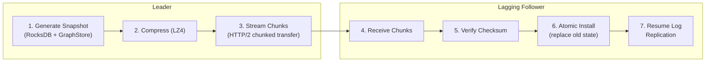

# Production-Grade High Availability

Building a distributed consensus cluster that works in a controlled environment is easy. Building one that survives network partitions, flapping connections, and storage corruption in a production data center is much harder.

Samyama Enterprise builds upon the core Raft implementation with several production-hardened enhancements.

## Hardened Network Transport

While the OSS version uses a simulated or basic TCP transport, Enterprise implements a high-performance **HTTP/2 based RPC layer** (via `Axum` and `Hyper`).

*   **Encryption**: All inter-node traffic is encrypted with TLS by default, ensuring that data replicated across the cluster is safe from interception.
*   **Multiplexing**: HTTP/2 allows multiple concurrent Raft messages (heartbeats, append entries, votes) to share a single connection, significantly reducing latency and overhead.
*   **Keep-Alive**: Intelligent probing detects "silent" network failures faster, triggering leader re-election before the application layer experiences a timeout.

## Robust Snapshot Synchronization

In a large cluster, a node that has been offline for a long time cannot catch up by replaying millions of individual log entries. It needs a **Snapshot**.

Samyama Enterprise automates the entire snapshot lifecycle:

1.  **Generation**: The Leader creates a consistent point-in-time image of the `GraphStore` and `RocksDB`.
2.  **Streaming**: The snapshot is compressed and streamed to the lagging Follower using a chunked transfer protocol to avoid memory spikes.
3.  **Atomic Installation**: The Follower installs the snapshot atomically, replacing its old state only after verifying the snapshot's checksum.

## Cluster Metrics & Health

Maintaining a healthy Raft cluster requires deep visibility into node roles and replication lag. Enterprise exports specific metrics for each node:
*   `raft_role`: Is this node a Leader, Follower, or Candidate?
*   `raft_term`: The current logical clock value.
*   `raft_replication_lag`: The distance (in sequence numbers) between the Leader's log and this node's log.

By monitoring these metrics, SREs can proactively identify lagging nodes or cluster instability before they impact service availability.
