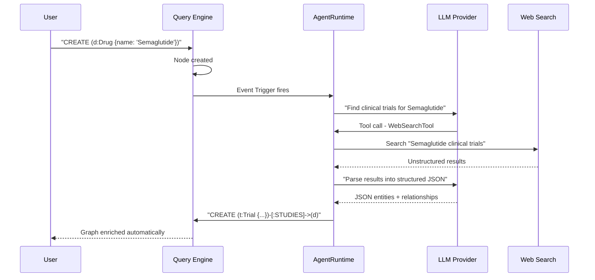

# Agentic Enrichment

Traditional databases are passive. They store what you give them. If you ask a question and the data isn't there, you get an empty result. 

Samyama introduces **Agentic Enrichment**—a paradigm shift where the database becomes an active participant in building its own knowledge.

## From RAG to GAK

We are all familiar with **Retrieval-Augmented Generation (RAG)**: using a database to help an LLM. 
Samyama implements **Generation-Augmented Knowledge (GAK)**: using an LLM to help build the database.

## The Autonomous Enrichment Loop

Samyama can be configured with **Enrichment Policies** via `AgentConfig`. When a new node is created or a specific property is queried, an autonomous agent (managed by `AgentRuntime`) can "wake up" to fill in the gaps.



### The Runtime Architecture

Inside the engine, the agent loop is implemented in `src/agent/mod.rs` using a `tool`-based architecture. 

```rust
pub struct AgentRuntime {
    config: AgentConfig,
    llm_client: Arc<NLQClient>,
    tools: HashMap<String, Box<dyn AgentTool>>,
}

#[async_trait]
pub trait AgentTool: Send + Sync {
    fn name(&self) -> &str;
    fn description(&self) -> &str;
    async fn execute(&self, input: &Value) -> Result<Value, AgentError>;
}
```

### Example: The Research Assistant
Imagine you are building a medical knowledge graph. You create a node for a new drug, `Semaglutide`.

**The Passive Way**: You manually search PubMed, find papers, and insert them.
**The Samyama Way**: 
1.  You create the `Drug` node.
2.  An **Event Trigger** fires an `AgentRuntime` instance.
3.  The Agent uses a `WebSearchTool` (implementing the `AgentTool` trait) to find recent clinical trials.
4.  The Agent interacts with the LLM via `NLQClient` to parse the unstructured results into structured JSON.
5.  The database automatically executes `CREATE` commands to link the new papers to the `Drug` node.

> **Developer Tip:** You can see this GAK paradigm in action by running `cargo run --example agentic_enrichment_demo`. This demo will automatically reach out to an LLM provider, search the web for missing node properties, and execute the Cypher queries to persist them in the local graph.

## Just-In-Time (JIT) Knowledge Graphs

This enables what we call a **JIT Knowledge Graph**. The graph doesn't need to be complete on day one. It grows and "heals" itself based on user interaction. 

If a user asks: *"How does the current Fed interest rate impact my mortgage?"* and the `Fed Rate` node is missing, the database can fetch the live rate, create the node, and then answer the question.

## Safety & Validation

Auto-generated Cypher from LLM outputs is validated before execution:

1. **Schema Validation**: Generated `CREATE` commands must target known labels and property types
2. **Query Safety**: The `NLQPipeline::is_safe_query()` method rejects destructive operations (`DELETE`, `DROP`) from agent-generated queries
3. **Rate Limiting**: The `AgentConfig` includes limits on enrichment operations per minute to prevent runaway loops
4. **Audit Trail**: All agent-generated mutations are logged (Enterprise) for traceability

> **See also:** The [AI & Vector Search](./ai_vector_search.md) chapter for the underlying HNSW infrastructure, and the [SDKs, CLI & API](./sdk_cli_api.md) chapter for how to access `AgentRuntime` via the SDK.

By integrating LLMs directly into the write pipeline, Samyama transforms from a simple storage engine into a dynamic, self-evolving brain.
