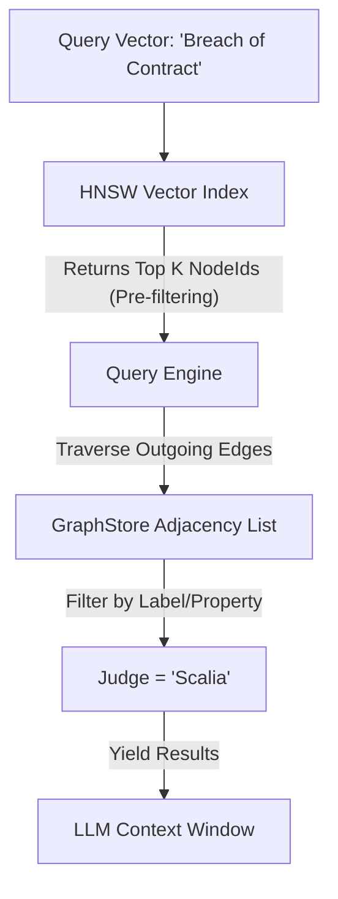

# AI & Vector Search

The "Vector Database" hype train has led to many specialized tools (Pinecone, Weaviate). But a vector is just a property of a node. Separating vectors from the graph creates data silos.

Samyama treats Vectors as **First-Class Citizens**.

## The HNSW Index & `VectorIndexManager`

We use the **Hierarchical Navigable Small World (HNSW)** algorithm (via the `hnsw_rs` crate) to index high-dimensional vectors. In Samyama, this is orchestrated by the `VectorIndexManager` defined in `src/vector/manager.rs`.

*   **Storage**: Vectors are stored persistently via `ColumnStore` or a dedicated RocksDB column family.
*   **Indexing**: The HNSW graph (`VectorIndex`) is maintained in memory for millisecond-speed nearest neighbor search.

```rust
pub struct VectorIndex {
    dimensions: usize,
    metric: DistanceMetric, // Cosine, L2, or DotProduct
    hnsw: Hnsw<'static, f32, CosineDistance>,
}
```

The system natively supports multiple distance metrics out-of-the-box (`Cosine`, `L2`, `DotProduct`) depending on the embedding model used, automatically matching the metric type to the specific index (`IndexKey`).

> **Developer Tip:** See `benches/vector_benchmark.rs` to observe how Samyama achieves over 15,000 queries per second (QPS) for 128-dimensional Cosine distance searches on commodity hardware.

## Graph RAG (Retrieval Augmented Generation)

The true power of Samyama comes from combining Vector Search with Graph Traversal in a single query.

**Scenario**: You want to find legal precedents that are *semantically similar* to a case file AND *cited by* a specific judge.

If using a pure Vector DB:
1.  Query Vector DB -> Get top 100 docs.
2.  Filter in application -> Keep only those cited by Judge X.
3.  Problem: You might filter out all 100 docs!

### The Samyama Graph RAG Architecture



Samyama achieves this efficiently using the `VectorSearchOperator` intertwined with standard graph operators:

```cypher
// 1. Vector Search finds the entry points
CALL db.index.vector.queryNodes('Precedent', 'embedding', $query_vector, 100)
YIELD node, score

// 2. Graph Pattern filters them immediately
MATCH (node)<-[:CITED]-(j:Judge {name: 'Scalia'})

// 3. Return best matches
RETURN node.summary, score
ORDER BY score DESC LIMIT 5
```

This "Pre-filtering" happens directly inside the execution engine, minimizing memory transfers and enabling highly efficient Retrieval-Augmented Generation workflows.

## Embedding Providers

Samyama stores and indexes vectors — but **generating** them (turning text, images, or other data into vectors) is a separate concern. The database is intentionally embedding-model-agnostic: you choose the provider that fits your stack.

### Provider Options

| Provider | Language | Model Example | Use Case |
| :--- | :--- | :--- | :--- |
| **Mock** (default) | Rust/Python | Random vectors | Testing, CI, development |
| **sentence-transformers** | Python | `all-MiniLM-L6-v2` | Production Python apps |
| **ONNX Runtime** | Rust (`ort` crate) | Same models, ONNX format | Production Rust apps |
| **OpenAI API** | Any (HTTP) | `text-embedding-3-small` | Cloud-hosted, no GPU needed |
| **Ollama** | Any (HTTP) | `nomic-embed-text` | Local, private, no API keys |

### Why Mock is the Default

Samyama ships with a **Mock** embedding provider that generates random vectors. This is deliberate:

- **Zero dependencies**: No model downloads, no Python, no GPU drivers
- **Fast CI**: Tests and benchmarks run without external services
- **Small binary**: No +30MB ONNX Runtime or ML framework bundled
- **Your choice**: Embedding models evolve fast — we don't lock you in

For production, you bring your own embeddings. The database doesn't care *how* the vectors were generated — it indexes and searches them the same way.

### Python SDK with sentence-transformers

The most common path for Python applications. Install `sentence-transformers` alongside the Samyama Python SDK:

```bash
pip install samyama sentence-transformers
```

```python
from samyama import SamyamaClient
from sentence_transformers import SentenceTransformer

# Load embedding model (downloads ~80MB on first run)
model = SentenceTransformer("all-MiniLM-L6-v2")  # 384 dimensions

client = SamyamaClient.embedded()

# Create vector index
client.create_vector_index("Document", "embedding", 384, "cosine")

# Generate and store embeddings
texts = ["Graph databases unify structure and search",
         "Knowledge graphs power industrial operations"]
embeddings = model.encode(texts)

for i, emb in enumerate(embeddings):
    node_id = client.query("default",
        f"CREATE (d:Document {{title: '{texts[i]}'}}) RETURN id(d)")[0][0]
    client.add_vector("Document", "embedding", node_id, emb.tolist())

# Semantic search
query_emb = model.encode("How do graph databases work?").tolist()
results = client.vector_search("Document", "embedding", query_emb, 5)
# Returns: [(node_id, distance), ...]
```

### Rust with ONNX Runtime

For Rust applications that need in-process embeddings without Python, use the `ort` crate with ONNX-exported models:

```bash
# Export a sentence-transformers model to ONNX (one-time, requires Python)
python -c "
from optimum.onnxruntime import ORTModelForFeatureExtraction
model = ORTModelForFeatureExtraction.from_pretrained(
    'sentence-transformers/all-MiniLM-L6-v2', export=True)
model.save_pretrained('./model_onnx')
"
```

```rust
// In your Rust application
use ort::{Session, Value};

let session = Session::builder()?
    .with_model_from_file("model_onnx/model.onnx")?;

// Tokenize and run inference (simplified — real code needs a tokenizer)
let embeddings = session.run(inputs)?;

// Store in Samyama
client.create_vector_index("Document", "embedding", 384, DistanceMetric::Cosine).await?;
client.add_vector("Document", "embedding", node_id, &embedding_vec).await?;
```

### HTTP Embedding Providers

Any service that exposes an embedding endpoint works. Generate vectors externally, store them in Samyama:

```bash
# OpenAI
curl -s https://api.openai.com/v1/embeddings \
  -H "Authorization: Bearer $OPENAI_API_KEY" \
  -d '{"model":"text-embedding-3-small","input":"Graph databases"}' \
  | jq '.data[0].embedding'

# Ollama (local)
curl -s http://localhost:11434/api/embeddings \
  -d '{"model":"nomic-embed-text","prompt":"Graph databases"}' \
  | jq '.embedding'
```

Then store via Samyama's HTTP API or SDK. The database is agnostic to the source.

### Choosing a Provider

```
Need real embeddings?
├── Python app? → sentence-transformers (easiest, best model selection)
├── Rust app?   → ort crate + ONNX model (fastest, no Python dep)
├── Any language, cloud OK? → OpenAI API (simplest, pay-per-use)
├── Any language, local/private? → Ollama (free, runs anywhere)
└── Just testing? → Mock (default, zero setup)
```

> **See also:** The [Agentic Enrichment](./agentic_enrichment.md) chapter for how vector search powers autonomous knowledge graph expansion, and the [SDKs, CLI & API](./sdk_cli_api.md) chapter for the `VectorClient` API.
