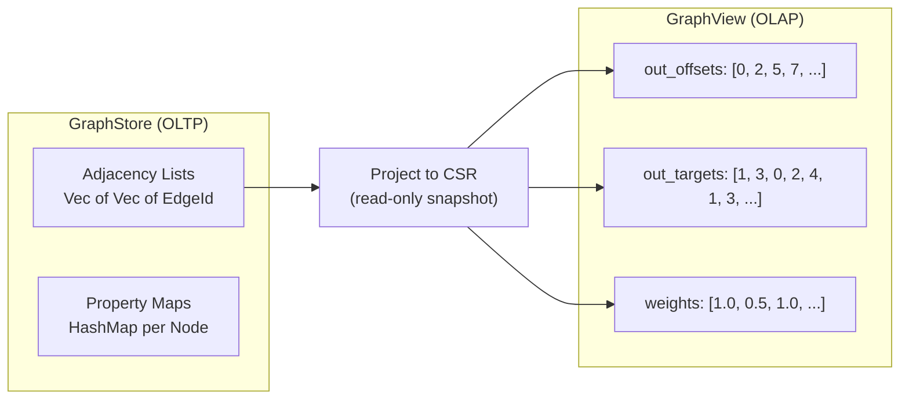

# Analytical Power (CSR & Algorithms)

Transactional queries (OLTP) usually touch a small subgraph: "Find Alice's friends."
Analytical queries (OLAP) touch the *entire* graph: "Rank every webpage by importance (PageRank)."

The pointer-chasing structure of a standard graph database (Adjacency Lists) is excellent for OLTP but suboptimal for OLAP due to cache misses.

Samyama solves this by introducing a dedicated **Analytics Engine** in the `samyama-graph-algorithms` crate. This crate is decoupled from the core storage engine, allowing it to iterate independently and even be used as a standalone library.

## The CSR (Compressed Sparse Row) Format

When you run an algorithm like PageRank or Weakly Connected Components, Samyama doesn't run it directly on the `GraphStore`. Instead, it "projects" the relevant subgraph into a highly optimized read-only structure called **CSR**.

A Graph $G=(V, E)$ in CSR format is represented by three contiguous arrays:
1.  **`out_offsets`**: Indices indicating where each node's neighbor list starts in the `out_targets` array.
2.  **`out_targets`**: A massive, flat array containing all neighbor `NodeId`s.
3.  **`weights`**: (Optional) Edge weights corresponding to the `out_targets` list.

```rust
pub struct GraphView {
    pub out_offsets: Vec<usize>,
    pub out_targets: Vec<NodeId>,
    pub weights: Vec<f32>,
}
```



### Why CSR?
*   **Memory Efficiency**: CSR eliminates the memory overhead of adjacency lists (which are `Vec<Vec<EdgeId>>` in the core engine). 
*   **Sequential Memory Access**: Iterating through a node's neighbors becomes a simple sequential scan of the `out_targets` array, which the CPU can prefetch with nearly 100% accuracy.
*   **Zero-Lock Parallelism**: Since the CSR structure is immutable once built, algorithms can scale across all available CPU cores using **Rayon** without a single mutex or atomic lock.

## The Algorithm Library (`samyama-graph-algorithms`)

The `samyama-graph-algorithms` crate includes an extensive range of graph analytical operations. Every algorithm accesses the graph through the `GraphView` representation (CSR Format).

Supported algorithms currently include:

1.  **Centrality & Importance**:
    *   `pagerank`: Global node importance ranking.
    *   `lcc` (Local Clustering Coefficient): Measuring "tight-knitness" around individual nodes.

2.  **Community Detection & Connectivity**:
    *   `weakly_connected_components` (WCC): Identifying isolated clusters ignoring edge direction.
    *   `strongly_connected_components` (SCC): Finding subgraphs where every node is mutually reachable.
    *   `cdlp` (Community Detection via Label Propagation): Discovering overlapping and non-overlapping dense networks.
    *   `count_triangles`: Analyzing social cohesion.

3.  **Pathfinding & Network Flow**:
    *   `bfs`: Breadth-first traversal.
    *   `dijkstra`: Finding shortest paths with edge weights.
    *   `bfs_all_shortest_paths`: Resolving every potential path of minimum distance between entities.
    *   `edmonds_karp`: Calculating the absolute maximum flow rate between a source and a sink node.
    *   `prim_mst`: Determining the Minimum Spanning Tree of the graph.

4.  **Statistical & Dimensionality Reduction**:
    *   `pca` (Principal Component Analysis): Reduces high-dimensional node features to their principal components. Supports two solvers:
        -   **Randomized SVD** (default): Uses the Halko-Martinsson-Tropp algorithm for efficient dimensionality reduction on large datasets. Automatically selected when `n > 500`.
        -   **Power Iteration** (legacy): Deflation-based eigenvector computation with Gram-Schmidt re-orthogonalization.

### PCA Configuration

```rust
pub struct PcaConfig {
    pub n_components: usize,      // Number of components (default: 2)
    pub max_iterations: usize,    // For Power Iteration only (default: 100)
    pub tolerance: f64,           // Convergence threshold (default: 1e-6)
    pub center: bool,             // Subtract column means (default: true)
    pub scale: bool,              // Divide by std dev (default: false)
    pub solver: PcaSolver,        // Auto, Randomized, or PowerIteration
}
```

The `PcaResult` includes principal components, explained variance ratios, and `transform()` / `transform_one()` methods for projecting new data points.

> **Enterprise Note**: GPU-accelerated PCA is available in Samyama Enterprise for datasets exceeding 50,000 nodes (see the [Enterprise Edition](./samyama_enterprise.md) chapter).

## SDK Integration

The same CSR-based algorithms are accessible through the Samyama SDK ecosystem. The Rust SDK's `AlgorithmClient` trait provides direct method access, while the Python and TypeScript SDKs execute algorithms via Cypher queries.

```python
from samyama import SamyamaClient

# Embedded mode: algorithms run in-process at Rust speeds
client = SamyamaClient.embedded()

# Execute PageRank via Cypher
result = client.query("""
    MATCH (n:Person)-[:KNOWS]->(m:Person)
    RETURN n.name, n.pagerank
""")
```

> **Note:** The Rust SDK's `AlgorithmClient` provides direct Rust API access to all algorithms (e.g., `client.page_rank(config, "Person", "KNOWS")`) without going through Cypher. See the [SDKs, CLI & API](./sdk_cli_api.md) chapter for details.

This architecture allows Samyama to replace dedicated graph analytics frameworks like NetworkX (which is slow) or GraphFrames (which requires Spark), providing a single engine for storage and analysis.
