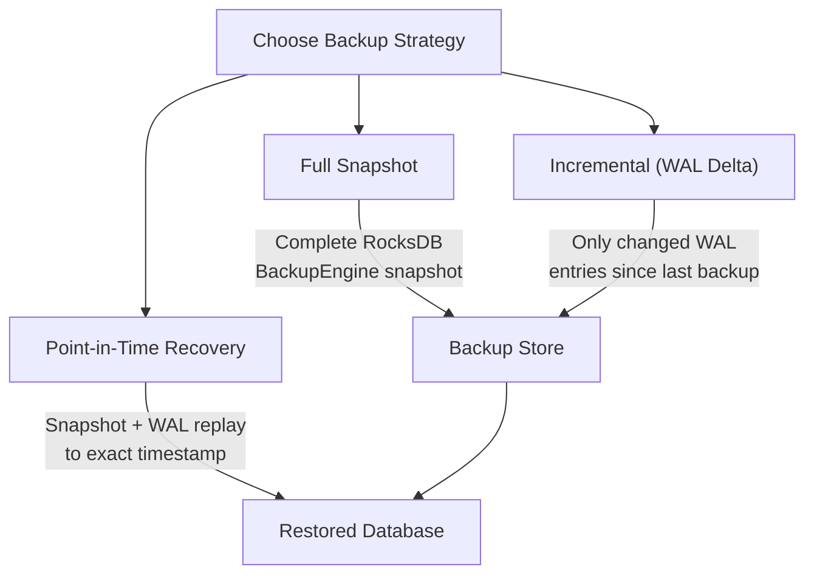

# Backup & Disaster Recovery

In an enterprise setting, a database is only as good as its last backup. Samyama Enterprise includes a comprehensive data protection suite that ensures zero data loss and minimal downtime.

## Backup Strategies



Samyama supports three distinct levels of backup:

### 1. Full Snapshots
Leveraging RocksDB's `BackupEngine`, Samyama can create a consistent, point-in-time snapshot of the entire database state without blocking incoming queries. These snapshots are stored in a dedicated backup directory and can be moved to off-site storage (e.g., AWS S3).

### 2. Incremental Backups
To optimize for storage and speed, Samyama can perform incremental backups. It tracks the Write-Ahead Log (WAL) sequence numbers and only archives the data blocks that have changed since the last full or incremental backup.

### 3. Point-in-Time Recovery (PITR)
This is the most advanced feature of our recovery engine. By replaying the archived WAL entries against a snapshot, Samyama can restore the database to an exact moment in time. 
*   **Use Case**: If a developer accidentally runs a `MATCH (n) DELETE n` query at 10:30:05 AM, the administrator can restore the system to 10:30:04 AM, undoing the damage with microsecond precision.

## The ADMIN.BACKUP Protocol

Backups are managed via the RESP protocol using standard Redis-compatible clients.

```bash
# Create a new backup
redis-cli ADMIN.BACKUP CREATE

# List existing backups
redis-cli ADMIN.BACKUP LIST

# Verify the integrity of a backup
redis-cli ADMIN.BACKUP VERIFY 5
```

## Retention Policies

To prevent disk exhaustion, Samyama Enterprise allows administrators to define automatic retention policies:
*   **Max Count**: Keep only the last $N$ backups.
*   **Max Age**: Automatically delete backups older than $X$ days.

This automated maintenance ensures that the system remains operational without manual intervention, providing peace of mind for site reliability engineers.

## Recovery Guarantees

| Metric | Guarantee |
| :--- | :--- |
| **RPO (Recovery Point Objective)** | Zero data loss with WAL-based incremental backups; microsecond precision with PITR |
| **RTO (Recovery Time Objective)** | Minutes for full snapshot restore; seconds for WAL replay of recent changes |
| **Consistency** | Backups use RocksDB's `BackupEngine` which creates a consistent snapshot without blocking writes |
| **Concurrent Writes** | Backup operations do not block incoming queries—RocksDB snapshots are lock-free |

> **Developer Tip:** Schedule backups during off-peak hours for minimal performance impact. Use `ADMIN.BACKUP VERIFY` periodically to ensure backup integrity before you need them.
