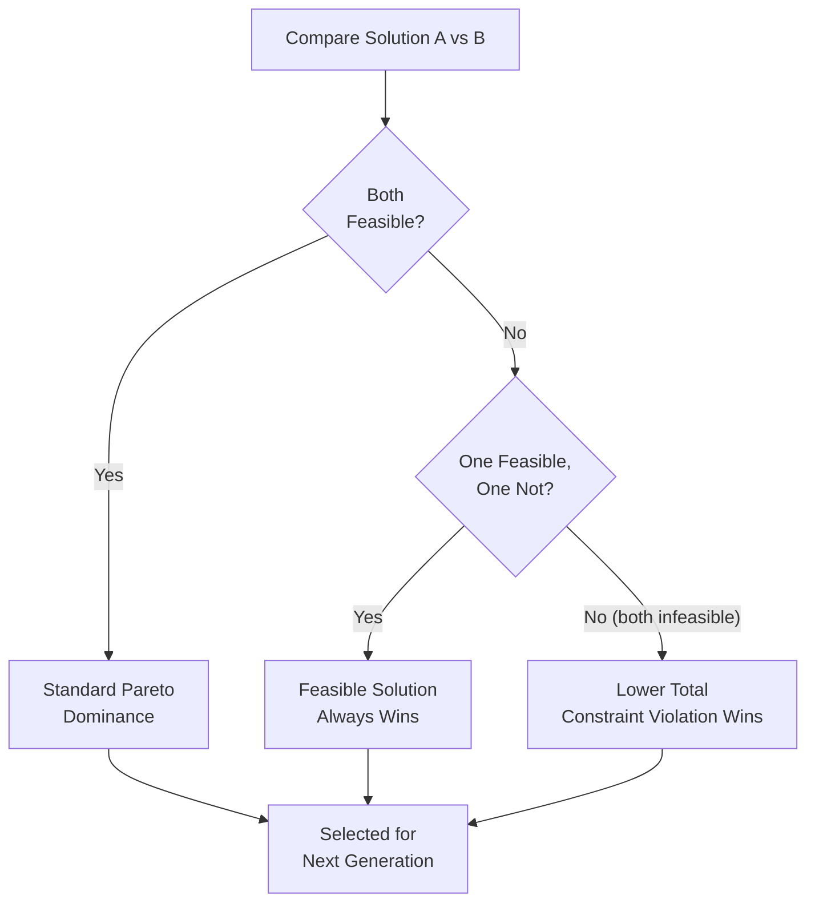

# Constrained Multi-Objective Optimization

The `samyama-optimization` crate (included in the open-source Community Edition) provides full support for multi-objective optimization, including **NSGA-II** and **MOTLBO** with the **Constrained Dominance Principle** for handling complex real-world constraints.

> **Note**: All 22 metaheuristic solvers—including the multi-objective solvers NSGA-II and MOTLBO—are available in the OSS edition. The Enterprise edition adds GPU-accelerated constraint evaluation for large-scale problems.

## The Reality of Constraints

In academic problems, objectives like "Minimize Cost" and "Maximize Quality" are often explored in a vacuum. In industry, these objectives must be solved while adhering to hard physical or regulatory constraints:
*   **Supply Chain**: Minimize lead time AND maximize profit, *but* total warehouse volume cannot exceed 5,000m³.
*   **Energy**: Maximize grid stability AND minimize carbon output, *but* no single plant can operate at >95% capacity for more than 4 hours.

## Constrained Dominance Principle

The `samyama-optimization` crate implements this principle in the **NSGA-II** and **MOTLBO** solvers. Instead of a simple "penalty" approach (which often struggles to find feasible solutions in tight spaces), the selection logic follows a strict hierarchy:



1.  **Feasibility First**: A solution that satisfies all constraints is always preferred over one that violates any constraint.
2.  **Comparative Violation**: Between two infeasible solutions, the one with the lower total constraint violation is preferred.
3.  **Standard Dominance**: Between two feasible solutions, standard Pareto dominance rules apply.

## Defining Constraints in Cypher

The `algo.or.solve` procedure allows for explicit constraint definitions:

```cypher
CALL algo.or.solve({
  algorithm: 'NSGA2',
  label: 'Generator',
  objectives: ['cost', 'emissions'],
  constraints: [
    { property: 'load', max: 500.0 },
    { property: 'temperature', max: 100.0 }
  ],
  population_size: 100
})
YIELD pareto_front
```

This advanced logic ensures that the "Pareto Front" returned by the solver contains solutions that are not only optimal but also **physically executable**, making Samyama a powerful tool for industrial decision-making.
