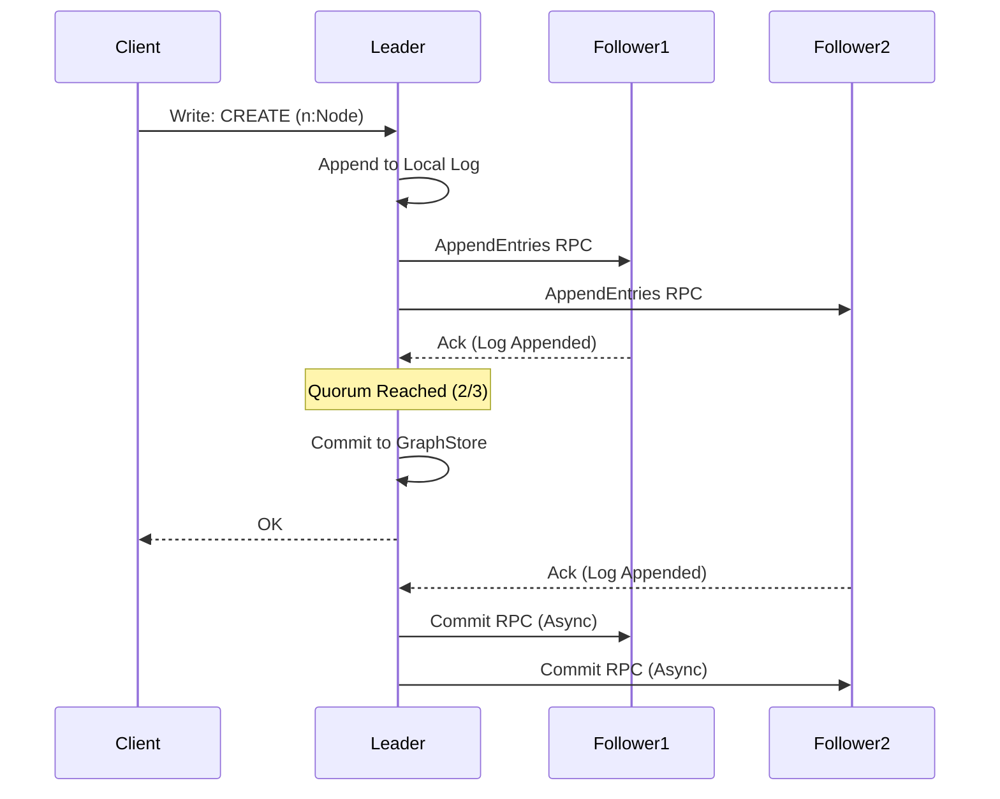

# Distributed Consensus & Sharding

A single node can only go so far. To scale beyond a single machine's memory and CPU, Samyama employs a distributed architecture built on the Raft consensus algorithm.

## Consistency via Raft

We use the `openraft` crate, a modern, asynchronous implementation of the Raft protocol.

Raft provides **Strong Consistency** by ensuring that a cluster of nodes agrees on the order of operations (the Log) before applying them to the state machine (the Graph).

### The Raft Cluster Architecture



### The Raft Loop
1.  **Leader Election**: Nodes elect a Leader.
2.  **Log Replication**: All write requests go to the Leader. The Leader appends the request to its log and sends it to Followers.
3.  **Commit**: Once a majority (Quorum) acknowledges the log entry, the Leader commits it.
4.  **Apply**: The committed entry is applied to the `GraphStore`.

This ensures that if a client receives an "OK" response, the data is durable on at least $N/2 + 1$ nodes.

> **Developer Tip:** You can run a fully functional 3-node in-memory cluster locally to observe Leader Election and Log Replication by running `cargo run --example cluster_demo`.

## Sharding Strategy

Samyama implements **Tenant-Level Sharding**.

In a multi-tenant environment (e.g., a SaaS platform serving many companies), data from different tenants is naturally isolated.

*   **Shard**: A logical partition of the data.
*   **Routing**: The `Router` component (`src/sharding/router.rs`) maps a `TenantId` to a specific Raft Cluster (Shard).

```rust
// Simplified Routing Logic
pub fn route(&self, tenant_id: &str) -> ClusterId {
    let hash = seahash::hash(tenant_id.as_bytes());
    hash % self.num_shards
}
```

This approach avoids the complexity of distributed graph partitioning (cutting edges across machines) while offering infinite horizontal scale for multi-tenant workloads.

### Future: Graph Partitioning
For single-tenant graphs that exceed one machine, we are researching "Graph-Aware Partitioning" using METIS, but for now, Tenant Sharding is the production-ready strategy.
