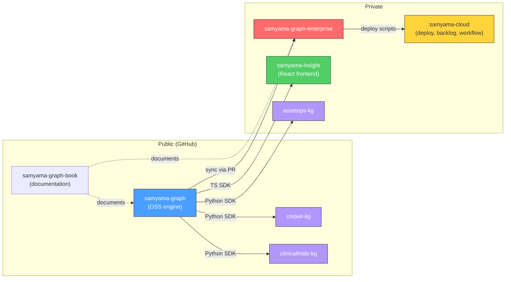
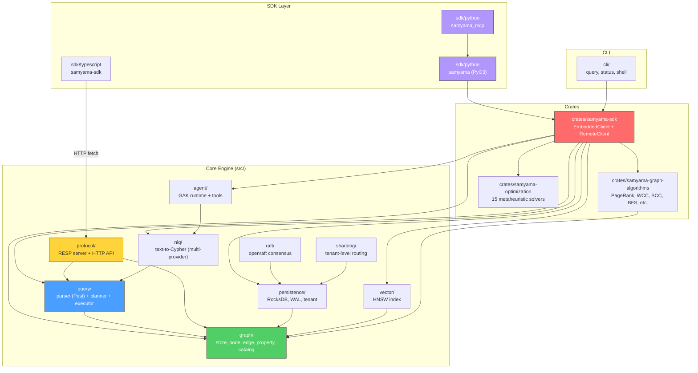
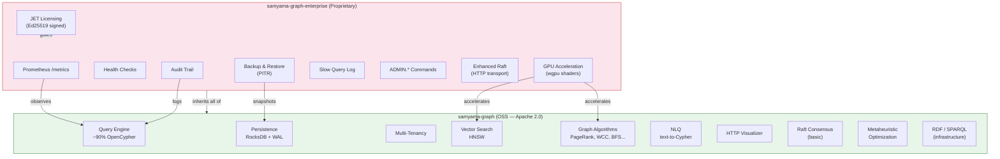
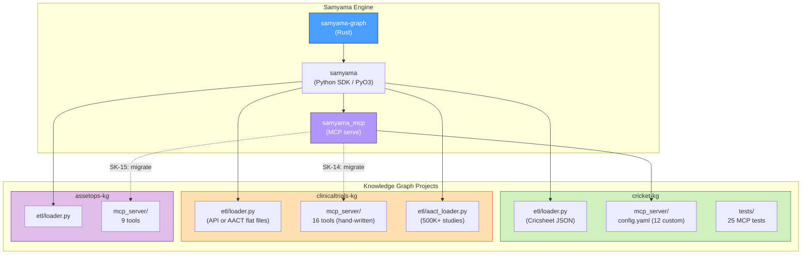
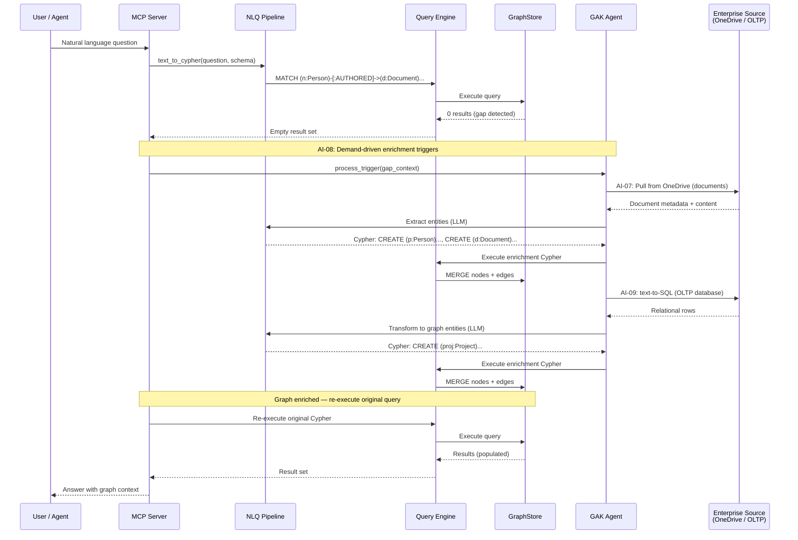
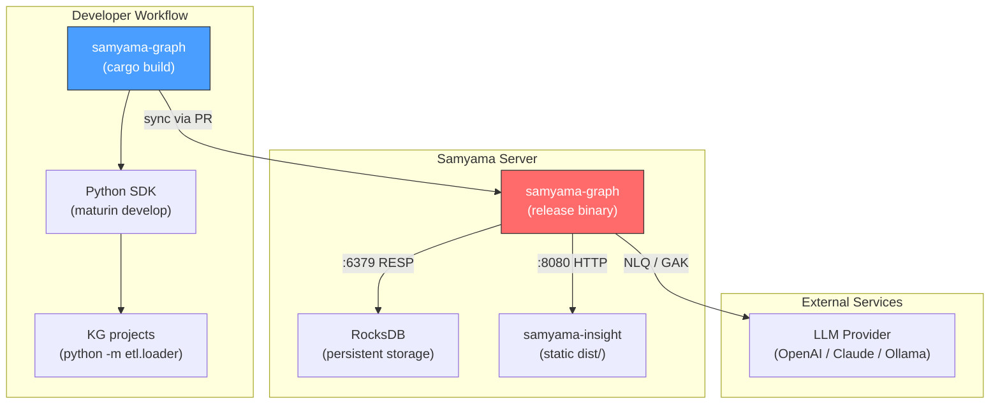
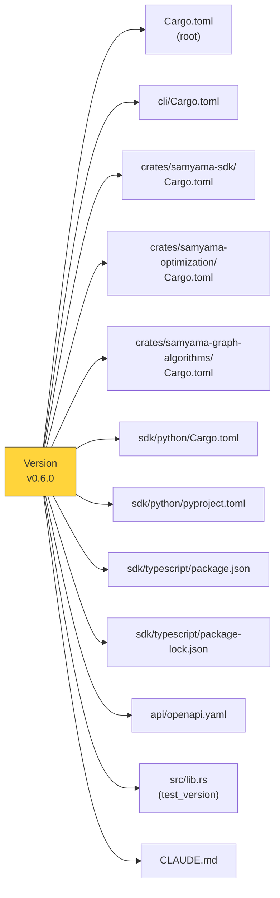

# Ecosystem Architecture & Dependency Graph

This chapter maps the full Samyama ecosystem: repositories, modules, features, and knowledge graph projects — with dependency graphs showing how everything connects.

---

## 1. Repository Map

The Samyama ecosystem spans 7 repositories.

| Repository | Visibility | Purpose |
|---|---|---|
| `samyama-graph` | Public | Rust graph DB engine (OSS) |
| `samyama-graph-enterprise` | Private | Enterprise features (GPU, monitoring, backup, licensing) |
| `samyama-graph-book` | Public | mdBook documentation + research papers |
| `samyama-insight` | Private | React + Vite frontend (schema explorer, query console, visualizer) |
| `samyama-cloud` | Private | Deployment configs, backlog, workflow |
| `cricket-kg` | Public | Cricket knowledge graph (Cricsheet data) |
| `clinicaltrials-kg` | Public | Clinical trials KG (ClinicalTrials.gov / AACT data) |
| `assetops-kg` | Private | Asset operations KG (industrial IoT data) |

---

## 2. samyama-graph Module Architecture

The OSS engine is organized into 7 core modules, 3 workspace crates, and 3 SDK packages.

### Module Responsibilities

| Module | Key Types | Entry Points |
|---|---|---|
| `graph/` | `GraphStore`, `Node`, `Edge`, `PropertyValue`, `GraphCatalog` | In-memory storage, O(1) lookups, sorted adjacency lists |
| `query/` | `QueryExecutor`, `MutQueryExecutor`, `PhysicalOperator` | Pest parser → AST → logical plan → physical plan → Volcano iterator |
| `protocol/` | `RespServer`, `HttpServer`, `CommandHandler` | RESP on :6379, HTTP on :8080 |
| `persistence/` | `StorageEngine`, `WAL`, `TenantManager` | RocksDB column families, per-tenant isolation |
| `raft/` | `RaftNode`, `GraphStateMachine`, `ClusterManager` | openraft-based leader election + log replication |
| `nlq/` | `NLQPipeline`, `NLQClient`, `LLMProvider` | text → schema-aware prompt → LLM → Cypher extraction |
| `agent/` | `AgentRuntime`, `Tool` trait, `AgentConfig` | GAK: query gap → enrichment prompt → LLM → Cypher → ingest |
| `vector/` | `HnswIndex`, `VectorSearch` | HNSW with cosine/L2/inner-product, bincode persistence |
| `crates/samyama-sdk` | `SamyamaClient`, `EmbeddedClient`, `RemoteClient` | Async trait with extension traits (AlgorithmClient, VectorClient) |
| `crates/samyama-graph-algorithms` | `GraphView` (CSR), PageRank, WCC, SCC, BFS, Dijkstra | Build CSR projection → run algorithm → return results |
| `crates/samyama-optimization` | `Solver` trait, GA, PSO, SA, ACO, etc. | 15 solvers with `or.solve()` Cypher procedure |
| `sdk/python/samyama` | `SamyamaClient` (PyO3) | `.embedded()` / `.connect(url)` factory methods |
| `sdk/python/samyama_mcp` | `SamyamaMCPServer`, generators, schema discovery | Auto-generate MCP tools from graph schema |
| `sdk/typescript` | `SamyamaClient` class | Pure TS with `fetch`, `.connectHttp()` factory |

---

## 3. Enterprise Feature Layering (OSS → SGE)

### Feature Availability Matrix

| Feature | Community (OSS) | Enterprise |
|---|---|---|
| OpenCypher query engine | ✅ | ✅ |
| Persistence (RocksDB + WAL) | ✅ | ✅ |
| Multi-tenancy | ✅ | ✅ |
| Vector search (HNSW) | ✅ | ✅ |
| Graph algorithms (11 algos) | ✅ | ✅ |
| NLQ (text-to-Cypher) | ✅ | ✅ |
| Raft consensus (basic) | ✅ | ✅ |
| Metaheuristic optimization | ✅ | ✅ |
| MCP server generation | ✅ | ✅ |
| Prometheus /metrics | ❌ | ✅ |
| Backup & restore (PITR) | ❌ | ✅ |
| Audit trail | ❌ | ✅ |
| ADMIN.* commands | ❌ | ✅ |
| GPU acceleration (wgpu) | ❌ | ✅ |
| Enhanced Raft (HTTP transport) | ❌ | ✅ |

---

## 4. Knowledge Graph Projects

All KG projects share the same stack: Python SDK → samyama-mcp-serve → custom config.

### KG Schema Summary

| KG | Node Labels | Edge Types | Data Source | Data Volume |
|---|---|---|---|---|
| cricket-kg | 6 (Player, Match, Team, Venue, Tournament, Season) | 12 | Cricsheet JSON | ~100-500 matches |
| clinicaltrials-kg | 15 (ClinicalTrial, Condition, Intervention, Sponsor, Site, ...) | 25 | ClinicalTrials.gov API or AACT flat files | ~500K+ studies |
| assetops-kg | 8 (Asset, Component, FailureMode, MaintenanceRecord, ...) | 11 | Industrial IoT data | Domain-specific |

---

## 5. Feature Dependency Graph (Backlog)

The complete feature dependency chain across all backlog items. Green = done, blue = in progress, white = planned.

```mermaid
graph TB
    subgraph "Query Engine (Done ✅)"
        QE01["QE-01<br/>Parameterized $param"]
        QE02["QE-02<br/>PROFILE stats"]
        QE03["QE-03<br/>shortestPath()"]
        QE07["QE-07<br/>CALL procedures"]
    end

    subgraph "Cypher Completeness (Done ✅)"
        CY01["CY-01<br/>collect(DISTINCT)"]
        CY02["CY-02<br/>datetime args"]
        CY04["CY-04<br/>Named paths"]
        CY05["CY-05<br/>Path functions"]
    end

    subgraph "Planner / Optimizer (Done ✅)"
        QP01["QP-01 Predicate pushdown"]
        QP02["QP-02 Cost-based"]
        QP05["QP-05 Plan cache"]
        QP11["QP-11 Graph-native enum"]
        QP12["QP-12 Triple stats"]
        QP13["QP-13 ExpandInto"]
        QP14["QP-14 Direction reversal"]
        QP15["QP-15 Logical plan IR"]
    end

    subgraph "Planner (Planned)"
        QP06["QP-06<br/>Histogram stats"]
        QP09["QP-09<br/>Operator fusion"]
        QP10["QP-10<br/>Adaptive exec"]
    end

    subgraph "Indexes (Done ✅)"
        IX01["IX-01..06<br/>DROP/SHOW/Composite/Unique"]
    end

    subgraph "Indexes (Planned)"
        IX07["IX-07<br/>Full-text index"]
        IX08["IX-08<br/>OR union scans"]
    end

    subgraph "Performance (Done ✅)"
        PF01["PF-01 CSR"]
        PF04["PF-04 Late materialization"]
        PF06["PF-06 AST cache"]
    end

    subgraph "Performance (Planned)"
        PF07["PF-07<br/>MVCC"]
        PF09["PF-09<br/>WCO joins"]
        PF10["PF-10<br/>Parallel exec"]
    end

    subgraph "Data Structures (Done ✅)"
        DS01["DS-01 Triple stats"]
        DS02["DS-02 Sorted adjacency"]
    end

    subgraph "Data Structures (Planned)"
        DS03["DS-03<br/>Type-partitioned adj"]
    end

    subgraph "SDK / MCP (Done ✅)"
        SK01["SK-01..06<br/>Rust/Python/TS SDK + CLI"]
        SK09["SK-09 npm publish"]
        SK10["SK-10 EXPLAIN/PROFILE"]
        SK11["SK-11 Schema/Stats"]
        SK12["SK-12<br/>samyama-mcp-serve"]
        SK13["SK-13<br/>cricket-kg MCP"]
    end

    subgraph "SDK (Planned)"
        SK14["SK-14<br/>clinicaltrials MCP"]
        SK15["SK-15<br/>assetops MCP"]
    end

    subgraph "HA (Done ✅)"
        HA01["HA-01 Raft"]
        HA02["HA-02 Sharding"]
        HA03["HA-03 Vector persist"]
    end

    subgraph "HA (Planned)"
        HA04["HA-04<br/>Temporal queries"]
        HA05["HA-05<br/>Graph sharding"]
        HA06["HA-06<br/>Distributed exec"]
    end

    subgraph "AI (Done ✅)"
        AI01["AI-01 GAK runtime"]
        AI02["AI-02 NLQ"]
        AI03["AI-03 Auto-embed"]
    end

    subgraph "AI / JIT KG (Planned)"
        AI07["AI-07<br/>Enterprise connectors"]
        AI08["AI-08<br/>Demand-driven agent"]
        AI09["AI-09<br/>Text-to-SQL bridge"]
        AI10["AI-10<br/>JIT KG demo"]
    end

    subgraph "GPU (Done ✅)"
        GP01["GP-01..10<br/>PageRank, CDLP, LCC,<br/>PCA, triangles, vectors,<br/>aggregates, sort"]
    end

    subgraph "Benchmarks (Done ✅)"
        BM01["BM-01..03<br/>Graphalytics, SNB, FinBench"]
    end

    subgraph "Benchmarks (Planned)"
        BM04["BM-04<br/>SF10 scale"]
        BM05["BM-05<br/>SNB BI tuning"]
        BM07["BM-07<br/>Comparative bench"]
    end

    subgraph "Visualizer (Done ✅)"
        VZ01["VZ-01..05<br/>Plan DAG, PROFILE,<br/>Stats, Console, Features"]
        VZ07["VZ-07..10<br/>Schema, CSV/JSON Import, E2E"]
    end

    subgraph "KG Projects"
        KG01["KG-01<br/>AACT full loader<br/>(in progress)"]
    end

    %% Dependencies
    CY01 & CY02 & QE03 & CY04 --> BM05
    CY04 --> CY05
    PF06 --> QP05
    QP01 & QP02 --> BM04
    PF07 --> HA04
    DS02 --> PF09
    HA05 --> HA06
    QE01 --> QP11
    QP12 --> QP11
    DS02 --> QP13
    QP14 --> QP11
    QP15 --> QP11
    SK09 --> VZ01
    SK10 --> VZ01
    SK11 --> VZ07
    QE07 --> VZ07
    SK12 --> SK13
    SK12 --> SK14
    SK12 --> SK15

    %% JIT KG chain
    AI01 --> AI07
    AI02 --> AI07
    SK12 --> AI07
    AI02 --> AI09
    AI07 --> AI08
    AI09 --> AI08
    AI08 --> AI10

    %% KG-01
    IX01 --> KG01

    %% Benchmark deps
    BM07 -.-> BM05

    style QE01 fill:#51cf66,stroke:#333,color:#fff
    style QE02 fill:#51cf66,stroke:#333,color:#fff
    style QE03 fill:#51cf66,stroke:#333,color:#fff
    style QE07 fill:#51cf66,stroke:#333,color:#fff
    style CY01 fill:#51cf66,stroke:#333,color:#fff
    style CY02 fill:#51cf66,stroke:#333,color:#fff
    style CY04 fill:#51cf66,stroke:#333,color:#fff
    style CY05 fill:#51cf66,stroke:#333,color:#fff
    style QP01 fill:#51cf66,stroke:#333,color:#fff
    style QP02 fill:#51cf66,stroke:#333,color:#fff
    style QP05 fill:#51cf66,stroke:#333,color:#fff
    style QP11 fill:#51cf66,stroke:#333,color:#fff
    style QP12 fill:#51cf66,stroke:#333,color:#fff
    style QP13 fill:#51cf66,stroke:#333,color:#fff
    style QP14 fill:#51cf66,stroke:#333,color:#fff
    style QP15 fill:#51cf66,stroke:#333,color:#fff
    style IX01 fill:#51cf66,stroke:#333,color:#fff
    style PF01 fill:#51cf66,stroke:#333,color:#fff
    style PF04 fill:#51cf66,stroke:#333,color:#fff
    style PF06 fill:#51cf66,stroke:#333,color:#fff
    style DS01 fill:#51cf66,stroke:#333,color:#fff
    style DS02 fill:#51cf66,stroke:#333,color:#fff
    style SK01 fill:#51cf66,stroke:#333,color:#fff
    style SK09 fill:#51cf66,stroke:#333,color:#fff
    style SK10 fill:#51cf66,stroke:#333,color:#fff
    style SK11 fill:#51cf66,stroke:#333,color:#fff
    style SK12 fill:#51cf66,stroke:#333,color:#fff
    style SK13 fill:#51cf66,stroke:#333,color:#fff
    style HA01 fill:#51cf66,stroke:#333,color:#fff
    style HA02 fill:#51cf66,stroke:#333,color:#fff
    style HA03 fill:#51cf66,stroke:#333,color:#fff
    style AI01 fill:#51cf66,stroke:#333,color:#fff
    style AI02 fill:#51cf66,stroke:#333,color:#fff
    style AI03 fill:#51cf66,stroke:#333,color:#fff
    style GP01 fill:#51cf66,stroke:#333,color:#fff
    style BM01 fill:#51cf66,stroke:#333,color:#fff
    style VZ01 fill:#51cf66,stroke:#333,color:#fff
    style VZ07 fill:#51cf66,stroke:#333,color:#fff
    style KG01 fill:#4a9eff,stroke:#333,color:#fff
    style AI07 fill:#fff,stroke:#333
    style AI08 fill:#fff,stroke:#333
    style AI09 fill:#fff,stroke:#333
    style AI10 fill:#fff,stroke:#333
```

---

## 6. Data Flow: Query → Enrichment → Response

This diagram shows the runtime data flow for a JIT KG query, incorporating the planned AI-07..AI-10 features.

---

## 7. Deployment Architecture

---

## 8. Version Sync Points

All packages must stay version-aligned. These are the 13 files that must be updated together on a version bump (Step 0.5 in the workflow):

---

## 9. Technology Stack

| Layer | Technology | Purpose |
|---|---|---|
| **Language** | Rust (2021 edition) | Core engine, persistence, protocol |
| **Parser** | Pest (PEG) | OpenCypher grammar → AST |
| **Storage** | RocksDB | Persistent key-value with column families |
| **Consensus** | openraft | Raft leader election + log replication |
| **Vector Index** | Custom HNSW | Approximate nearest neighbor search |
| **GPU** | wgpu + WGSL shaders | GPU-accelerated algorithms (enterprise) |
| **Python SDK** | PyO3 0.22 + maturin | Rust → Python FFI binding |
| **MCP Framework** | FastMCP v2 | Model Context Protocol stdio server |
| **TypeScript SDK** | Pure TS + fetch | HTTP client for browser/Node.js |
| **Frontend** | React + Vite + shadcn/ui | Interactive dashboard (samyama-insight) |
| **E2E Testing** | Playwright | Browser-based end-to-end tests |
| **Benchmarks** | Criterion | Rust micro-benchmarks (10 suites) |
| **CI/CD** | GitHub Actions | Automated builds, tests, sync |
| **Licensing** | Ed25519 (JET tokens) | Cryptographic feature gating |
| **LLM Integration** | OpenAI, Claude, Gemini, Ollama | NLQ + Agentic enrichment |
