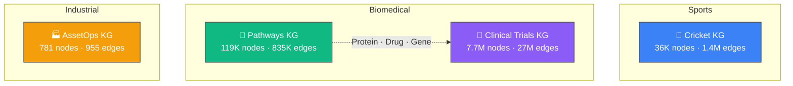
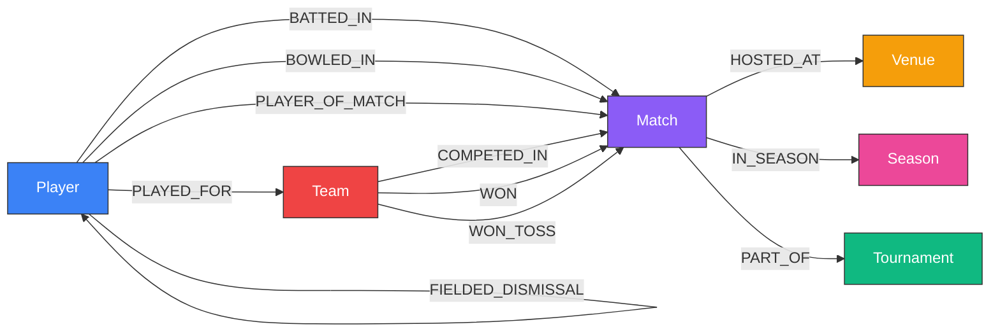
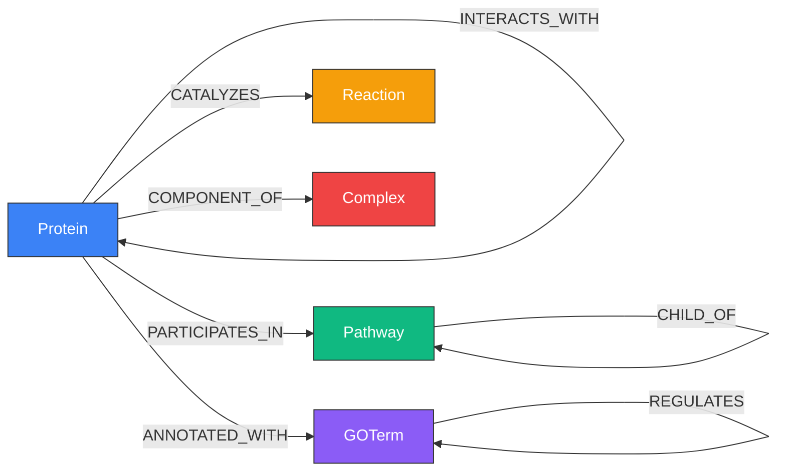
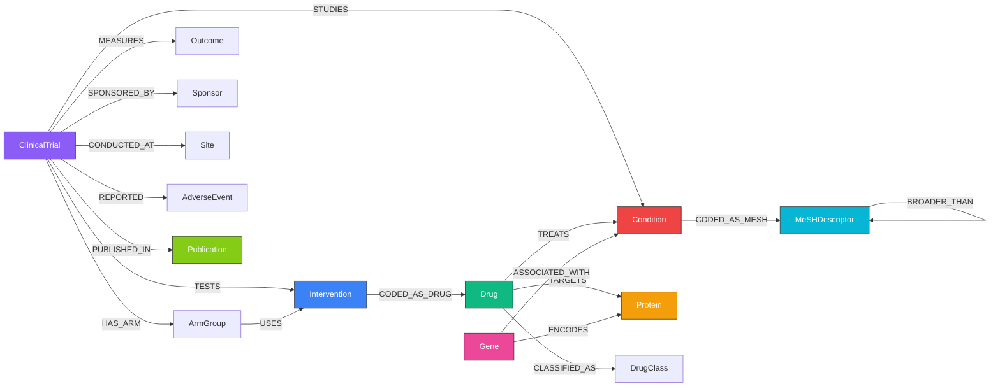

# Knowledge Graph Catalog

Samyama ships with pre-built knowledge graphs spanning sports, biomedicine, and industrial operations. Each KG is available as a portable `.sgsnap` snapshot that loads in seconds, and comes with an MCP server for AI agent integration.

---

## Catalog Overview



| KG | Nodes | Edges | Labels | Edge Types | Snapshot | Source |
|----|------:|------:|-------:|-----------:|---------|--------|
| [Cricket KG](#cricket-kg) | 36,619 | 1,392,017 | 6 | 12 | 21 MB | [Cricsheet](https://cricsheet.org/) |
| [Pathways KG](#pathways-kg) | 118,686 | 834,785 | 5 | 9 | 9 MB | Reactome, STRING, GO, WikiPathways, UniProt |
| [Clinical Trials KG](#clinical-trials-kg) | 7,711,965 | 27,069,085 | 15 | 25 | 711 MB | ClinicalTrials.gov, MeSH, RxNorm, OpenFDA, PubMed |
| [AssetOps KG](#assetops-kg) | 781 | 955 | 8 | 10 | < 1 MB | Synthetic (AssetOpsBench) |

---

## Cricket KG

> 21K international cricket matches from [Cricsheet](https://cricsheet.org/) — ball-by-ball data spanning T20, ODI, and Test formats.

[](https://github.com/samyama-ai/samyama-graph/releases/download/kg-snapshots-v2/samyama-cricket-demo.mp4)

*Click for full demo (1:56) — Dashboard, Cypher Queries, and Graph Simulation*

### Schema



| Label | Count | Key Properties |
|-------|------:|----------------|
| Match | 21,324 | date, match_type, season, winner |
| Player | 12,933 | name |
| Tournament | 1,053 | name |
| Venue | 877 | name, city |
| Team | 383 | name |
| Season | 49 | name |

### Example Queries

```cypher
-- Top 10 run scorers across all formats
MATCH (p:Player)-[b:BATTED_IN]->(m:Match)
RETURN p.name AS player, sum(b.runs) AS total_runs
ORDER BY total_runs DESC LIMIT 10

-- Bowler-batsman rivalries
MATCH (bowler:Player)-[d:DISMISSED]->(victim:Player)
RETURN bowler.name, victim.name, count(d) AS times
ORDER BY times DESC LIMIT 10

-- Venue-team affinity (home advantage)
MATCH (t:Team)-[:WON]->(m:Match)-[:HOSTED_AT]->(v:Venue)
WITH t, v, count(m) AS wins WHERE wins >= 5
RETURN t.name, v.name, wins ORDER BY wins DESC LIMIT 15
```

**Repository:** [samyama-ai/cricket-kg](https://github.com/samyama-ai/cricket-kg)
**Snapshot:** [kg-snapshots-v1](https://github.com/samyama-ai/samyama-graph/releases/tag/kg-snapshots-v1) (`cricket.sgsnap`, 21 MB)

---

## Pathways KG

> Biological pathways knowledge graph combining 5 open-license data sources — Reactome, STRING, Gene Ontology, WikiPathways, and UniProt. Human-only (organism 9606).

[](https://github.com/samyama-ai/samyama-graph/releases/download/kg-snapshots-v3/samyama-pathways-demo.mp4)

*Click for full demo (2:06) — Dashboard, Cypher Queries, and Graph Simulation*

### Schema



| Label | Count | Key Properties |
|-------|------:|----------------|
| GOTerm | 51,897 | go_id, name, namespace, definition |
| Protein | 37,990 | uniprot_id, name, gene_name |
| Complex | 15,963 | reactome_id, name |
| Reaction | 9,988 | reactome_id, name |
| Pathway | 2,848 | reactome_id, name, source |

| Edge Type | Count | Description |
|-----------|------:|-------------|
| ANNOTATED_WITH | 265,492 | Protein → GO term annotation |
| INTERACTS_WITH | 227,818 | Protein-protein interaction (STRING, score ≥ 700) |
| PARTICIPATES_IN | 140,153 | Protein → Pathway membership |
| CATALYZES | 121,365 | Protein → Reaction catalysis |
| IS_A | 58,799 | GO term hierarchy |
| COMPONENT_OF | 8,186 | Protein → Complex membership |
| PART_OF | 7,122 | GO term part-of relation |
| REGULATES | 2,986 | GO term regulation |
| CHILD_OF | 2,864 | Pathway hierarchy |

**Repository:** [samyama-ai/pathways-kg](https://github.com/samyama-ai/pathways-kg)
**Snapshot:** [kg-snapshots-v3](https://github.com/samyama-ai/samyama-graph/releases/tag/kg-snapshots-v3) (`pathways.sgsnap`, 9 MB)

---

## Clinical Trials KG

> 575K+ clinical studies from [ClinicalTrials.gov](https://clinicaltrials.gov/) enriched with MeSH disease hierarchy, RxNorm drug normalization, ATC drug classification, OpenFDA adverse events, and PubMed publications.

### Schema



| Label | Key Properties | Source |
|-------|----------------|--------|
| ClinicalTrial | nct_id, title, phase, overall_status, enrollment | ClinicalTrials.gov |
| Condition | name, mesh_id, icd10_code | ClinicalTrials.gov |
| Intervention | name, type (DRUG/DEVICE/...), rxnorm_cui | ClinicalTrials.gov |
| Drug | rxnorm_cui, name, drugbank_id | RxNorm |
| Protein | uniprot_id, name, function | UniProt |
| Gene | gene_id, symbol, name | Linked ontologies |
| MeSHDescriptor | descriptor_id, name, tree_numbers | MeSH (NLM) |
| Sponsor | name, class (INDUSTRY/NIH/...) | ClinicalTrials.gov |
| Site | facility, city, country, latitude, longitude | ClinicalTrials.gov |
| Publication | pmid, title, journal, doi | PubMed |
| AdverseEvent | term, organ_system, is_serious | OpenFDA |
| ArmGroup | label, type (EXPERIMENTAL/...) | ClinicalTrials.gov |
| Outcome | measure, time_frame, type | ClinicalTrials.gov |
| DrugClass | atc_code, name, level | ATC |
| LabTest | loinc_code, name | LOINC |

**Repository:** [samyama-ai/clinicaltrials-kg](https://github.com/samyama-ai/clinicaltrials-kg) (private)
**Snapshot:** [kg-snapshots-v1](https://github.com/samyama-ai/samyama-graph/releases/tag/kg-snapshots-v1) (`clinical-trials.sgsnap`, 711 MB)

---

## AssetOps KG

> Synthetic industrial operations graph from the [AssetOpsBench](https://github.com/samyama-ai/AssetOpsBench) benchmark. Models assets, sensors, maintenance schedules, and failure modes for industrial IoT.

| Label | Count | Examples |
|-------|------:|---------|
| Asset | ~200 | Pumps, compressors, turbines |
| Sensor | ~150 | Temperature, vibration, pressure |
| WorkOrder | ~100 | Maintenance tasks |
| FailureMode | ~80 | Bearing failure, seal leak |
| Component | ~100 | Bearings, seals, impellers |
| Location | ~50 | Plants, areas, units |
| Operator | ~50 | Maintenance technicians |
| Schedule | ~50 | Maintenance windows |

**Repository:** [samyama-ai/assetops-kg](https://github.com/samyama-ai/assetops-kg) (private)

---

## Quick Start — Loading Any Snapshot

All snapshots follow the same load pattern:

```bash
# 1. Start Samyama Graph (v0.6.1+)
./target/release/samyama --demo social

# 2. Create a tenant
curl -X POST http://localhost:8080/api/tenants \
  -H 'Content-Type: application/json' \
  -d '{"id":"TENANT_ID","name":"TENANT_NAME"}'

# 3. Import snapshot into the tenant
curl -X POST http://localhost:8080/api/tenants/TENANT_ID/snapshot/import \
  -F "file=@snapshot.sgsnap"

# 4. Query
curl -X POST http://localhost:8080/api/query \
  -H 'Content-Type: application/json' \
  -d '{"query":"MATCH (n) RETURN labels(n), count(n)","graph":"TENANT_ID"}'

# 5. Explore in Insight
cd samyama-insight && npm run dev
# → http://localhost:5173 (select tenant from dropdown)
# → http://localhost:5173/simulation/TENANT_ID
```

> **Note:** Use `/api/tenants/:id/snapshot/import` (tenant-specific endpoint), NOT `/api/snapshot/import`. The generic endpoint always loads into the default tenant.
