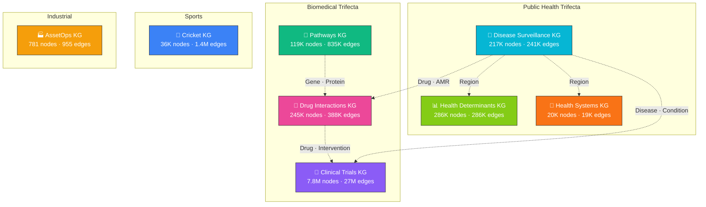
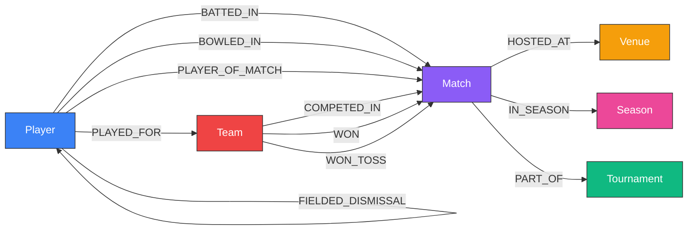
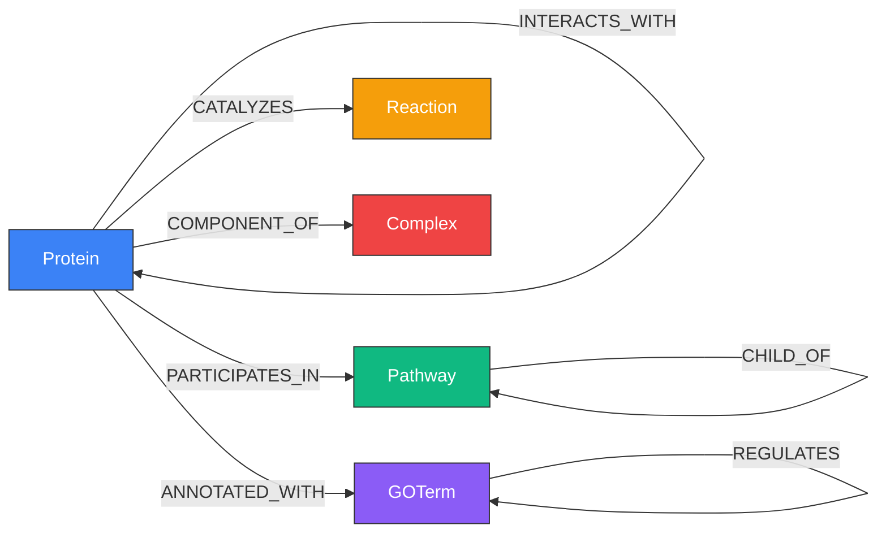
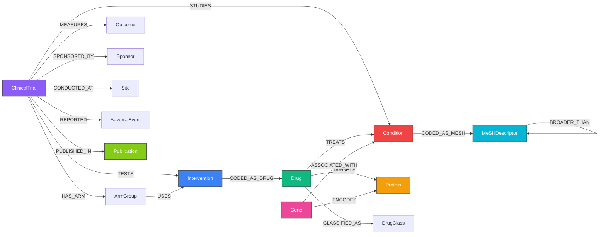
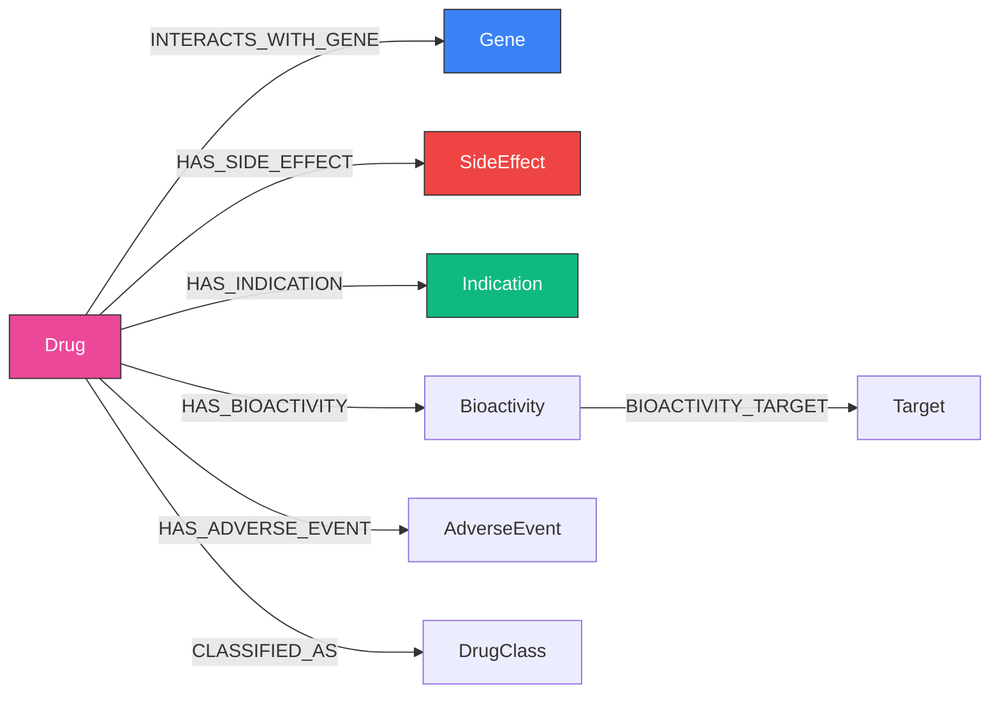
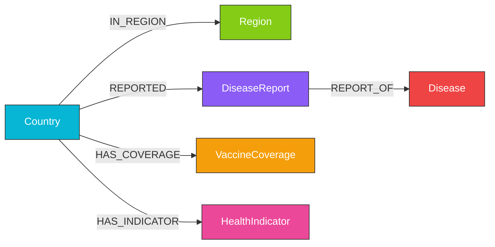
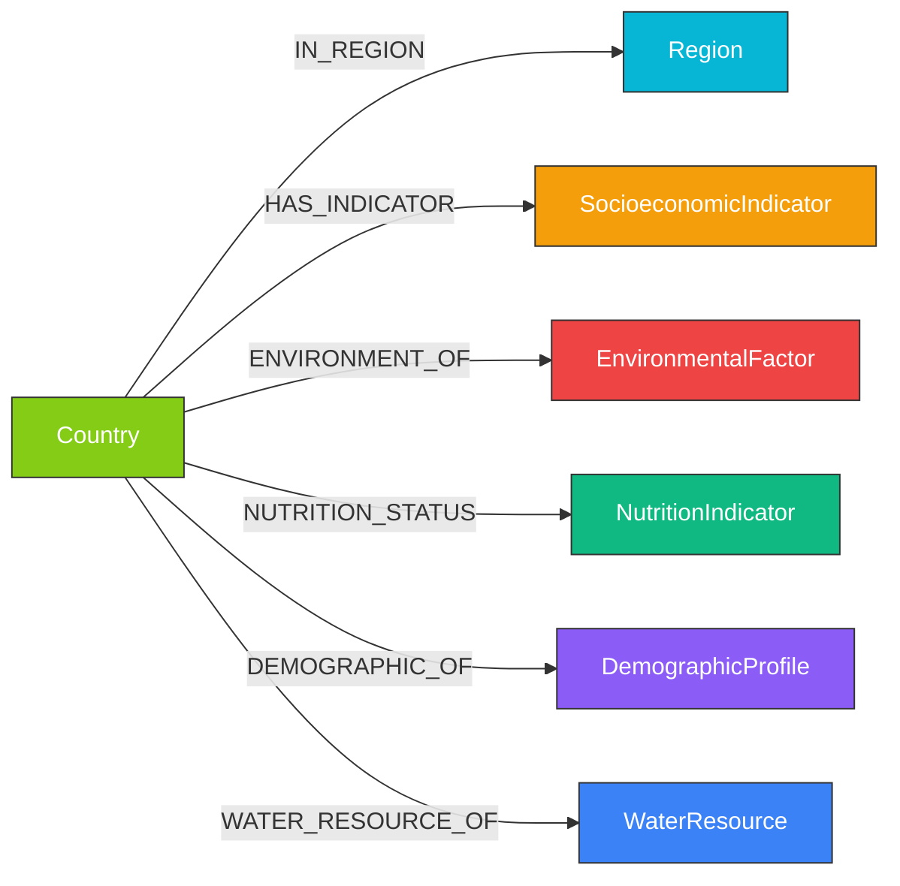
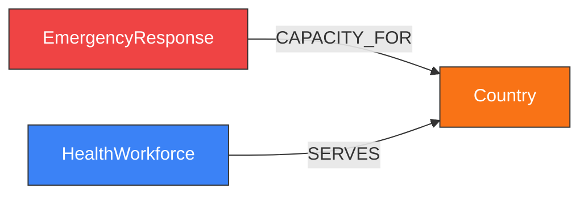

# Knowledge Graph Catalog

Samyama ships with 8 pre-built knowledge graphs spanning biomedicine, public health, sports, and industrial operations. Each KG is available as a portable `.sgsnap` snapshot that loads in seconds, stored on S3 (`s3://samyama-data/snapshots/`) and GitHub Releases. All KGs are cataloged in the Supabase `kg_registry` table.

---

## Catalog Overview



| KG | Nodes | Edges | Labels | Edge Types | Snapshot | Source | Status |
|----|------:|------:|-------:|-----------:|---------|--------|--------|
| [Cricket KG](#cricket-kg) | 36,619 | 1,392,017 | 6 | 12 | 21 MB | [Cricsheet](https://cricsheet.org/) | Live |
| [Pathways KG](#pathways-kg) | 118,686 | 834,785 | 5 | 9 | 9 MB | [Reactome](https://reactome.org/), STRING, GO | Live |
| [Clinical Trials KG](#clinical-trials-kg) | 7,774,446 | 26,973,997 | 15 | 25 | 711 MB | [AACT](https://aact.ctti-clinicaltrials.org/), MeSH, RxNorm | Live |
| [Drug Interactions KG](#drug-interactions-kg) | 245,000 | 388,000 | 8 | 9 | 8.1 MB | [DrugBank](https://go.drugbank.com/), SIDER, ChEMBL, DGIdb, OpenFDA | Live |
| [AssetOps KG](#assetops-kg) | 781 | 955 | 8 | 10 | < 1 MB | Synthetic ([AssetOpsBench](https://github.com/IBM/AssetOpsBench)) | Live |
| [Disease Surveillance KG](#disease-surveillance-kg) | 216,553 | 241,084 | 6 | 5 | 5.7 MB | [WHO GHO](https://ghoapi.azureedge.net/api) | Live |
| [Health Determinants KG](#health-determinants-kg) | 285,635 | 285,628 | 7 | 6 | 6.5 MB | [World Bank WDI](https://data.worldbank.org/), WHO Air Quality, WHO WASH | Live |
| [Health Systems KG](#health-systems-kg) | 19,661 | 19,428 | 3 | 2 | 0.5 MB | [WHO SPAR](https://extranet.who.int/e-spar), WHO NHWA | Live |

### Cross-KG Federation

The **biomedical trifecta** (Pathways + Clinical Trials + Drug Interactions) enables queries spanning molecular biology, translational medicine, and pharmacogenomics. With PubMed: 74.3M nodes, 1.07B edges — [96/100 queries pass](./biomedical_benchmark.md). BiomedQA benchmark: **98% accuracy** with MCP tools.

The **public health trifecta** (Disease Surveillance + Health Determinants + Health Systems) enables queries from disease outbreaks to population vulnerability to health system capacity — [40/40 queries pass](./public_health_benchmark.md). Bridges to the biomedical trifecta via `Country.iso_code`, `Drug.drugbank_id`, and `Gene.gene_name`.

Together, the **6-KG federation** spans molecular biology to population health in a single OpenCypher query. See [Cross-KG Federation](./kg_federation.md) for details.

---

## Cricket KG

> 21K international cricket matches from [Cricsheet](https://cricsheet.org/) — ball-by-ball data spanning T20, ODI, and Test formats.

[](https://github.com/samyama-ai/samyama-graph/releases/download/kg-snapshots-v2/samyama-cricket-demo.mp4)

*Click for full demo (1:56) — Dashboard, Cypher Queries, and Graph Simulation*

### Schema



| Label | Count | Key Properties |
|-------|------:|----------------|
| Match | 21,324 | date, match_type, season, winner |
| Player | 12,933 | name |
| Tournament | 1,053 | name |
| Venue | 877 | name, city |
| Team | 383 | name |
| Season | 49 | name |

### Example Queries

```cypher
-- Top 10 run scorers across all formats
MATCH (p:Player)-[b:BATTED_IN]->(m:Match)
RETURN p.name AS player, sum(b.runs) AS total_runs
ORDER BY total_runs DESC LIMIT 10

-- Bowler-batsman rivalries
MATCH (bowler:Player)-[d:DISMISSED]->(victim:Player)
RETURN bowler.name, victim.name, count(d) AS times
ORDER BY times DESC LIMIT 10

-- Venue-team affinity (home advantage)
MATCH (t:Team)-[:WON]->(m:Match)-[:HOSTED_AT]->(v:Venue)
WITH t, v, count(m) AS wins WHERE wins >= 5
RETURN t.name, v.name, wins ORDER BY wins DESC LIMIT 15
```

**Repository:** [samyama-ai/cricket-kg](https://github.com/samyama-ai/cricket-kg)
**Snapshot:** [kg-snapshots-v1](https://github.com/samyama-ai/samyama-graph/releases/tag/kg-snapshots-v1) (`cricket.sgsnap`, 21 MB)

---

## Pathways KG

> Biological pathways knowledge graph combining 5 open-license data sources — Reactome, STRING, Gene Ontology, WikiPathways, and UniProt. Human-only (organism 9606).

[](https://github.com/samyama-ai/samyama-graph/releases/download/kg-snapshots-v3/samyama-pathways-demo.mp4)

*Click for full demo (2:06) — Dashboard, Cypher Queries, and Graph Simulation*

### Schema



| Label | Count | Key Properties |
|-------|------:|----------------|
| GOTerm | 51,897 | go_id, name, namespace, definition |
| Protein | 37,990 | uniprot_id, name, gene_name |
| Complex | 15,963 | reactome_id, name |
| Reaction | 9,988 | reactome_id, name |
| Pathway | 2,848 | reactome_id, name, source |

| Edge Type | Count | Description |
|-----------|------:|-------------|
| ANNOTATED_WITH | 265,492 | Protein → GO term annotation |
| INTERACTS_WITH | 227,818 | Protein-protein interaction (STRING, score ≥ 700) |
| PARTICIPATES_IN | 140,153 | Protein → Pathway membership |
| CATALYZES | 121,365 | Protein → Reaction catalysis |
| IS_A | 58,799 | GO term hierarchy |
| COMPONENT_OF | 8,186 | Protein → Complex membership |
| PART_OF | 7,122 | GO term part-of relation |
| REGULATES | 2,986 | GO term regulation |
| CHILD_OF | 2,864 | Pathway hierarchy |

**Repository:** [samyama-ai/pathways-kg](https://github.com/samyama-ai/pathways-kg)
**Snapshot:** [kg-snapshots-v3](https://github.com/samyama-ai/samyama-graph/releases/tag/kg-snapshots-v3) (`pathways.sgsnap`, 9 MB)

---

## Clinical Trials KG

> 575K+ clinical studies from [ClinicalTrials.gov](https://clinicaltrials.gov/) enriched with MeSH disease hierarchy, RxNorm drug normalization, ATC drug classification, OpenFDA adverse events, and PubMed publications.

### Schema



| Label | Key Properties | Source |
|-------|----------------|--------|
| ClinicalTrial | nct_id, title, phase, overall_status, enrollment | ClinicalTrials.gov |
| Condition | name, mesh_id, icd10_code | ClinicalTrials.gov |
| Intervention | name, type (DRUG/DEVICE/...), rxnorm_cui | ClinicalTrials.gov |
| Drug | rxnorm_cui, name, drugbank_id | RxNorm |
| Protein | uniprot_id, name, function | UniProt |
| Gene | gene_id, symbol, name | Linked ontologies |
| MeSHDescriptor | descriptor_id, name, tree_numbers | MeSH (NLM) |
| Sponsor | name, class (INDUSTRY/NIH/...) | ClinicalTrials.gov |
| Site | facility, city, country, latitude, longitude | ClinicalTrials.gov |
| Publication | pmid, title, journal, doi | PubMed |
| AdverseEvent | term, organ_system, is_serious | OpenFDA |
| ArmGroup | label, type (EXPERIMENTAL/...) | ClinicalTrials.gov |
| Outcome | measure, time_frame, type | ClinicalTrials.gov |
| DrugClass | atc_code, name, level | ATC |
| LabTest | loinc_code, name | LOINC |

**Repository:** [samyama-ai/clinicaltrials-kg](https://github.com/samyama-ai/clinicaltrials-kg) (private)
**Snapshot:** [kg-snapshots-v1](https://github.com/samyama-ai/samyama-graph/releases/tag/kg-snapshots-v1) (`clinical-trials.sgsnap`, 711 MB)

---

## Drug Interactions KG

> Drug-gene interactions, side effects, indications, bioactivities, and adverse events from 5 open pharmacology databases. Bridges to Pathways KG (via gene name) and Clinical Trials KG (via DrugBank ID).

### Schema



### Performance

- **Rust native loader**: 245,000 nodes + 388,000 edges in **7.7s**
- **Snapshot**: 8.1 MB (`druginteractions.sgsnap`)
- **BiomedQA benchmark**: 98% accuracy with MCP tools

### Sources (5 of 6)

| Source | License | Content |
|--------|---------|---------|
| [DrugBank](https://go.drugbank.com/) CC0 | CC0 | 19,842 drug vocabulary + synonym mappings |
| [DGIdb](https://dgidb.org/) | Open | Drug-gene interactions from 4,182 genes |
| [SIDER](http://sideeffects.embl.de/) | CC-BY-SA | Side effects + indications |
| [ChEMBL](https://www.ebi.ac.uk/chembl/) | CC-BY-SA | 208K bioactivity records |
| [OpenFDA](https://open.fda.gov/) FAERS | Public | 1.7K adverse event reports |

**Repository:** [samyama-ai/druginteractions-kg](https://github.com/samyama-ai/druginteractions-kg)
**Rust loader:** `examples/druginteractions_loader.rs` in samyama-graph
**Snapshot:** [`druginteractions.sgsnap`](https://github.com/samyama-ai/samyama-graph/releases/tag/kg-snapshots-v5) (8.1 MB)

---

## Disease Surveillance KG

> WHO Global Health Observatory data — disease case/death counts, vaccine coverage, and health indicators across 234 countries.

### Schema



| Label | Count | Source |
|-------|------:|--------|
| Country | 234 | WHO GHO |
| Region | 6 | WHO regions (AFR, AMR, SEAR, EUR, EMR, WPR) |
| Disease | 15 | Cholera, Malaria, TB, HIV, Meningitis, etc. |
| DiseaseReport | ~49K | Annual case/death counts per country per disease |
| VaccineCoverage | ~10K | DTP3, MCV1, BCG, Polio3 coverage per country per year |
| HealthIndicator | ~164K | Life expectancy, infant mortality, sanitation, water |

**Repository:** [samyama-ai/surveillance-kg](https://github.com/VaidhyaMegha/surveillance-kg)
**Rust loader:** `examples/surveillance_loader.rs` in samyama-graph
**Snapshot:** [`surveillance.sgsnap`](https://github.com/samyama-ai/samyama-graph/releases/tag/kg-snapshots-v4) (5.7 MB)
**Data source:** [WHO GHO OData API](https://ghoapi.azureedge.net/api) — 30 indicators across infectious diseases, vaccines, and health metrics

---

## Health Determinants KG

> Population vulnerability indicators from World Bank WDI, WHO Air Quality, and WHO Water/Sanitation — 80 curated indicators across 211 countries (1990–2024).

### Schema



| Category | Nodes | Indicators | Examples |
|----------|------:|-----------|---------|
| Countries | 211 | — | ISO 3166-1 alpha-3, income level, WB region |
| Regions | 7 | — | South Asia, Sub-Saharan Africa, etc. |
| Socioeconomic | 52,367 | 16 | GDP, GNI, poverty, Gini, unemployment, literacy, health expenditure |
| Environmental | 35,667 | 10 + PM2.5 | PM2.5 exposure, forest area, renewable energy, CO2 |
| Nutrition | 14,073 | 10 | Stunting, wasting, obesity, undernourishment, anemia |
| Demographic | 107,088 | 15 | Population, fertility, life expectancy, infant mortality, urbanization |
| Water | 76,222 | 10 + WASH | Drinking water, sanitation, freshwater withdrawal, water stress |

### Performance

- **Rust native loader**: 285,635 nodes + 285,628 edges in **2.4s**
- **Snapshot**: 6.5 MB (`health-determinants.sgsnap`)
- **Benchmark**: [40/40 queries pass](./public_health_benchmark.md) (median 15ms)

### Sources

| Source | License | Content |
|--------|---------|---------|
| [World Bank WDI](https://data.worldbank.org/) | CC-BY 4.0 | 80 indicators, 211 countries, 1990–2024 |
| [WHO GHO](https://ghoapi.azureedge.net/api) Air Quality | Open | PM2.5 annual mean (1,880 records) |
| [WHO GHO](https://ghoapi.azureedge.net/api) WASH | Open | Water/sanitation (47K records) |

**Repository:** [samyama-ai/health-determinants-kg](https://github.com/samyama-ai/health-determinants-kg)
**Rust loader:** `examples/health_determinants_loader.rs` in samyama-graph-enterprise
**Snapshot:** [`health-determinants.sgsnap`](https://github.com/samyama-ai/samyama-graph/releases/tag/kg-snapshots-v6) (6.5 MB)

---

## Health Systems KG

> Health system capacity — IHR emergency preparedness and health workforce density from WHO, across 233 countries.

### Schema



| Label | Count | Source |
|-------|------:|--------|
| Country | 233 | WHO GHO |
| EmergencyResponse | 8,430 | WHO SPAR v2 — 15 IHR capacities per country per year |
| HealthWorkforce | 10,998 | WHO NHWA — physicians, nurses, dentists, pharmacists |

### Performance

- **Rust native loader**: 19,661 nodes + 19,428 edges in **149ms**
- **Snapshot**: 0.5 MB (`health-systems.sgsnap`)
- **Benchmark**: [40/40 queries pass](./public_health_benchmark.md) (cross-KG with Health Determinants)

### Sources

| Source | License | Content |
|--------|---------|---------|
| [WHO SPAR v2](https://extranet.who.int/e-spar) | Open | 15 IHR capacity scores, 233 countries |
| [WHO NHWA](https://apps.who.int/nhwa/) | Open | Health workforce density per 10K population |

**Pending sources** (loaders built, data not yet downloaded):
GAVI vaccine supply, Global Fund disbursements, IHME health expenditure

**Repository:** [samyama-ai/health-systems-kg](https://github.com/samyama-ai/health-systems-kg)
**Rust loader:** `examples/health_systems_loader.rs` in samyama-graph-enterprise
**Snapshot:** [`health-systems.sgsnap`](https://github.com/samyama-ai/samyama-graph/releases/tag/kg-snapshots-v6) (0.5 MB)

---

## AssetOps KG

> Synthetic industrial operations graph from the [AssetOpsBench](https://github.com/samyama-ai/AssetOpsBench) benchmark. Models assets, sensors, maintenance schedules, and failure modes for industrial IoT.

| Label | Count | Examples |
|-------|------:|---------|
| Asset | ~200 | Pumps, compressors, turbines |
| Sensor | ~150 | Temperature, vibration, pressure |
| WorkOrder | ~100 | Maintenance tasks |
| FailureMode | ~80 | Bearing failure, seal leak |
| Component | ~100 | Bearings, seals, impellers |
| Location | ~50 | Plants, areas, units |
| Operator | ~50 | Maintenance technicians |
| Schedule | ~50 | Maintenance windows |

**Repository:** [samyama-ai/assetops-kg](https://github.com/samyama-ai/assetops-kg) (private)

---

## Quick Start — Loading Any Snapshot

All snapshots follow the same load pattern:

```bash
# 1. Start Samyama Graph (v0.7.0+)
./target/release/samyama

# 2. Create a tenant
curl -X POST http://localhost:8080/api/tenants \
  -H 'Content-Type: application/json' \
  -d '{"id":"TENANT_ID","name":"TENANT_NAME"}'

# 3. Import snapshot into the tenant
curl -X POST http://localhost:8080/api/tenants/TENANT_ID/snapshot/import \
  -F "file=@snapshot.sgsnap"

# 4. Query
curl -X POST http://localhost:8080/api/query \
  -H 'Content-Type: application/json' \
  -d '{"query":"MATCH (n) RETURN labels(n), count(n)","graph":"TENANT_ID"}'

# 5. Explore in Insight
cd samyama-insight && npm run dev
# → http://localhost:5173 (select tenant from dropdown)
# → http://localhost:5173/simulation/TENANT_ID
```

> **Note:** Use `/api/tenants/:id/snapshot/import` (tenant-specific endpoint), NOT `/api/snapshot/import`. The generic endpoint always loads into the default tenant.
