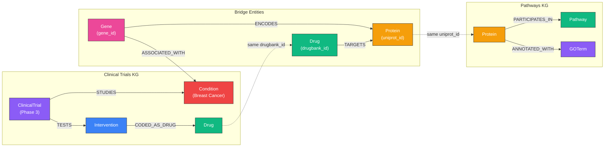

# Cross-KG Federation

When multiple knowledge graphs share entity types — the same proteins, drugs, or genes appear in different datasets — loading them into the same Samyama tenant creates a **federated graph** where a single Cypher query can traverse across data sources.

This chapter shows how to combine the Pathways KG and Clinical Trials KG into a single biomedical graph and answer questions that neither KG can answer alone.

---

## Why Federation?

The Pathways KG knows **molecular biology** — which proteins interact, what pathways they participate in, which GO processes they're annotated with. The Clinical Trials KG knows **translational medicine** — which drugs are in trials, what conditions they treat, what adverse events they cause.

Neither KG alone can answer:

> *"Which biological pathways are disrupted by drugs currently in Phase 3 trials for breast cancer?"*

This query requires traversing:

```
ClinicalTrial (phase='Phase 3') → STUDIES → Condition (name contains 'breast cancer')
ClinicalTrial → TESTS → Intervention → CODED_AS_DRUG → Drug
Drug → TARGETS → Protein
Protein → PARTICIPATES_IN → Pathway
```

The first two hops live in the Clinical Trials KG. The last two hops live in the Pathways KG. The **Drug → TARGETS → Protein** edge is the bridge.



### Join Points

Three entity types appear in both KGs with matching identifiers:

| Entity | Pathways KG Property | Clinical Trials KG Property | Join Key |
|--------|---------------------|---------------------------|----------|
| **Protein** | `Protein.uniprot_id` | `Protein.uniprot_id` | UniProt accession (e.g., P04637) |
| **Drug** | `Drug.drugbank_id` | `Drug.drugbank_id` | DrugBank ID (e.g., DB00072) |
| **Gene** | `Gene.gene_id` | `Gene.gene_id` | NCBI Gene ID (e.g., 7157) |

---

## Loading Multiple Snapshots into One Tenant

### Step 1: Start the server

```bash
./target/release/samyama
```

### Step 2: Create a combined tenant

```bash
curl -X POST http://localhost:8080/api/tenants \
  -H 'Content-Type: application/json' \
  -d '{"id":"biomedical","name":"Biomedical (Pathways + Clinical Trials)"}'
```

### Step 3: Load snapshots sequentially

Load the smaller snapshot first, then the larger one. Each import appends to the existing graph — nodes and edges accumulate.

```bash
# Pathways first (9 MB, ~119K nodes)
curl -X POST http://localhost:8080/api/tenants/biomedical/snapshot/import \
  -F "file=@pathways.sgsnap"
# Expected: 118,686 nodes, 834,785 edges

# Clinical Trials second (711 MB, ~7.7M nodes)
curl -X POST http://localhost:8080/api/tenants/biomedical/snapshot/import \
  -F "file=@clinical-trials.sgsnap"
# Expected: 7,711,965 nodes, 27,069,085 edges
```

### Step 4: Verify the combined graph

```bash
curl -X POST http://localhost:8080/api/query \
  -H 'Content-Type: application/json' \
  -d '{"query":"MATCH (n) RETURN labels(n) AS label, count(n) AS count ORDER BY count DESC","graph":"biomedical"}'
```

You should see labels from **both** KGs:

| Label | Source | Expected Count |
|-------|--------|---------------:|
| ClinicalTrial | Clinical Trials | ~575,000 |
| Condition | Clinical Trials | varies |
| Intervention | Clinical Trials | varies |
| GOTerm | Pathways | 51,897 |
| Protein | **Both** | 37,990 + Clinical Trials |
| Drug | **Both** | Clinical Trials + Pathways |
| Gene | **Both** | Clinical Trials + Pathways |
| Complex | Pathways | 15,963 |
| Reaction | Pathways | 9,988 |
| Pathway | Pathways | 2,848 |
| MeSHDescriptor | Clinical Trials | varies |
| ... | ... | ... |

> **Important:** Snapshot import creates new nodes — it does not merge on matching properties. This means a Protein like TP53 may exist as two separate nodes (one from each snapshot) with the same `uniprot_id`. Cross-KG queries must join on properties, not on node identity.

---

## Cross-KG Federated Queries

Since nodes from different snapshots are not merged, cross-KG queries use **property-based joins** — matching on shared identifiers like `uniprot_id` or `drugbank_id`.

### Query 1: Pathways disrupted by drugs in Phase 3 breast cancer trials

```cypher
-- Find drugs in Phase 3 breast cancer trials
MATCH (ct:ClinicalTrial)-[:STUDIES]->(cond:Condition)
WHERE ct.phase = 'Phase 3'
  AND cond.name CONTAINS 'Breast'
WITH ct
MATCH (ct)-[:TESTS]->(int:Intervention)-[:CODED_AS_DRUG]->(drug:Drug)
WITH DISTINCT drug

-- Bridge to pathways via protein targets (property join)
MATCH (drug)-[:TARGETS]->(prot1:Protein)
MATCH (prot2:Protein)-[:PARTICIPATES_IN]->(pw:Pathway)
WHERE prot1.uniprot_id = prot2.uniprot_id

RETURN pw.name AS pathway,
       count(DISTINCT drug.name) AS drugs_targeting,
       collect(DISTINCT drug.name) AS drug_names
ORDER BY drugs_targeting DESC
LIMIT 15
```

### Query 2: GO processes affected by trial drugs

```cypher
-- Drugs being tested in active trials
MATCH (ct:ClinicalTrial)-[:TESTS]->(int:Intervention)-[:CODED_AS_DRUG]->(drug:Drug)
WHERE ct.overall_status = 'RECRUITING'
WITH DISTINCT drug

-- Bridge to GO annotations via protein targets
MATCH (drug)-[:TARGETS]->(prot1:Protein)
MATCH (prot2:Protein)-[:ANNOTATED_WITH]->(go:GOTerm)
WHERE prot1.uniprot_id = prot2.uniprot_id
  AND go.namespace = 'biological_process'

RETURN go.name AS biological_process,
       count(DISTINCT drug.name) AS drugs,
       count(DISTINCT prot2.name) AS proteins
ORDER BY drugs DESC
LIMIT 10
```

### Query 3: PPI neighbors of clinical drug targets

```cypher
-- Find proteins targeted by a specific drug
MATCH (drug:Drug {name: 'Trastuzumab'})-[:TARGETS]->(target:Protein)
WITH target

-- Find interaction partners in pathways PPI network
MATCH (pw_prot:Protein)-[:INTERACTS_WITH]-(partner:Protein)
WHERE pw_prot.uniprot_id = target.uniprot_id

RETURN target.name AS drug_target,
       partner.name AS ppi_neighbor,
       count(*) AS interaction_strength
ORDER BY interaction_strength DESC
LIMIT 20
```

### Query 4: Disease ↔ Pathway connections through genes

```cypher
-- Genes associated with a disease (from clinical trials KG)
MATCH (gene:Gene)-[:ASSOCIATED_WITH]->(cond:Condition)
WHERE cond.name CONTAINS 'Diabetes'
WITH gene

-- Gene's protein → pathways (from pathways KG)
MATCH (gene)-[:ENCODES]->(prot1:Protein)
MATCH (prot2:Protein)-[:PARTICIPATES_IN]->(pw:Pathway)
WHERE prot1.uniprot_id = prot2.uniprot_id

RETURN pw.name AS pathway,
       count(DISTINCT gene.symbol) AS genes,
       collect(DISTINCT gene.symbol) AS gene_list
ORDER BY genes DESC
LIMIT 10
```

### Query 5: Adverse events linked to pathway disruption

```cypher
-- Drugs with serious adverse events
MATCH (drug:Drug)<-[:CODED_AS_DRUG]-(int:Intervention)<-[:TESTS]-(ct:ClinicalTrial)
MATCH (ct)-[:REPORTED]->(ae:AdverseEvent)
WHERE ae.is_serious = true
WITH drug, count(DISTINCT ae.term) AS ae_count
WHERE ae_count >= 5

-- What pathways do these drugs target?
MATCH (drug)-[:TARGETS]->(prot1:Protein)
MATCH (prot2:Protein)-[:PARTICIPATES_IN]->(pw:Pathway)
WHERE prot1.uniprot_id = prot2.uniprot_id

RETURN drug.name AS drug,
       ae_count AS serious_adverse_events,
       collect(DISTINCT pw.name) AS targeted_pathways
ORDER BY ae_count DESC
LIMIT 10
```

---

## Testing Instructions

### Prerequisites

- Samyama Graph Enterprise v0.7.0+ running on `localhost:8080`
- Snapshots downloaded:
  - `pathways.sgsnap` from [kg-snapshots-v3](https://github.com/samyama-ai/samyama-graph/releases/tag/kg-snapshots-v3)
  - `clinical-trials.sgsnap` from [kg-snapshots-v1](https://github.com/samyama-ai/samyama-graph/releases/tag/kg-snapshots-v1)
- At least 8 GB free RAM (Clinical Trials KG is large)

### Step-by-step test script

```bash
#!/bin/bash
# test_cross_kg_federation.sh
# Tests cross-KG federation between Pathways and Clinical Trials

set -e
API="http://localhost:8080"

echo "=== Step 1: Create biomedical tenant ==="
curl -s -X POST "$API/api/tenants" \
  -H 'Content-Type: application/json' \
  -d '{"id":"biomedical","name":"Biomedical Federation"}' | python3 -m json.tool

echo -e "\n=== Step 2: Load Pathways KG ==="
curl -s -X POST "$API/api/tenants/biomedical/snapshot/import" \
  -F "file=@pathways.sgsnap" | python3 -c "
import sys,json; d=json.load(sys.stdin)
print(f'  Pathways: {d[\"nodes_imported\"]:,} nodes, {d[\"edges_imported\"]:,} edges')"

echo -e "\n=== Step 3: Load Clinical Trials KG ==="
echo "  (This may take 1-2 minutes for the 711 MB snapshot)"
curl -s -X POST "$API/api/tenants/biomedical/snapshot/import" \
  -F "file=@clinical-trials.sgsnap" | python3 -c "
import sys,json; d=json.load(sys.stdin)
print(f'  Clinical Trials: {d[\"nodes_imported\"]:,} nodes, {d[\"edges_imported\"]:,} edges')"

echo -e "\n=== Step 4: Verify combined graph ==="
curl -s -X POST "$API/api/query" \
  -H 'Content-Type: application/json' \
  -d '{"query":"MATCH (n) RETURN labels(n) AS label, count(n) AS count ORDER BY count DESC","graph":"biomedical"}' | python3 -c "
import sys,json
for r in json.load(sys.stdin)['records']:
    print(f'  {r[0][0]:20s} {r[1]:>10,}')"

echo -e "\n=== Step 5: Check join points ==="

echo "  Proteins with uniprot_id (Pathways):"
curl -s -X POST "$API/api/query" \
  -H 'Content-Type: application/json' \
  -d '{"query":"MATCH (p:Protein) WHERE p.uniprot_id IS NOT NULL RETURN count(p) AS proteins_with_uid","graph":"biomedical"}' | python3 -c "
import sys,json; print(f'    {json.load(sys.stdin)[\"records\"][0][0]:,}')"

echo "  Drugs with drugbank_id:"
curl -s -X POST "$API/api/query" \
  -H 'Content-Type: application/json' \
  -d '{"query":"MATCH (d:Drug) WHERE d.drugbank_id IS NOT NULL RETURN count(d) AS drugs_with_dbid","graph":"biomedical"}' | python3 -c "
import sys,json; print(f'    {json.load(sys.stdin)[\"records\"][0][0]:,}')"

echo -e "\n=== Step 6: Cross-KG query — Pathways disrupted by Phase 3 breast cancer drugs ==="
curl -s -X POST "$API/api/query" \
  -H 'Content-Type: application/json' \
  -d '{
    "query": "MATCH (ct:ClinicalTrial)-[:STUDIES]->(cond:Condition) WHERE ct.phase = '\"'\"'Phase 3'\"'\"' AND cond.name CONTAINS '\"'\"'Breast'\"'\"' WITH ct MATCH (ct)-[:TESTS]->(int:Intervention)-[:CODED_AS_DRUG]->(drug:Drug) WITH DISTINCT drug MATCH (drug)-[:TARGETS]->(prot1:Protein) MATCH (prot2:Protein)-[:PARTICIPATES_IN]->(pw:Pathway) WHERE prot1.uniprot_id = prot2.uniprot_id RETURN pw.name AS pathway, count(DISTINCT drug.name) AS drugs ORDER BY drugs DESC LIMIT 10",
    "graph": "biomedical"
  }' | python3 -c "
import sys,json
d=json.load(sys.stdin)
if 'error' in d:
    print(f'  Error: {d[\"error\"]}')
else:
    print(f'  Columns: {d[\"columns\"]}')
    for r in d.get('records',[])[:10]:
        print(f'    {r}')"

echo -e "\n=== Step 7: Simpler cross-KG validation — shared proteins ==="
curl -s -X POST "$API/api/query" \
  -H 'Content-Type: application/json' \
  -d '{"query":"MATCH (p1:Protein)-[:PARTICIPATES_IN]->(pw:Pathway) MATCH (p2:Protein)<-[:TARGETS]-(d:Drug) WHERE p1.uniprot_id = p2.uniprot_id RETURN count(DISTINCT p1.uniprot_id) AS shared_proteins, count(DISTINCT d.name) AS drugs, count(DISTINCT pw.name) AS pathways","graph":"biomedical"}' | python3 -c "
import sys,json
d=json.load(sys.stdin)
if 'error' in d:
    print(f'  Error: {d[\"error\"]}')
else:
    r=d['records'][0]; print(f'  Shared proteins: {r[0]}, Drugs: {r[1]}, Pathways: {r[2]}')"

echo -e "\n=== Done ==="
```

### Expected results

If both snapshots loaded correctly:

1. **Label distribution** should show labels from both KGs (Pathway, GOTerm, Protein from Pathways; ClinicalTrial, Condition, Intervention from Clinical Trials)
2. **Join points** should show thousands of proteins with `uniprot_id` and hundreds of drugs with `drugbank_id`
3. **Cross-KG query** should return pathways like "Signal Transduction", "Immune System", "Disease" that are targeted by Phase 3 breast cancer drugs
4. **Shared proteins** count should be > 0, confirming the bridge works

### Troubleshooting

| Issue | Cause | Fix |
|-------|-------|-----|
| Import times out | Clinical Trials snapshot is 711 MB | Increase curl timeout: `curl --max-time 600 ...` |
| Out of memory | Combined graph needs ~8 GB | Use Mac Mini (16 GB) or reduce to pathways-only |
| Cross-KG query returns 0 rows | Protein IDs don't overlap | Verify with simpler query: `MATCH (p:Protein) WHERE p.uniprot_id = 'P04637' RETURN p` |
| Property join slow | No index on uniprot_id | Create index: `redis-cli GRAPH.QUERY biomedical "CREATE INDEX FOR (p:Protein) ON (p.uniprot_id)"` |

---

## Architecture Notes

### Why Property Joins (Not Node Merging)?

Snapshot import creates fresh nodes with auto-assigned IDs. Two Protein nodes from different snapshots with the same `uniprot_id` are distinct graph nodes. We join them via `WHERE p1.uniprot_id = p2.uniprot_id`.

**Trade-offs:**

| Approach | Pros | Cons |
|----------|------|------|
| **Property join** (current) | Simple, no ETL changes, snapshots stay independent | Slower on large joins, duplicate nodes |
| **ETL-time merge** | Fastest queries, single node per protein | Requires custom loader, order-dependent |
| **Post-load MERGE** | Clean graph, works with any snapshots | Expensive for millions of nodes |

For production workloads, consider building a dedicated cross-KG ETL that uses `MERGE` on shared identifiers during loading. For exploration and prototyping, property joins work well.

### Future: Native Cross-Tenant Queries

A future Samyama release may support cross-tenant query federation natively, allowing:

```cypher
-- Hypothetical future syntax
MATCH (drug:Drug)-[:TARGETS]->(p:Protein)
  ON TENANT 'clinical'
MATCH (p2:Protein)-[:PARTICIPATES_IN]->(pw:Pathway)
  ON TENANT 'pathways'
WHERE p.uniprot_id = p2.uniprot_id
RETURN pw.name, drug.name
```

Until then, loading into a single tenant with property joins is the recommended approach.
