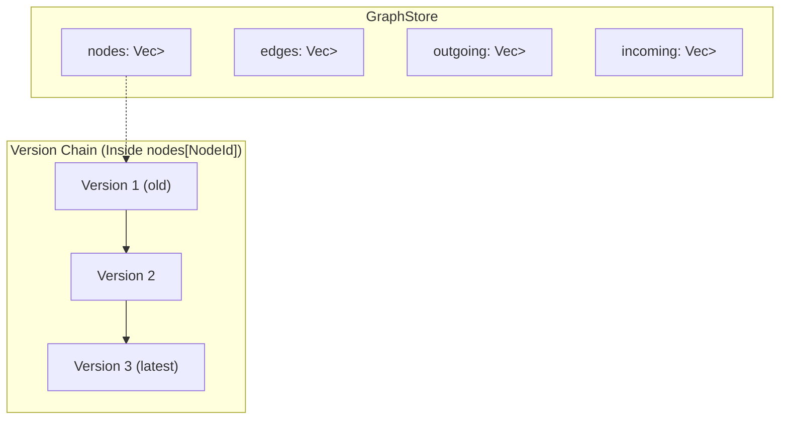
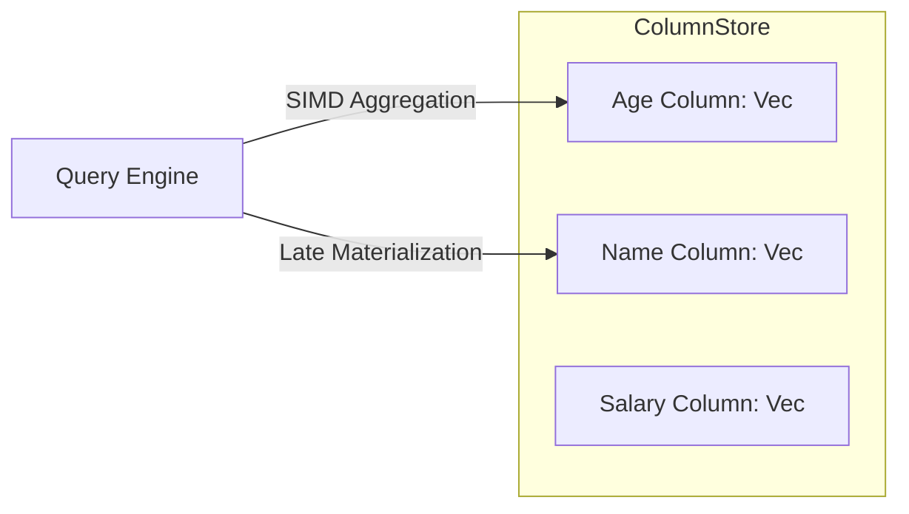

# Managing State (MVCC & Memory)

In a high-performance database, "State" is the enemy of speed. Managing it requires locks, and locks kill concurrency.

If User A is reading a graph to calculate the shortest path between two cities, and User B updates a road in the middle of that calculation, what should happen?
1.  **Locking**: User B waits until User A finishes. (Safe but slow).
2.  **Dirty Read**: User A sees the half-updated state and crashes. (Fast but broken).
3.  **MVCC**: User A sees the "old" version of the road, while User B writes the "new" version. Both proceed in parallel.

Samyama implements **Multi-Version Concurrency Control (MVCC)** using a specialized in-memory structure that prioritizes cache locality and zero-overhead lookups.

## The Data Structure: Versioned Arena

Unlike traditional graph databases that rely heavily on scattered heap allocations (`Box<Node>`, `Rc<RefCell<Node>>`), Samyama uses a **Versioned Arena** pattern defined centrally in `src/graph/store.rs`.



```rust
pub struct GraphStore {
    /// Node storage (Arena with versioning: NodeId -> [Versions])
    nodes: Vec<Vec<Node>>,

    /// Edge storage (Arena with versioning: EdgeId -> [Versions])
    edges: Vec<Vec<Edge>>,

    /// Outgoing edges for each node (adjacency list)
    outgoing: Vec<Vec<EdgeId>>,

    /// Incoming edges for each node (adjacency list)
    incoming: Vec<Vec<EdgeId>>,
    
    /// Current global version for MVCC
    pub current_version: u64,
    
    // Additional fields omitted for clarity:
    // free_id_pools, label_index, edge_type_index,
    // cardinality_stats, tenant metadata, etc.
}
```

### 1. The ID is the Index
A `NodeId` in Samyama is not a random UUID; it's a direct `u64` index into the `nodes` vector. `NodeId(5)` means "look at index 5 in the vector". This gives us **O(1)** access time without hashing, ensuring cache-friendly contiguous memory layout.

### 2. The Version Chain & Snapshot Isolation
The inner vector `Vec<Node>` and `Vec<Edge>` represents the history of that entity. When a query starts, it grabs the `current_version`. The engine iterates backward over the history chain to find the newest version `<= query_version`, guaranteeing **Snapshot Isolation** without holding read locks.

> **Developer Tip**: See `benches/mvcc_benchmark.rs` to observe how Samyama maintains read latencies <5µs even under heavy concurrent write pressure due to this lock-free snapshot mechanism.

## Columnar Property Storage & Indices

Beyond the core topology, `GraphStore` integrates dedicated sub-systems for high-performance access:



```rust
    /// Vector indices manager
    pub vector_index: Arc<VectorIndexManager>,

    /// Property indices manager
    pub property_index: Arc<IndexManager>,

    /// Columnar storage for node properties
    pub node_columns: ColumnStore,

    /// Columnar storage for edge properties
    pub edge_columns: ColumnStore,
```

By separating structural metadata (topology, version) from the actual property values (stored in `ColumnStore`), Samyama enables **Late Materialization**. The engine can traverse millions of relationships scanning only the `outgoing` adjacency lists, and query the `node_columns` *only* when the user requests specific attributes in the `RETURN` clause. This drastically reduces CPU cache eviction.

## Graph Statistics for Optimization

Finally, `GraphStore` maintains internal `GraphStatistics`, tracking `label_counts`, `edge_type_counts`, and `PropertyStats` (null fraction, distinct counts, selectivity). This allows the query planner to intelligently order operators based on cost estimations. See the [Query Optimization](./query_optimization.md) chapter for details on how statistics drive the cost-based optimizer.

## ACID Guarantees

Samyama provides strong transactional guarantees aligned with the ACID model:

| Property | Status | Mechanism |
| :--- | :---: | :--- |
| **Atomicity** | ✅ | RocksDB `WriteBatch` + WAL ensures all-or-nothing modifications |
| **Consistency** | ✅ | Schema validation + Raft consensus (writes acknowledged after quorum) |
| **Isolation** | ⚠️ Partial | Per-query isolation via `RwLock`; MVCC foundation for snapshot isolation. Interactive `BEGIN...COMMIT` transactions planned |
| **Durability** | ✅ | RocksDB persistence + Raft replication to majority before acknowledgment |

### CAP Trade-off

Samyama's Raft-based clustering chooses **CP** (Consistency + Partition Tolerance):
- During a network partition, the minority partition cannot accept writes (preserving consistency)
- Reads from the majority partition remain consistent
- Availability is sacrificed during partitions in favor of data correctness
