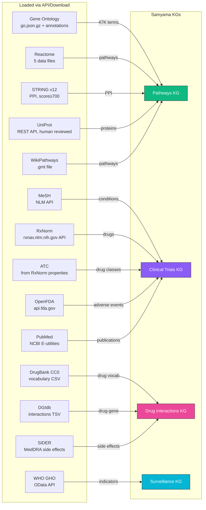
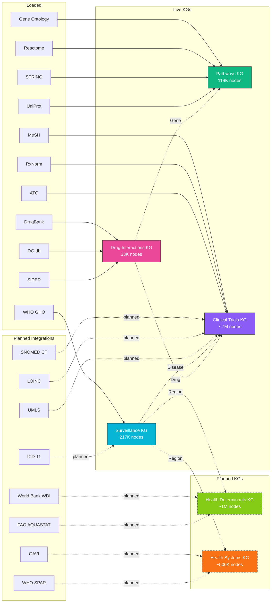

# Ontology & Standards Catalog

This catalog surveys **147 publicly available ontologies, knowledge graphs, and standards** relevant to Samyama Graph's knowledge graph ecosystem — organized by domain, ranked by relevance tier.

> **Source of truth:** [`data/ontology_catalog.csv`](data/ontology_catalog.csv) — machine-readable, importable into any tool or pipeline.

---

## Relevance Tiers

| Tier | Meaning | Count |
|------|---------|-------|
| **1 — Critical** | Directly maps to an active Samyama KG, evaluation workflow, or partner need | 67 |
| **2 — High** | Strong alignment; likely needed within 6 months | 61 |
| **3 — Moderate** | Useful reference for broader evaluation scenario generation | 20 |

---

## A. Public Health & Epidemiology (31)

Core ontologies for disease classification, surveillance, epidemiology, and LMIC health systems.

| Abbrev | Name | Maintainer | Size | License | Tier |
|--------|------|------------|------|---------|------|
| **ICD-11** | International Classification of Diseases | WHO | 55K+ entities | CC BY-ND 3.0 IGO | 1 |
| **MeSH** | Medical Subject Headings | NLM/NIH | 29K descriptors | Public domain | 1 |
| **SNOMED CT** | Systematized Nomenclature of Medicine | SNOMED International | 350K+ concepts | Affiliate license | 1 |
| **GHO** | Global Health Observatory | WHO | 2,300+ indicators | Open access | 1 |
| **DHS** | Demographic and Health Surveys | USAID/ICF | 400+ surveys, 90+ countries | Open (registration) | 1 |
| **GBD** | Global Burden of Disease | IHME | 369 diseases, 204 countries | IHME free license | 1 |
| **IDO** | Infectious Disease Ontology | OBO Foundry | ~3K classes | CC BY 4.0 | 2 |
| **OBI** | Ontology for Biomedical Investigations | OBO Foundry | ~4.5K classes | CC BY 4.0 | 2 |
| **EPO** | Epidemiology Ontology | Community (OBO) | ~500 classes | CC BY 4.0 | 2 |
| **HL7 FHIR** | Fast Healthcare Interoperability Resources | HL7 International | 150+ resources | CC0 1.0 | 2 |
| **IHR** | International Health Regulations | WHO | 196 parties | Open standard | 2 |
| **GLASS** | Global AMR Surveillance System | WHO | 127+ countries | Open data | 1 |
| **WUENIC** | National Immunization Coverage Estimates | WHO/UNICEF | 196 countries | Open data | 1 |
| **HPO** | Human Phenotype Ontology | Monarch Initiative | 18K+ terms | Custom open | 2 |
| **NCIt** | NCI Thesaurus | National Cancer Institute | 180K+ concepts | Public domain | 1 |
| **PopHO** | Population Health Ontology | Univ. of Victoria | ~1K classes | Open | 2 |
| **VO** | Vaccine Ontology | Univ. of Michigan | ~10K classes | CC BY 3.0 | 2 |
| **APOLLO_SV** | Apollo Structured Vocabulary | Univ. of Pittsburgh | ~700 classes | CC BY 4.0 | 1 |
| **HSO** | Health Surveillance Ontology | Data-Driven Surveillance | Emerging | CC BY 4.0 | 1 |
| **TRANS** | Pathogen Transmission Ontology | Univ. of Maryland | 32 terms | CC0 1.0 | 1 |
| **ARO** | Antibiotic Resistance Ontology | McMaster Univ./CARD | 5K+ terms | CC BY 4.0 | 1 |
| **SYMP** | Symptom Ontology | Univ. of Maryland | ~900 terms | CC0 1.0 | 1 |
| **NTDO** | Neglected Tropical Disease Ontology | UFPE Brazil | 20+ diseases | Open | 1 |
| **OMOP CDM** | OHDSI Common Data Model | OHDSI | 10M+ concepts | Apache 2.0 | 1 |
| **DHIS2** | District Health Information System 2 | Univ. of Oslo | 2.4B+ people served | BSD 3-Clause | 1 |
| **OpenMRS** | Open Medical Record System | OpenMRS community | 50K+ concepts | MPL 2.0 | 1 |
| **WHO DON eKG** | WHO Disease Outbreak News KG | Academic (2025) | Decades of reports | Open | 1 |
| **ECTO** | Environmental Exposures Ontology | OBO Foundry/Monarch | 12K+ classes | CC BY 4.0 | 1 |
| **3M** | Micro-Meso-Macro SDOH Ontology | Academic (JMIR) | 383 classes | Open | 1 |
| **FHIR SDOH** | HL7 FHIR SDOH Profile | HL7 International | Profile/guide | HL7 license | 1 |
| **MHO** | Mental Health Ontology | Academic consortium | In development | Open | 2 |

## B. Social Determinants & Environmental Health (14)

Ontologies mapping environmental exposures, social factors, and their health impacts.

| Abbrev | Name | Maintainer | Size | License | Tier |
|--------|------|------------|------|---------|------|
| **WDI** | World Development Indicators | World Bank | 1,600+ indicators | CC BY 4.0 | 1 |
| **HDI** | Human Development Index | UNDP | 191 countries | Open access | 1 |
| **ENVO** | Environment Ontology | OBO Foundry | ~7K classes | CC BY 4.0 | 1 |
| **ExO** | Exposure Ontology | OBO Foundry | ~1K classes | CC BY 4.0 | 1 |
| **AQD** | WHO Air Quality Database | WHO | 6,000+ cities | Open access | 1 |
| **AQUASTAT** | FAO Water Resources | FAO | 200+ countries | Open access | 1 |
| **SDoHO** | Social Determinants of Health Ontology | Academic | ~500 classes | Open | 1 |
| **ChEBI** | Chemical Entities of Biological Interest | EMBL-EBI | 60K+ entities | CC BY 4.0 | 2 |
| **TXPO** | Toxicology Ontology | OBO Foundry | ~2K classes | CC BY 4.0 | 2 |
| **FoodOn** | Food Ontology | OBO Foundry | ~30K classes | CC BY 3.0 | 2 |
| **SDGIO** | SDG Interface Ontology | OBO/UN | ~1.5K classes | CC BY 4.0 | 2 |
| **UMEP** | Urban Environmental Predictor | Academic | Modular | Open source | 3 |
| **GEMS/Water** | Global Water Quality | UNEP | 4M+ entries | Open access | 2 |
| **CTD** | Comparative Toxicogenomics Database | NC State | 2.6M interactions | Open | 2 |

## C. Biomedical & Clinical (32)

Disease, drug, genomics, clinical, and anatomy ontologies plus major biomedical knowledge graphs.

| Abbrev | Name | Maintainer | Size | License | Tier |
|--------|------|------------|------|---------|------|
| **GO** | Gene Ontology | GO Consortium | 47K+ terms | CC BY 4.0 | 1 |
| **UMLS** | Unified Medical Language System | NLM/NIH | 4.5M+ concepts | UMLS license | 1 |
| **DrugBank** | DrugBank | OMx/Univ. Alberta | 15K+ drugs | CC BY-NC 4.0 | 1 |
| **RxNorm** | RxNorm | NLM/NIH | 115K+ concepts | UMLS license | 1 |
| **MONDO** | Mondo Disease Ontology | Monarch Initiative | 35K+ classes | CC BY 4.0 | 2 |
| **DOID** | Human Disease Ontology | Univ. Maryland | ~12K classes | CC0 1.0 | 2 |
| **LOINC** | Lab Observation Identifiers | Regenstrief Institute | 99K+ terms | Free (registration) | 2 |
| **ATC** | Anatomical Therapeutic Chemical | WHO | 6,300+ codes | WHO license | 2 |
| **Hetionet** | Hetionet | Himmelstein/UPenn | 47K nodes, 2.25M edges | CC0 1.0 | 2 |
| **PrimeKG** | Precision Medicine KG | Harvard/Zitnik Lab | 129K nodes, 8M edges | CC BY-NC-SA 4.0 | 1 |
| **SPOKE** | UCSF Knowledge Engine | UCSF | 27M nodes, 53M edges | API access | 2 |
| **PRO** | Protein Ontology | Georgetown Univ. | ~40K classes | CC BY 4.0 | 3 |
| **SO** | Sequence Ontology | OBO Foundry | ~2.5K terms | CC BY-SA 4.0 | 3 |
| **FMA** | Foundational Model of Anatomy | Univ. Washington | 83K+ classes | Creative Commons | 3 |
| **UBERON** | Multi-Species Anatomy Ontology | OBO Foundry | 16K+ classes | CC BY 3.0 | 3 |
| **CL** | Cell Ontology | OBO Foundry | ~2.7K classes | CC BY 4.0 | 3 |
| **CDISC** | Clinical Data Standards | CDISC | 100+ domains | Free (membership) | 2 |
| **ORDO** | Orphanet Rare Disease Ontology | INSERM | 10K+ diseases | CC BY 4.0 | 3 |
| **PATO** | Phenotype and Trait Ontology | OBO Foundry | ~2.7K classes | CC BY 3.0 | 3 |
| **DINTO** | Drug-Drug Interaction Ontology | Univ. Murcia | ~28K classes | CC BY 3.0 | 1 |
| **PharmGKB** | Pharmacogenomics KB | Stanford | ~700 drug labels | CC BY-SA 4.0 | 2 |
| **OMIM** | Online Mendelian Inheritance | Johns Hopkins | ~16.9K entries | Academic free | 2 |
| **DisGeNET** | Gene-Disease Associations | IMIM Barcelona | 1.1M associations | CC BY-NC-SA 4.0 | 1 |
| **Open Targets** | Drug Target Platform | EMBL-EBI/Sanger | 63K targets | Apache 2.0/CC0 | 2 |
| **Monarch KG** | Monarch Initiative KG | NIH | 700K nodes, 7M edges | CC BY 4.0 | 2 |
| **Biolink** | Biolink Model | Monarch/NIH NCATS | ~300 classes | CC0 1.0 | 1 |
| **CKG** | Clinical Knowledge Graph | Novo Nordisk/Copenhagen | 16M nodes, 220M rels | MIT | 2 |
| **KEGG** | Kyoto Encyclopedia | Kanehisa Labs | 560 pathways | Academic free | 2 |
| **SIDER** | Side Effect Resource | EMBL | 1.4K drugs, 5.9K SEs | CC BY-NC-SA 4.0 | 1 |
| **BioKG** | AstraZeneca BioKG | AstraZeneca | ~2M entities | MIT | 2 |
| **EFO** | Experimental Factor Ontology | EMBL-EBI | ~52K classes | Apache 2.0 | 2 |
| **KG-Hub** | Knowledge Graph Hub | Monarch/LBNL | Multiple KGs | BSD-3 | 3 |

## D. AI Safety, Ethics & Evaluation (24)

Risk taxonomies, regulatory frameworks, fairness definitions, and adversarial threat models.

| Abbrev | Name | Maintainer | Size | License | Tier |
|--------|------|------------|------|---------|------|
| **AI RMF** | NIST AI Risk Management Framework | NIST | 4 functions, 72 subcats | Public domain | 1 |
| **EU AI Act** | EU AI Act Risk Classification | European Commission | 4 risk tiers | EU regulation | 1 |
| **ISO 42001** | AI Management System Standard | ISO/IEC | Clauses + Annex A | Paid standard | 2 |
| **ISO 23894** | AI Risk Management | ISO/IEC | Process model | Paid standard | 2 |
| **IEEE 7000** | Ethical System Design Standard | IEEE | 10 clauses | IEEE license | 2 |
| **MLCommons** | AILuminate Safety Benchmark | MLCommons | 12 hazard categories | Open | 1 |
| **MIT AIRR** | AI Risk Repository | MIT FutureTech | 1,700+ risks | Open access | 1 |
| **OWASP AI** | AI Security & Privacy Guide | OWASP | 10+ attack categories | CC BY-SA 4.0 | 2 |
| **ATLAS** | Adversarial Threat Landscape for AI | MITRE | 12 tactics, 30+ techniques | Open | 2 |
| **OECD.AI** | AI Policy Observatory | OECD | 5 principles | Open access | 2 |
| **PAI** | Partnership on AI Framework | PAI | Thematic pillars | Open access | 2 |
| **Fairness** | Fairness-Aware ML Taxonomy | Academic | 20+ definitions | Academic | 1 |
| **AIID** | AI Incident Database | Responsible AI Collaborative | 3,000+ incidents | Open access | 1 |
| **RAI-MM** | Responsible AI Maturity Model | Various | 5 maturity levels | Various | 3 |
| **ATRS** | Algorithmic Transparency Standard | Ada Lovelace Institute | 20+ fields | Open | 3 |
| **AI BOM** | AI Bill of Materials | NTIA/CISA | Metadata fields | Public domain | 2 |
| **AI Atlas Nexus** | IBM Graph-Native Risk Ontology | IBM Research | 8+ taxonomies | Apache 2.0 | 1 |
| **AIR 2024** | AI Risk Categorization Decoded | Academic (NeurIPS) | 314 risk categories | Open | 1 |
| **AILuminate** | MLCommons Safety Benchmark | MLCommons | 24K+ prompts/lang | Open | 1 |
| **OECD AI Class** | AI System Classification | OECD | 5 dimensions | Open access | 1 |
| **OWASP LLM** | Top 10 for LLM Applications | OWASP | 10 risk categories | CC BY-SA 4.0 | 1 |
| **CSET** | AI Harm Taxonomy | Georgetown | 10 harm categories | Open | 1 |
| **FRIA** | Fundamental Rights Impact Assessment | Academic (EU) | Emerging | Open | 2 |
| **Fairlearn** | Fairness Metrics Toolkit | Microsoft | 10+ metrics | MIT | 1 |

## E. Human Rights & Humanitarian (19)

Human rights instruments, humanitarian standards, GBV taxonomies, and crisis data.

| Abbrev | Name | Maintainer | Size | License | Tier |
|--------|------|------------|------|---------|------|
| **UDHR** | Universal Declaration of Human Rights | UN | 30 articles | Public domain | 1 |
| **ICCPR** | Intl Covenant on Civil & Political Rights | UN OHCHR | 53 articles | Public domain | 1 |
| **UNGPs** | UN Guiding Principles on Business & HR | UN OHCHR | 31 principles | Public domain | 1 |
| **HXL** | Humanitarian Exchange Language | OCHA | 300+ hashtags | Open standard | 1 |
| **ReliefWeb** | OCHA ReliefWeb Taxonomy | UN OCHA | 100+ terms | Open | 2 |
| **Sphere** | Sphere Standards | Sphere Association | 4 sectors, 20+ standards | CC BY-NC-ND 4.0 | 2 |
| **IHL-Onto** | Intl Humanitarian Law Ontology | Academic | ~800 classes | Research | 2 |
| **PIM** | Protection Incident Classification | UNHCR | 50+ incident types | Open standard | 1 |
| **TF-GBV** | Tech-Facilitated GBV Taxonomy | HI/Tattle/Academic | 20+ categories | Varies | 1 |
| **HSP** | Humanitarian Standards Partnership | CHS Alliance | 9 commitments | CC BY-NC-ND 3.0 | 3 |
| **CVI** | Climate Vulnerability Index | ND-GAIN | 192 countries | Open access | 2 |
| **CPO** | Conflict and Peace Ontology | UCDP/PRIO | 2.5K+ conflicts | Open access | 2 |
| **OntoRights** | Human Rights Ontology | Academic | ~500 classes | Open | 1 |
| **Uwazi** | HURIDOCS Documentation Platform | HURIDOCS | 10K+ templates | Open source | 1 |
| **GBVIMS** | GBV Information Management System | UNFPA/UNICEF/IRC | 6 GBV types | Open standard | 1 |
| **OGBV** | Online Gender-Based Violence Ontology | Academic | ~200 classes | Open | 2 |
| **CARE** | Indigenous Data Governance Principles | GIDA | 4 principles | Open standard | 1 |
| **PROV-O** | Provenance Ontology | W3C | W3C Recommendation | W3C License | 2 |
| **IASC GBV** | GBV Guidelines Framework | IASC | Guidelines | Open | 2 |

## F–J. Additional Domains

### F. Agriculture & Food Security (8)

| Abbrev | Name | Tier |
|--------|------|------|
| **AGROVOC** | FAO Multilingual Agricultural Thesaurus (40K+ concepts, 40+ languages) | 1 |
| **CO** | CGIAR Crop Ontology (5K+ traits, 30+ crops) | 2 |
| **PO** | Plant Ontology (~2K classes) | 3 |
| **IPC** | FAO Food Security Classification (5 phases) | 1 |
| **LPO** | Livestock Product Ontology | 3 |
| **IKO** | Indigenous Knowledge Ontology (emerging) | 2 |
| **GACS** | Global Agricultural Concept Scheme (15K+ concepts) | 2 |
| **AgroPortal** | Agronomic Ontology Repository (150+ ontologies) | 2 |

### G. Accessibility & Disability (6)

| Abbrev | Name | Tier |
|--------|------|------|
| **WCAG 2.2** | Web Content Accessibility Guidelines (78 success criteria) | 1 |
| **ICF** | WHO Classification of Functioning & Disability (1,454 categories) | 2 |
| **MFOEM** | Emotion Ontology (~800 classes) | 2 |
| **WAI-ARIA** | Accessible Rich Internet Applications (200+ roles) | 2 |
| **NCP** | Neurodiversity Cognitive Profile Frameworks (emerging) | 2 |
| **ISO 9999** | Assistive Technology Classification (11 classes) | 3 |

### H. Education & Workforce (5)

| Abbrev | Name | Tier |
|--------|------|------|
| **ISCED** | UNESCO Education Classification (9 levels) | 2 |
| **Open Badges** | Verifiable Digital Credentials (open standard) | 3 |
| **DigComp 2.2** | Digital Literacy Framework (5 areas, 21 competences) | 2 |
| **O*NET** | Occupational Information Network (1,016 occupations) | 3 |
| **ESCO** | European Skills & Competences (13.9K skills, 30 languages) | 3 |

### I. Legal & Governance (5)

| Abbrev | Name | Tier |
|--------|------|------|
| **ELI** | European Legislation Identifier | 3 |
| **LKIF** | Legal Knowledge Interchange Format (~200 classes) | 3 |
| **GDB** | Global Data Barometer (109 countries, 80+ indicators) | 2 |
| **DPV** | W3C Data Privacy Vocabulary (800+ concepts) | 2 |
| **NIST PF** | NIST Privacy Framework (5 functions, 18 categories) | 2 |

### J. Geospatial & Infrastructure (4)

| Abbrev | Name | Tier |
|--------|------|------|
| **GeoNames** | Geographical Database (12M+ entries) | 2 |
| **ISO 3166** | Country Codes (249 countries) | 1 |
| **OSM** | OpenStreetMap (10B+ features) | 2 |
| **Healthsites** | Health Facility Locations (160K+ facilities) | 1 |

---

## How These Connect to Samyama KGs

### Currently Loaded (code-verified)

### Logical Map (full vision including planned)

### Not Yet Loaded

| Ontology | Where Referenced | Status |
|----------|-----------------|--------|
| **SNOMED CT** | Clinical Trials test schema | No download or parser code |
| **ICD-11** | Catalog description | Not downloaded; ICD-10 codes pass through from AACT but no enrichment |
| **LOINC** | Schema has `LabTest(loinc_code)` | No LOINC data loader |
| **UMLS** | Test schema string | No code at all |
| **World Bank WDI** | Health Determinants KG (planned) | KG not yet built |
| **FAO AQUASTAT** | Health Determinants KG (planned) | KG not yet built |
| **WHO SPAR** | Health Systems KG (planned) | KG not yet built |
| **GAVI** | Health Systems KG (planned) | KG not yet built |

---

*Data source: [`data/ontology_catalog.csv`](data/ontology_catalog.csv) — 147 entries across 10 categories.*
