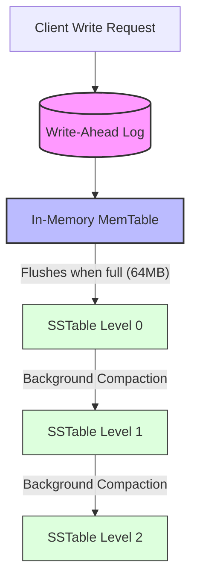
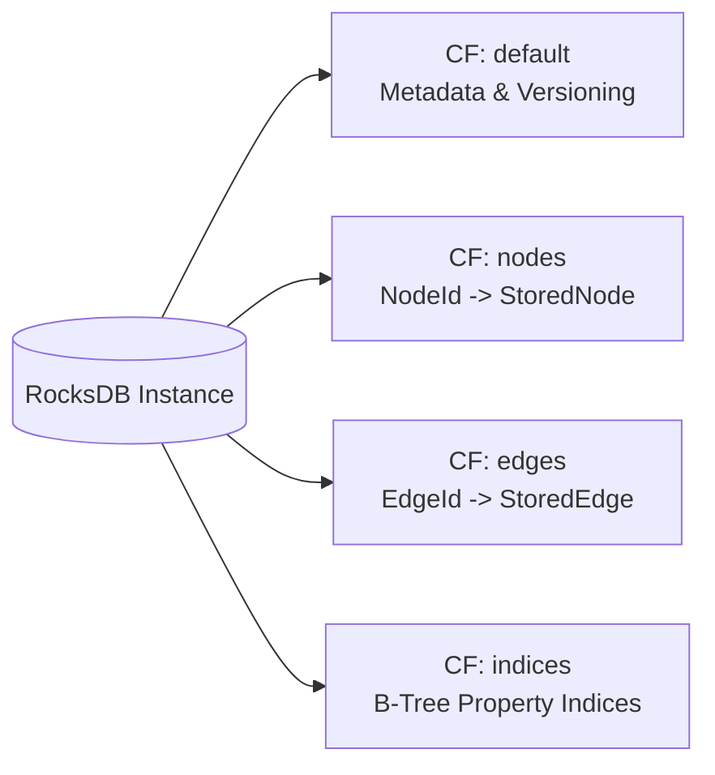

# Persistence at Scale

Every database must answer a fundamental question: **How do we not lose data?**

For an in-memory graph database like Samyama, this is doubly critical. While we prioritize speed by keeping the active dataset in RAM, we need a robust, battle-tested persistence layer to ensure durability (the 'D' in ACID) and to support datasets larger than memory.

We chose **RocksDB**.

## Why RocksDB?

RocksDB, originally forked from Google's LevelDB by Facebook, is an embedded key-value store based on a **Log-Structured Merge-Tree (LSM-Tree)**. It is the industry standard for high-performance storage engines, powering systems like CockroachDB, TiKV, and Kafka Streams.

### The LSM-Tree Advantage

Graph workloads are write-heavy. Creating a single "relationship" between two nodes might involve updating adjacency lists on both ends, updating indices, and writing to the transaction log.

Traditional B-Tree storage suffers from **Write Amplification**—changing a few bytes can require rewriting entire 4KB or 8KB pages.

LSM-Trees solve this by turning random writes into sequential ones. Here is how Samyama flows data into RocksDB:



This architecture allows Samyama to sustain massive ingestion rates, as seen in `benches/full_benchmark.rs` where we hit **> 800,000 nodes/second** in raw write throughput.

## Schema Design: Mapping Graphs to Key-Value

How do you store a graph (nodes and edges) in a Key-Value store? We use **Column Families** (logical partitions within RocksDB) to separate different types of data, preventing them from slowing each other down during compaction.



### Key Structure

We use a simple, efficient binary encoding for keys. All IDs are `u64` integers.
*   **Node Key**: `[u8; 8]` -> Big-Endian representation of `NodeId`.
*   **Edge Key**: `[u8; 8]` -> Big-Endian representation of `EdgeId`.

### Value Serialization

For the values (the actual data), we need a format that is compact and fast to deserialize. We chose **Bincode**.

Bincode is a Rust-specific binary serialization format that effectively dumps the memory representation of a struct to disk. It is significantly faster than JSON, Protobuf, or MsgPack for Rust-to-Rust communication.

```rust
#[derive(Serialize, Deserialize)]
struct StoredNode {
    id: u64,
    labels: Vec<String>,
    properties: Vec<u8>, // Compressed property map
    created_at: i64,
    updated_at: i64,
}
```

## The Persistence Code

The integration lives in `src/persistence/storage.rs`. Here is a simplified view of how we initialize RocksDB with optimal settings for graph workloads:

```rust
pub fn open(path: impl AsRef<Path>) -> StorageResult<Self> {
    let mut opts = Options::default();
    opts.create_if_missing(true);
    
    // Performance Tuning
    opts.set_write_buffer_size(64 * 1024 * 1024); // 64MB batches
    opts.set_compression_type(rocksdb::DBCompressionType::Lz4);

    let cf_descriptors = vec![
        ColumnFamilyDescriptor::new("default", Options::default()),
        ColumnFamilyDescriptor::new("nodes", Self::node_cf_options()),
        ColumnFamilyDescriptor::new("edges", Self::edge_cf_options()),
        ColumnFamilyDescriptor::new("indices", Self::index_cf_options()),
    ];

    let db = DB::open_cf_descriptors(&opts, &path, cf_descriptors)?;
    Ok(Self { db: Arc::new(db), /* ... */ })
}
```

> **Developer Tip:** Check out `examples/persistence_demo.rs` to see a full working example of how to configure Samyama to persist data to disk, write millions of edges, shut down the server, and seamlessly recover state on the next boot.

## Durability vs. Performance

We allow users to configure the `sync` behavior.
- **Strict Mode**: Every write calls `fsync`, guaranteeing data is on disk. Slower but safest.
- **Background Mode**: Writes are acknowledged once in the OS buffer cache. Faster, but risks data loss on power failure (process crash is still safe).

In Samyama, we default to a balanced approach: the Raft log (for consensus) is always fsync'd, while the RocksDB state machine catches up asynchronously. This ensures cluster-wide consistency even if a single node fails.
