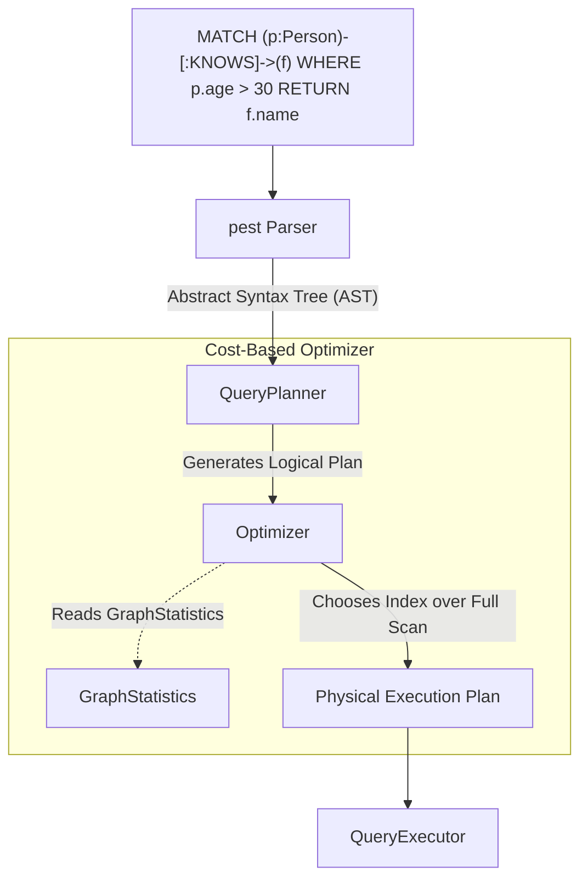
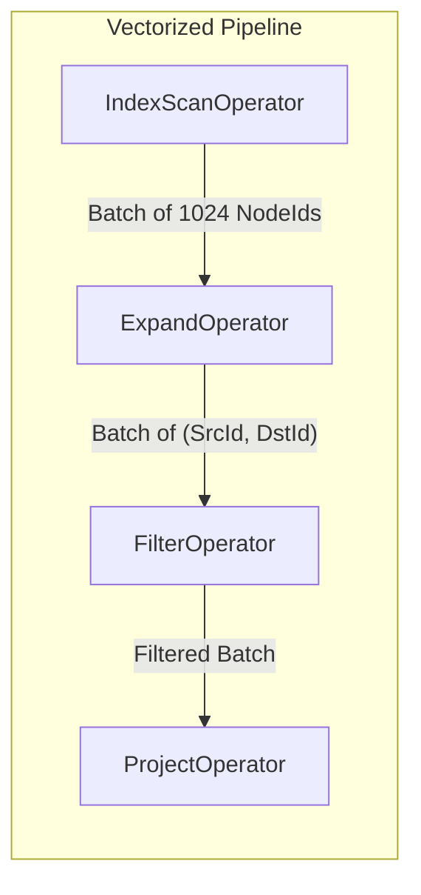

# The Query Engine

The heart of Samyama is its query engine. It translates the user's intent (expressed in OpenCypher) into actionable operations on the `GraphStore`.

## From String to Execution Plan

When a user sends a query, it travels through a meticulously optimized pipeline:



1.  **Parsing (`cypher.pest`)**: The query string is converted into an Abstract Syntax Tree (AST).
2.  **Logical Planning**: The `QueryPlanner` processes the AST into an `ExecutionPlan`.
3.  **Optimization**: The planner uses `GraphStatistics` to perform cost-based optimization (CBO), such as choosing the correct `IndexManager` scan instead of a full sequential scan.

## Execution Model: The Volcano Iterator & Vectorized Processing

Samyama implements a hybrid **Volcano Iterator model** utilizing **Vectorized Execution**. 



```rust
pub struct QueryExecutor<'a> {
    store: &'a GraphStore,
    planner: QueryPlanner,
}

pub trait PhysicalOperator {
    /// High-performance batch path
    fn next_batch(&mut self, store: &GraphStore, batch_size: usize) -> Option<RecordBatch>;
}
```

*(Simplified for clarity; the actual trait includes error handling via `ExecutionResult` and additional methods like `describe()` and `name()` for plan introspection.)*

Instead of fetching one row at a time, each `PhysicalOperator` processes a `RecordBatch`.

### All 28 Physical Operators

Samyama implements 28 physical operators, organized by function:

| Category | Operators |
| :--- | :--- |
| **Scan** | `NodeScanOperator`, `IndexScanOperator` |
| **Traversal** | `ExpandOperator`, `ShortestPathOperator` |
| **Filter & Transform** | `FilterOperator`, `ProjectOperator`, `UnwindOperator`, `WithBarrierOperator` |
| **Join** | `JoinOperator`, `LeftOuterJoinOperator`, `CartesianProductOperator` |
| **Aggregation & Sort** | `AggregateOperator`, `SortOperator`, `LimitOperator`, `SkipOperator` |
| **Write (Mutating)** | `CreateNodeOperator`, `CreateEdgeOperator`, `CreateNodesAndEdgesOperator`, `MatchCreateEdgeOperator`, `MergeOperator`, `DeleteOperator`, `SetPropertyOperator`, `RemovePropertyOperator`, `ForeachOperator` |
| **Index** | `CreateIndexOperator`, `CreateVectorIndexOperator` |
| **Specialized** | `VectorSearchOperator`, `AlgorithmOperator` | 

By processing batches:
*   **Amortized Overhead**: Calling virtual functions per batch instead of per row drops L1 instruction cache misses significantly.
*   **Late Materialization**: We pass lightweight `NodeId` arrays within `RecordBatch` columns. Actual properties are fetched from `ColumnStore` at the very end of the pipeline (`ProjectOperator`).

## Advanced Profiling (EXPLAIN)

A key enterprise feature is the ability to inspect the Execution Plan without executing it. When a query starts with `EXPLAIN`, the `QueryExecutor` intercepts it:

```rust
if query.explain {
    return Ok(Self::explain_plan_with_stats(&plan, Some(self.store)));
}
```

The system returns a detailed tree of `OperatorDescription` instances combined with current `GraphStatistics` (null fractions, selectivity estimations). This allows database administrators to visualize exactly why the query planner chose a specific index over a graph traversal, enabling deep query tuning.


