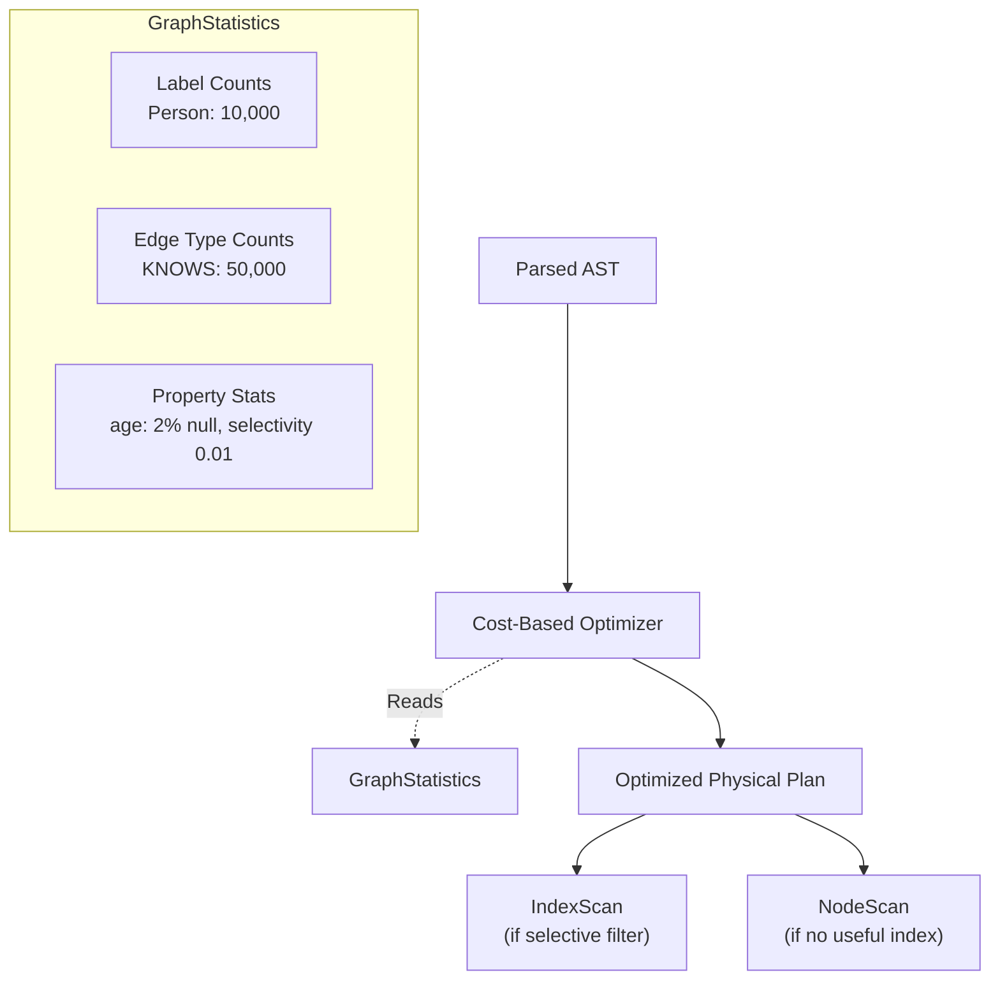

# Query Optimization (Explain)

As queries grow in complexity—involving multiple hops, filters, and vector searches—it becomes impossible to optimize performance by guessing. Samyama provides `EXPLAIN` for query introspection, backed by a cost-based optimizer that uses graph statistics to choose efficient execution plans.

## The Cost-Based Optimizer

Before a query is executed, the **QueryPlanner** transforms the AST into a physical execution plan. This involves selecting operators, ordering joins, and choosing between index scans and full scans—all based on real-time statistics.



### How Statistics Are Gathered

`GraphStore::compute_statistics()` builds a `GraphStatistics` struct with:

| Statistic | Source | Use |
| :--- | :--- | :--- |
| **Label counts** | O(1) from `label_index` | Estimate scan cardinality |
| **Edge type counts** | O(1) from `edge_type_index` | Estimate expand cardinality |
| **Average degree** | Computed from edge/node ratio | Estimate join fan-out |
| **Property stats** | Sampled from first 1,000 nodes per label | Estimate filter selectivity |

Property stats include `null_fraction`, `distinct_count`, and `selectivity`—enabling the optimizer to predict how many rows survive a `WHERE` filter.

### Cost Estimation Formulas

The optimizer uses these key estimation methods:

- **`estimate_label_scan(label)`**: Returns the number of nodes with that label. For `:Person` with 10,000 nodes, cost = 10,000.
- **`estimate_expand(edge_type)`**: Returns the number of edges of that type. For `:KNOWS` with 50,000 edges, cost = 50,000.
- **`estimate_equality_selectivity(label, property)`**: Returns the fraction of nodes that match a given property value. For `age = 30` on a label with 100 distinct age values, selectivity ≈ 0.01.

The planner multiplies these estimates through the operator tree to predict row counts at each stage.

### Index Selection Heuristics

The optimizer decides between scan strategies based on selectivity:

| Condition | Strategy | Why |
| :--- | :--- | :--- |
| Equality filter on indexed property | **IndexScan** (O(1) hash or O(log n) B-tree) | Direct lookup, skips full scan |
| Range filter on indexed property | **B-Tree IndexScan** (O(log n + k)) | Efficient range iteration |
| Low-selectivity filter (> 30% of rows) | **NodeScan + Filter** | Full scan is cheaper than index overhead |
| No filter on scan variable | **NodeScan** | No alternative |
| Label with < 100 nodes | **NodeScan** | Not worth index overhead |

### Join Ordering

When a query involves multiple `MATCH` patterns (e.g., `MATCH (a)-[:R]->(b)-[:S]->(c)`), the optimizer orders joins to minimize intermediate result sizes:

1. Start with the pattern that produces the fewest rows (most selective label + filter)
2. Expand along edges with the lowest fan-out first
3. Apply filters as early as possible (**predicate pushdown**)

## EXPLAIN: Visualizing the Plan

The `EXPLAIN` prefix tells the engine to parse and plan the query, but **not** execute it. It returns the operator tree that the physical executor will follow.

### Example 1: Simple Traversal

```cypher
EXPLAIN MATCH (n:Person)-[:KNOWS]->(m:Person)
WHERE n.age > 30
RETURN m.name
```

**Output**:
```text
+----------------------------------+----------------+
| Operator                         | Estimated Rows |
+----------------------------------+----------------+
| ProjectOperator (m.name)         |             50 |
|   FilterOperator (n.age > 30)    |             50 |
|     ExpandOperator (-[:KNOWS]->) |            500 |
|       NodeScanOperator (:Person) |            100 |
+----------------------------------+----------------+

--- Statistics ---
Label 'Person': 100 nodes
Edge type 'KNOWS': 500 edges
Property 'age': null_fraction=0.02, distinct=40, selectivity=0.025
```

### Example 2: Index-Driven Lookup

```cypher
EXPLAIN MATCH (n:Person {name: 'Alice'})-[:KNOWS]->(m)
RETURN m.name
```

**Output**:
```text
+----------------------------------------------+----------------+
| Operator                                     | Estimated Rows |
+----------------------------------------------+----------------+
| ProjectOperator (m.name)                     |              5 |
|   ExpandOperator (-[:KNOWS]->)               |              5 |
|     IndexScanOperator (:Person, name='Alice') |              1 |
+----------------------------------------------+----------------+
```

Notice the optimizer chose `IndexScanOperator` instead of `NodeScanOperator + FilterOperator` because `name` has an index and high selectivity.

### Example 3: Aggregation with Sort

```cypher
EXPLAIN MATCH (n:Person)-[:KNOWS]->(m:Person)
RETURN m.name, count(*) AS friends
ORDER BY friends DESC
LIMIT 10
```

**Output**:
```text
+----------------------------------+----------------+
| Operator                         | Estimated Rows |
+----------------------------------+----------------+
| LimitOperator (10)               |             10 |
|   SortOperator (friends DESC)    |            100 |
|     AggregateOperator (count)    |            100 |
|       ExpandOperator (-[:KNOWS]->)|            500 |
|         NodeScanOperator (:Person)|            100 |
+----------------------------------+----------------+
```

### Reading EXPLAIN Output

Key things to look for:

- **Operator ordering**: Filters should appear as close to the scan as possible (predicate pushdown)
- **IndexScan vs. NodeScan**: If you have an indexed property in your `WHERE` clause and see `NodeScanOperator` instead of `IndexScanOperator`, the optimizer may lack statistics—run a query first to populate stats
- **Estimated Rows**: Large drops between operators indicate selective filters. If estimated rows *increase* at an `ExpandOperator`, the graph has high fan-out at that relationship type
- **Statistics section**: Shows the raw data the optimizer used for its decisions

## Optimization Techniques Applied

Samyama's optimizer applies several rule-based and cost-based optimizations:

| Technique | Description |
| :--- | :--- |
| **Predicate Pushdown** | Move `WHERE` filters below `ExpandOperator` when possible |
| **Index Selection** | Choose hash/B-tree index when selectivity < 30% |
| **Join Reordering** | Start with the most selective pattern |
| **Late Materialization** | Pass `NodeRef(id)` instead of full nodes; resolve properties only at `ProjectOperator` |
| **Limit Propagation** | Push `LIMIT` into scan operators to stop early |

## Future: PROFILE (Runtime Statistics)

> **Status: Planned** — `PROFILE` is on the roadmap but not yet implemented. Currently, only `EXPLAIN` is available.

A future `PROFILE` command would execute the query and collect timing and row-count data for every operator, adding `Actual Rows` and `Time (ms)` columns alongside the estimates. This would enable:
- Identifying the actual bottleneck operator (not just estimated)
- Comparing estimated vs. actual cardinality to detect stale statistics
- Measuring late materialization savings at the `ProjectOperator`

> **Developer Tip:** Use `EXPLAIN` before running expensive queries. If the plan looks suboptimal, try adding a property index with `CREATE INDEX ON :Label(property)` and re-run `EXPLAIN` to see if the optimizer switches to an `IndexScanOperator`.
