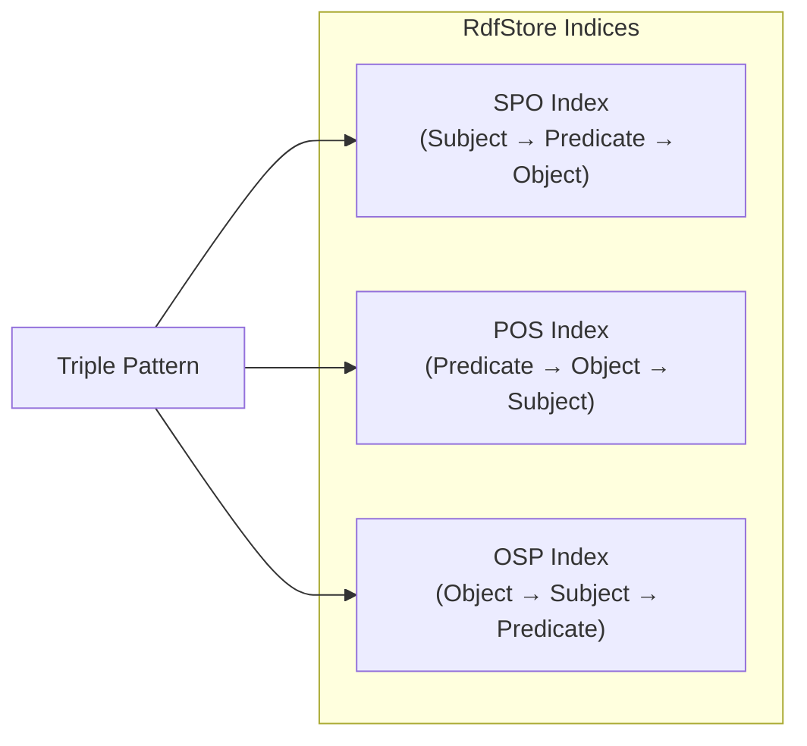

# RDF & SPARQL Support

Samyama provides native support for the **Resource Description Framework (RDF)** data model alongside its property graph engine. This enables interoperability with Linked Data ecosystems, ontology-based knowledge graphs, and standards-compliant data exchange.

## RDF Data Model

RDF represents knowledge as a collection of **triples**—statements in the form of Subject-Predicate-Object:

```
<http://example.org/alice> <http://xmlns.com/foaf/0.1/name> "Alice" .
<http://example.org/alice> <http://xmlns.com/foaf/0.1/knows> <http://example.org/bob> .
```

### Core Types

Samyama's RDF implementation (built on the `oxrdf` crate) provides the standard RDF term types:

| Type | Description | Example |
| :--- | :--- | :--- |
| `NamedNode` | An IRI-identified resource | `<http://example.org/alice>` |
| `BlankNode` | An anonymous resource | `_:b1` |
| `Literal` | A value (with optional language/datatype) | `"Alice"`, `"42"^^xsd:integer` |
| `Triple` | A Subject-Predicate-Object statement | — |
| `Quad` | A Triple + named graph | — |

### Triple Patterns

For querying, Samyama supports `TriplePattern` and `QuadPattern` with optional wildcards:

```rust
// Find all triples where Alice is the subject
let pattern = TriplePattern::new(
    Some(alice.clone().into()),
    None,  // any predicate
    None,  // any object
);
let results = store.query(pattern);
```

## In-Memory RDF Store

The `RdfStore` provides an efficient in-memory triple store with **three-way indexing**:



This triple-indexing strategy enables O(1) lookups for any fixed pattern component:
- **SPO**: Efficient for "What does Alice know?"
- **POS**: Efficient for "Who has the name 'Alice'?"
- **OSP**: Efficient for "What relates to Alice?"

Named graphs are also supported, allowing triples to be organized into logical collections.

## Serialization Formats

Samyama supports reading and writing RDF in four standard formats:

| Format | Extension | Library | Read | Write |
| :--- | :--- | :--- | :---: | :---: |
| **Turtle** | `.ttl` | `rio_turtle` | ✅ | ✅ |
| **N-Triples** | `.nt` | `rio_api` | ✅ | ✅ |
| **RDF/XML** | `.rdf` | `rio_xml` | ✅ | ✅ |
| **JSON-LD** | `.jsonld` | Custom | ❌ | ✅ |

### Example: Loading Turtle Data

```rust
use samyama::rdf::{RdfParser, RdfFormat, RdfStore};

let turtle_data = r#"
    @prefix foaf: <http://xmlns.com/foaf/0.1/> .
    @prefix ex: <http://example.org/> .

    ex:alice foaf:name "Alice" ;
             foaf:knows ex:bob .
    ex:bob   foaf:name "Bob" .
"#;

let triples = RdfParser::parse(turtle_data, RdfFormat::Turtle)?;
let mut store = RdfStore::new();
for triple in triples {
    store.insert(triple)?;
}
```

### Example: Serializing to N-Triples

```rust
use samyama::rdf::{RdfSerializer, RdfFormat};

let output = RdfSerializer::serialize_store(&store, RdfFormat::NTriples)?;
// <http://example.org/alice> <http://xmlns.com/foaf/0.1/name> "Alice" .
// <http://example.org/alice> <http://xmlns.com/foaf/0.1/knows> <http://example.org/bob> .
// <http://example.org/bob> <http://xmlns.com/foaf/0.1/name> "Bob" .
```

## Namespace Management

The `NamespaceManager` provides prefix resolution for compact IRIs, pre-loaded with standard ontologies:

| Prefix | Namespace |
| :--- | :--- |
| `rdf` | `http://www.w3.org/1999/02/22-rdf-syntax-ns#` |
| `rdfs` | `http://www.w3.org/2000/01/rdf-schema#` |
| `xsd` | `http://www.w3.org/2001/XMLSchema#` |
| `owl` | `http://www.w3.org/2002/07/owl#` |
| `foaf` | `http://xmlns.com/foaf/0.1/` |
| `dc` / `dcterms` | Dublin Core |

```rust
let ns = NamespaceManager::new();
let expanded = ns.expand("foaf:name");
// → "http://xmlns.com/foaf/0.1/name"
```

## SPARQL Query Engine

> **Status: Foundation** — The SPARQL engine infrastructure is in place (parser via `spargebra`, executor scaffolding, result types), but query execution is not yet fully operational. The current focus is on the property graph / OpenCypher engine.

The `SparqlEngine` provides the framework for SPARQL 1.1 query processing:

```rust
pub struct SparqlEngine {
    store: RdfStore,
    executor: SparqlExecutor,
}

impl SparqlEngine {
    pub fn query(&self, sparql: &str) -> SparqlResult<SparqlResults>;
    pub fn update(&mut self, sparql: &str) -> SparqlResult<()>;
}
```

### Planned Query Forms

| Form | Purpose | Status |
| :--- | :--- | :---: |
| `SELECT` | Return variable bindings | Planned |
| `CONSTRUCT` | Build new RDF graphs | Planned |
| `ASK` | Boolean existence check | Planned |
| `DESCRIBE` | Resource description | Planned |

### Result Formats

SPARQL results support standard serialization formats:

```rust
pub enum ResultFormat {
    Json,   // SPARQL Results JSON
    Xml,    // SPARQL Results XML
    Csv,    // Tabular CSV
    Tsv,    // Tabular TSV
}
```

## Property Graph ↔ RDF Mapping

Samyama includes a mapping layer for converting between its native property graph model and RDF:

| Property Graph | RDF |
| :--- | :--- |
| Node with label "Person" | `<node_iri> rdf:type ex:Person` |
| Property `name = "Alice"` | `<node_iri> ex:name "Alice"` |
| Edge of type "KNOWS" | `<src_iri> ex:KNOWS <dst_iri>` |

> **Note:** The bidirectional mapping infrastructure (via `MappingConfig`) is defined but the automatic conversion is on the roadmap. Currently, RDF data should be loaded directly via the serialization parsers.

## Dependencies

The RDF/SPARQL stack uses these Rust crates:

| Crate | Version | Purpose |
| :--- | :--- | :--- |
| `oxrdf` | 0.2 | RDF primitive types |
| `rio_api` | 0.8 | RDF I/O API interface |
| `rio_turtle` | 0.8 | Turtle parser/serializer |
| `rio_xml` | 0.8 | RDF/XML parser/serializer |
| `spargebra` | 0.3 | SPARQL 1.1 parser |
