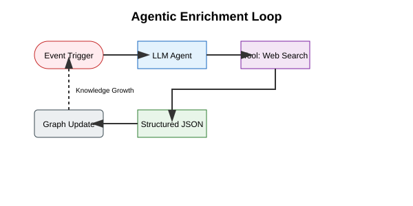

# Research Paper: Samyama Overview

We have published a comprehensive research paper detailing the architecture, design decisions, and performance evaluation of Samyama Graph.

**Title**: *Samyama: A Unified Graph-Vector Database with In-Database Optimization, Agentic Enrichment, and Hardware Acceleration*

**Authors**: [Madhulatha Mandarapu](https://www.linkedin.com/in/madhulatha-mandarapu-72bb6b2a/), [Sandeep Kunkunuru](https://www.linkedin.com/in/sandeepkunkunuru/)

**GitHub**: [samyama-ai/samyama-graph](https://github.com/samyama-ai/samyama-graph)

**Book**: [samyama-ai.github.io/samyama-graph-book](https://samyama-ai.github.io/samyama-graph-book/)

**Date**: March 2026 | **Version**: v0.5.12

**Keywords**: Graph Databases, Vector Search, Distributed Systems, Metaheuristic Optimization, Rust, GPU Acceleration, Agentic AI, RDF, LDBC.

## Download PDF

You can download the professional PDF version of this paper (arXiv-ready) from our GitHub Releases:
[Download Samyama Paper PDF](https://github.com/samyama-ai/samyama-graph-book/releases/latest/download/samyama_paper.pdf)

---

## Abstract

Modern data architectures are fragmented across graph databases, vector stores, analytics engines, and optimization solvers, resulting in complex ETL pipelines, synchronization overhead, and operational burden. We present **Samyama**, a high-performance, distributed graph-vector database written in Rust that unifies these workloads into a single engine. Samyama combines a RocksDB-backed persistent store with a versioned-arena MVCC model, a vectorized query executor with 28 physical operators, a dedicated CSR-based analytics engine, and native RDF/SPARQL support. The system integrates 22 metaheuristic optimization solvers directly into its query language, implements HNSW vector indexing with Graph RAG capabilities, and introduces "Agentic Enrichment" for autonomous graph expansion via LLMs. A comprehensive SDK ecosystem (Rust, Python, TypeScript) and CLI provide multiple access patterns.

The **Samyama Enterprise Edition** adds GPU acceleration via wgpu (Metal, Vulkan, DX12), production-grade observability, point-in-time recovery, and hardened high availability with HTTP/2 Raft transport.

Our evaluation on commodity hardware (Mac Mini M4, 16GB RAM) demonstrates:
- **Ingestion**: 255K nodes/s (CPU), 412K nodes/s (GPU-accelerated), 4.2M–5.2M edges/s
- **OLTP throughput**: 115K Cypher queries/sec at 1M nodes
- **Late materialization**: 4.0–4.7x latency reduction on multi-hop traversals
- **GPU PageRank**: 8.2x speedup at 1M nodes
- **LDBC Graphalytics**: 28/28 tests passed (100% validation)

---

## Paper Structure (10 Sections)

### 1. Introduction
Motivates the need for a unified graph-vector-optimization engine. Identifies 8 key contributions: unified engine, late materialization, in-database optimization, agentic enrichment (GAK), GPU acceleration, SDK ecosystem, RDF interoperability, and 100% LDBC Graphalytics validation.

### 2. System Architecture
Covers four subsystems:
- **Storage Engine**: RocksDB with LSM-tree, LZ4/Zstd compression, Column Families for multi-tenant isolation. `NodeId`/`EdgeId` as direct `u64` arena indices for O(1) access.
- **Memory Management & MVCC**: Versioned-arena (`Vec<Vec<T>>`) for Snapshot Isolation without read locks. ACID guarantees via WriteBatch + WAL + Raft quorum.
- **Query & Execution Engine**: ~90% OpenCypher via PEG parser (pest). Hybrid Volcano-Vectorized model with 28 physical operators and batch size 1,024. Cost-based optimizer using `GraphStatistics`. Late materialization via `Value::NodeRef(id)`.
- **RDF & SPARQL**: Native RDF via `oxrdf` with SPO/POS/OSP triple indices, Turtle/N-Triples/RDF-XML serialization, and `spargebra` SPARQL parser.

### 3. High-Performance Analytics
- **CSR Projection**: `GraphView` with `out_offsets`/`out_targets`/`weights` arrays for cache-efficient traversal with near-perfect CPU prefetch accuracy.
- **Algorithm Library**: 14 algorithms across centrality (PageRank, LCC), community (WCC, SCC, CDLP, Triangle Counting), pathfinding (BFS, Dijkstra), network flow (Edmonds-Karp, Prim's MST), and statistical (PCA with Randomized SVD + Power Iteration).

### 4. In-Database Optimization
22 metaheuristic solvers accessible via `CALL algo.or.solve(...)` Cypher procedures. Covers metaphor-less (Jaya, QOJAYA, Rao 1-3, TLBO, ITLBO, GOTLBO), swarm/evolutionary (PSO, DE, GA, GWO, ABC, BAT, Cuckoo, Firefly, FPA), physics-based (GSA, SA, HS, BMR, BWR), and multi-objective (NSGA-II, MOTLBO) families. All solvers use Rayon for parallel fitness evaluation.

### 5. AI & Agentic Enrichment
- **Vector Search**: HNSW indexing via `hnsw_rs` with Cosine, L2, Dot Product metrics. `VectorSearchOperator` enables Graph RAG.
- **GAK (Generation-Augmented Knowledge)**: `AgentRuntime` with tool-calling agents for autonomous graph expansion. Safety validation includes schema checking and destructive query rejection.
- **NLQ Pipeline**: Natural language to Cypher via OpenAI, Gemini, Ollama, or Claude providers.

### 6. SDK Ecosystem
Multi-language SDKs: Rust (`SamyamaClient` trait with `EmbeddedClient`/`RemoteClient`, `AlgorithmClient`/`VectorClient` extension traits), Python (PyO3), TypeScript (HTTP), CLI (query/status/ping/shell), and OpenAPI.

### 7. Enterprise Edition
- **GPU Acceleration**: wgpu compute shaders (Metal/Vulkan/DX12) for PageRank, CDLP, LCC, Triangle Counting, PCA. GPU PCA uses 5 specialized WGSL shaders with tiled covariance.
- **Observability**: 200+ Prometheus metrics, health probes, audit trail, slow query log.
- **Backup & PITR**: Full + incremental snapshots with microsecond-precision restore.
- **Hardened HA**: HTTP/2 Raft transport with TLS, snapshot streaming, cluster metrics.
- **License Hardening**: Ed25519 JET tokens with machine fingerprint binding and revocation lists.

### 8. Performance Evaluation
Comprehensive benchmarks on Mac Mini M4 (16GB RAM):

| Benchmark | Result |
| :--- | :--- |
| Node Ingestion (CPU / GPU) | 255K / 412K ops/s |
| Edge Ingestion (CPU / GPU) | 4.2M / 5.2M ops/s |
| Cypher OLTP (1M nodes) | 115,320 QPS at 0.008ms |
| Late Materialization | 4.0x (1-hop), 4.7x (2-hop) |
| GPU PageRank (1M nodes) | 8.2x speedup (11.2 ms) |
| Vector Search (10K, 128d) | 15,872 QPS |
| LDBC Graphalytics | **28/28 (100%)** |

GPU crossover: ~100K nodes for general algorithms, ~50K for PCA.

### 9. Related Work
Compares against Neo4j (JVM GC pauses), FalkorDB (no vector/optimization), Kuzudb (analytical-only), and DuckDB (relational, no native graph). Samyama differentiates by unifying OLTP, OLAP, vector, and optimization in one memory-safe binary.

### 10. Conclusion
Samyama bridges transactional integrity and analytical intelligence. 100% LDBC validation confirms algorithmic correctness. The SDK ecosystem lowers adoption barriers across Rust, Python, and TypeScript.

---

## Visualizations

The paper includes several illustrations detailing the system's design:

### 1. Unified Engine Architecture
A high-level view of how the RESP protocol interacts with the Cypher parser, which in turn orchestrates the Vectorized Executor across the HNSW (Vector) and RocksDB (Graph) indices.

### 2. The Optimization Frontier
A Pareto front chart illustrating how the NSGA-II solver identifies optimal trade-offs in multi-objective resource allocation directly on the graph.

### 3. JIT Knowledge Graph Expansion
A sequence diagram showing the Agentic Enrichment loop: an event trigger initiates an LLM search which automatically creates new nodes and edges, "healing" the graph's missing knowledge.

---

## Implemented Research

For a comprehensive list of the specific academic algorithms, models, and architectures implemented directly within the Samyama codebase, please see the [Index of Implemented Papers](./implemented_papers.md).
