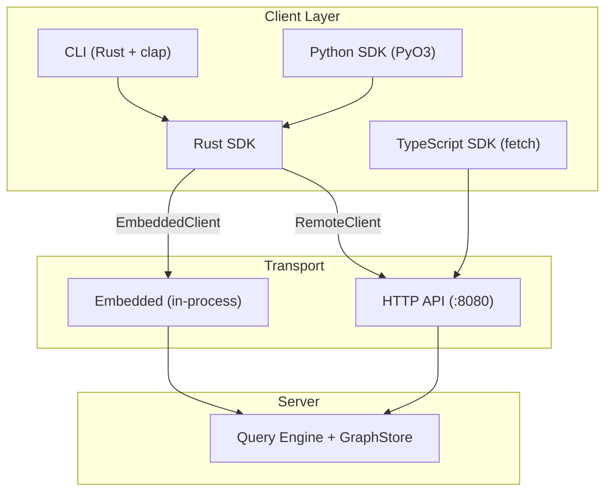

# SDKs, CLI & API

Samyama provides a comprehensive developer ecosystem beyond the raw RESP and HTTP protocols. This chapter covers the official SDKs (Rust, Python, TypeScript), the command-line interface, and the OpenAPI specification.

## Architecture Overview



All SDKs connect to the same engine—either over HTTP (remote) or directly in-process (embedded). The Rust SDK serves as the foundation: the CLI wraps it with a terminal interface, and the Python SDK wraps it via PyO3 FFI.

## 1. Rust SDK (`samyama-sdk`)

The Rust SDK is a workspace crate at `crates/samyama-sdk/` that provides both embedded and remote access to the graph engine.

### Core Trait: `SamyamaClient`

```rust
#[async_trait]
pub trait SamyamaClient: Send + Sync {
    async fn query(&self, graph: &str, cypher: &str) -> SamyamaResult<QueryResult>;
    async fn query_readonly(&self, graph: &str, cypher: &str) -> SamyamaResult<QueryResult>;
    async fn delete_graph(&self, graph: &str) -> SamyamaResult<()>;
    async fn list_graphs(&self) -> SamyamaResult<Vec<String>>;
    async fn status(&self) -> SamyamaResult<ServerStatus>;
    async fn ping(&self) -> SamyamaResult<String>;
}
```

### `EmbeddedClient` — In-Process Access

For applications that want to embed Samyama directly (no network overhead):

```rust
use samyama_sdk::{EmbeddedClient, SamyamaClient};

// Create a fresh graph store
let client = EmbeddedClient::new();

// Or wrap an existing store
let client = EmbeddedClient::with_store(store.clone());

// Execute queries
let result = client.query("default", "CREATE (n:Person {name: 'Alice'})").await?;
let result = client.query_readonly("default", "MATCH (n:Person) RETURN n.name").await?;
```

The `EmbeddedClient` also provides factory methods for accessing subsystems:

| Method | Returns | Purpose |
| :--- | :--- | :--- |
| `nlq_pipeline(config)` | `NLQPipeline` | Natural language query |
| `agent_runtime(config)` | `AgentRuntime` | Agentic enrichment |
| `persistence_manager(path)` | `PersistenceManager` | RocksDB persistence |
| `tenant_manager()` | `TenantManager` | Multi-tenancy |
| `store_read()` | `RwLockReadGuard<GraphStore>` | Direct read access |
| `store_write()` | `RwLockWriteGuard<GraphStore>` | Direct write access |

### `RemoteClient` — HTTP Transport

For connecting to a running Samyama server:

```rust
use samyama_sdk::{RemoteClient, SamyamaClient};

let client = RemoteClient::new("http://localhost:8080");
let status = client.status().await?;
let result = client.query("default", "MATCH (n) RETURN count(n)").await?;
```

### Extension Traits (EmbeddedClient Only)

**`AlgorithmClient`** provides direct access to graph algorithms without writing Cypher:

```rust
use samyama_sdk::AlgorithmClient;

let scores = client.page_rank(config, "Person", "KNOWS").await;
let components = client.weakly_connected_components("Person", "KNOWS").await;
let path = client.dijkstra(src, dst, "City", "ROAD", Some("distance")).await;
let pca_result = client.pca("Person", &["age", "income", "score"], config).await;
```

Available algorithm methods: `page_rank`, `weakly_connected_components`, `strongly_connected_components`, `bfs`, `dijkstra`, `edmonds_karp`, `prim_mst`, `count_triangles`, `bfs_all_shortest_paths`, `cdlp`, `local_clustering_coefficient`, `pca`.

**`VectorClient`** provides vector search operations:

```rust
use samyama_sdk::VectorClient;

client.create_vector_index("Document", "embedding", 384, "cosine").await?;
client.add_vector("Document", "embedding", node_id, vec![0.1, 0.2, ...]).await?;
let results = client.vector_search("Document", "embedding", query_vec, 10).await?;
```

### SDK Data Models

```rust
pub struct QueryResult {
    pub nodes: Vec<SdkNode>,
    pub edges: Vec<SdkEdge>,
    pub columns: Vec<String>,
    pub records: Vec<Vec<Value>>,
}

pub struct ServerStatus {
    pub status: String,      // "healthy"
    pub version: String,     // "0.5.12"
    pub storage: StorageStats,
}
```

## 2. Command-Line Interface (CLI)

The CLI at `cli/` is a Rust binary wrapping the Rust SDK with `clap` for argument parsing and `comfy-table` for formatted output.

### Installation & Usage

```bash
# Build from source
cargo build --release -p samyama-cli

# Connect to a running server
samyama-cli --url http://localhost:8080 query "MATCH (n) RETURN count(n)"

# Output formats
samyama-cli --format table query "MATCH (n:Person) RETURN n.name, n.age"
samyama-cli --format json  query "MATCH (n:Person) RETURN n.name"
samyama-cli --format csv   query "MATCH (n:Person) RETURN n.name, n.age"
```

### Subcommands

| Command | Description |
| :--- | :--- |
| `query <cypher>` | Execute a Cypher query (`--graph`, `--readonly` flags) |
| `status` | Get server status (version, node/edge counts) |
| `ping` | Check server connectivity |
| `shell` | Start an interactive REPL session |

### Interactive Shell

```
$ samyama-cli shell
samyama> MATCH (n:Person) RETURN n.name
+----------+
| n.name   |
+----------+
| Alice    |
| Bob      |
+----------+

samyama> :status
Status: healthy | Version: 0.5.12 | Nodes: 2000 | Edges: 11000

samyama> :help
samyama> :quit
```

### Environment Variables

| Variable | Default | Description |
| :--- | :--- | :--- |
| `SAMYAMA_URL` | `http://localhost:8080` | Server URL |

## 3. Python SDK (PyO3)

The Python SDK at `sdk/python/` provides native Python bindings via PyO3, wrapping the Rust SDK as a compiled C extension (cdylib).

### Usage

```python
from samyama import SamyamaClient

# Embedded mode (in-process, no server needed)
client = SamyamaClient.embedded()

# Remote mode (connect to running server)
client = SamyamaClient.connect("http://localhost:8080")

# Execute queries
result = client.query("MATCH (n:Person) RETURN n.name")
print(result.columns)   # ['n.name']
print(result.records)    # [['Alice'], ['Bob']]
print(len(result))       # 2

# Server info
status = client.status()
print(status.version)    # '0.5.12'
print(status.nodes)      # 2000
```

### Architecture

The Python SDK uses a shared `tokio::Runtime` (via `OnceLock`) to bridge Python's synchronous API with the Rust SDK's async internals. JSON serialization via `serde_json` handles the boundary between Rust types and Python objects.

## 4. TypeScript SDK

The TypeScript SDK at `sdk/typescript/` is a standalone pure-TypeScript implementation using the browser/Node.js `fetch` API for HTTP transport. It does **not** wrap the Rust SDK.

### Usage

```typescript
import { SamyamaClient } from 'samyama-sdk';

const client = SamyamaClient.connectHttp('http://localhost:8080');

// Execute queries
const result = await client.query('MATCH (n:Person) RETURN n.name');
console.log(result.columns);  // ['n.name']
console.log(result.records);  // [['Alice'], ['Bob']]

// Server status
const status = await client.status();
console.log(status.version);  // '0.5.12'
```

## 5. OpenAPI Specification

The HTTP API is documented in `api/openapi.yaml` and provides two endpoints:

### `POST /api/query`
Execute a Cypher query against the graph.

**Request:**
```json
{ "query": "MATCH (n:Person) RETURN n.name, n.age LIMIT 10" }
```

**Response:**
```json
{
  "nodes": [{ "id": "1", "labels": ["Person"], "properties": { "name": "Alice" } }],
  "edges": [],
  "columns": ["n.name", "n.age"],
  "records": [["Alice", 30], ["Bob", 25]]
}
```

### `GET /api/status`
Get server health and statistics.

**Response:**
```json
{
  "status": "healthy",
  "version": "0.5.12",
  "storage": { "nodes": 2000, "edges": 11000 }
}
```

## SDK Capability Matrix

| Capability | Rust (Embedded) | Rust (Remote) | Python | TypeScript |
| :--- | :---: | :---: | :---: | :---: |
| Cypher Queries | ✅ | ✅ | ✅ | ✅ |
| Server Status | ✅ | ✅ | ✅ | ✅ |
| Algorithm API | ✅ | ❌ | ❌ | ❌ |
| Vector Search API | ✅ | ❌ | ❌ | ❌ |
| NLQ Pipeline | ✅ | ❌ | ❌ | ❌ |
| Persistence Control | ✅ | ❌ | ❌ | ❌ |
| Multi-Tenancy | ✅ | ❌ | ❌ | ❌ |

> **Developer Tip:** All 10 domain-specific examples in the `examples/` directory have been migrated to use the SDK's `EmbeddedClient`, demonstrating real-world usage patterns for banking, clinical trials, supply chain, and more.
